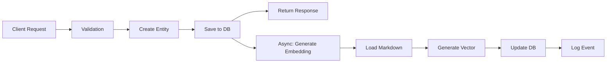
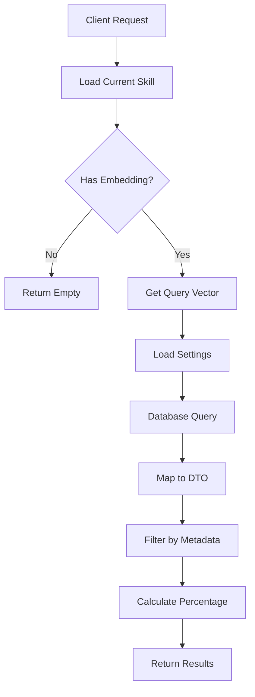
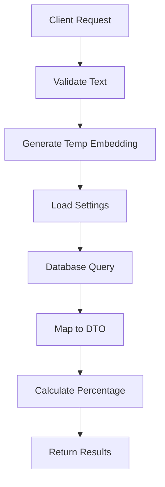
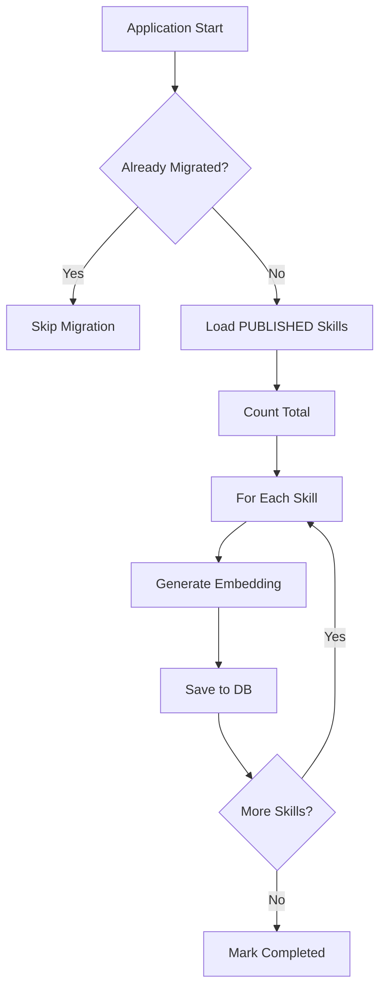
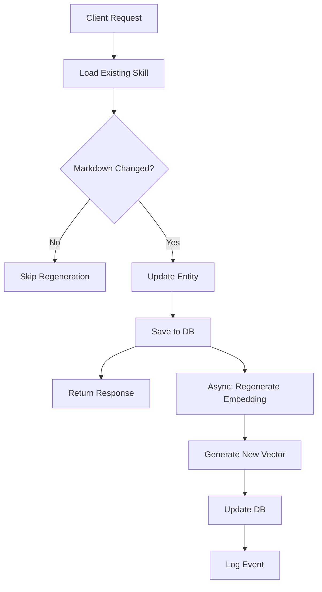

# Data Flow: Embeddings for Skills and Rules

**Document Version:** 1.0
**Date:** 2026-04-16
**Author:** AI Functional Design Agent
**Status:** Draft

---

## Overview

Документ описывает потоки данных (data flows) для всех операций функциональности "Embeddings for Skills and Rules". Каждый поток представлен как Input → Transform → Output с указанием ключевых шагов обработки.

---

## Table of Contents

1. [Генерация Embeddings](#генерация-embeddings)
2. [Поиск Похожих Элементов](#поиск-похожих-элементов)
3. [Миграция Существующих Данных](#миграция-существующих-данных)
4. [Обновление Embeddings](#обновление-embeddings)

---

## Генерация Embeddings

### DF-001: Генерация Embedding при Создании Skill

**Operation:** Создание нового skill с генерацией embedding

**Input:**
```
POST /api/skills
{
  "name": "My Skill",
  "description": "Description",
  "skillMarkdown": "# Markdown content\n...",
  "tags": ["tag1", "tag2"],
  "teamCode": "team1",
  "scope": "GLOBAL"
}
```

**Transform Steps:**

1. **Validation**
   - Валидация входных данных (name, skillMarkdown не пустые)
   - Проверка прав пользователя (ROLE_FLOW_CONFIGURATOR или ROLE_ADMIN)

2. **Create Skill Entity**
   ```
   SkillVersion skill = new SkillVersion();
   skill.setName("My Skill");
   skill.setDescription("Description");
   skill.setSkillMarkdown("# Markdown content\n...");
   skill.setStatus(Status.DRAFT);
   skill.setResourceVersion(1);
   ```

3. **Save to Database (Before Embedding)**
   ```
   skillVersion = skillVersionRepository.save(skill);
   // skill.id присваивается БД
   ```

4. **Async Trigger Embedding Generation**
   ```
   @Async
   public void generateEmbedding(UUID skillId) {
       // Шаги 5-7 выполняются асинхронно
   }
   ```

5. **Load Skill Markdown**
   ```
   SkillVersion skill = skillVersionRepository.findById(skillId).orElseThrow();
   String markdown = skill.getSkillMarkdown();
   ```

6. **Generate Embedding Vector**
   ```
   float[] embedding = embeddingProvider.generateEmbedding(markdown);
   // Возвращает: [0.123, -0.456, 0.789, ...] (384 элемента)
   ```

7. **Update Embedding in Database**
   ```
   skill.setEmbeddingVector(embedding);
   skillVersionRepository.save(skill);
   ```

8. **Log Event**
   ```
   auditService.log("embedding_generated", skillId, Map.of(
       "provider", "LOCAL",
       "dimension", 384
   ));
   ```

**Output:**
```
HTTP 201 Created
{
  "id": "uuid",
  "skillId": "skill-uuid",
  "version": "1.0.0",
  "name": "My Skill",
  "status": "DRAFT",
  "embeddingGenerated": true
}
```

**Data Flow Diagram:**


---

### DF-002: Генерация Embedding при Создании Rule

**Operation:** Создание нового rule с генерацией embedding

**Input:**
```
POST /api/rules
{
  "name": "My Rule",
  "description": "Description",
  "ruleMarkdown": "# Rule content\n...",
  "tags": ["tag1", "tag2"],
  "teamCode": "team1",
  "scope": "GLOBAL"
}
```

**Transform Steps:**

Аналогично DF-001, но для `RuleVersion` и `ruleMarkdown`.

**Output:**
```
HTTP 201 Created
{
  "id": "uuid",
  "ruleId": "rule-uuid",
  "version": "1.0.0",
  "name": "My Rule",
  "status": "DRAFT",
  "embeddingGenerated": true
}
```

---

## Поиск Похожих Элементов

### DF-003: Поиск Похожих Skills по ID

**Operation:** Поиск похожих PUBLISHED skills на основе косинусного сходства

**Input:**
```
GET /api/skills/{skillId}/similar
```

**Transform Steps:**

1. **Load Current Skill**
   ```
   SkillVersion currentSkill = skillVersionRepository.findById(skillId)
       .orElseThrow(() -> new NotFoundException("Skill not found"));
   ```

2. **Check Embedding Exists**
   ```
   if (currentSkill.getEmbeddingVector() == null) {
       return SimilarSkillsResponse.empty();
   }
   ```

3. **Get Query Vector**
   ```
   float[] queryVector = currentSkill.getEmbeddingVector();
   // [0.123, -0.456, 0.789, ...]
   ```

4. **Get Settings**
   ```
   float threshold = Float.parseFloat(
       systemSettingService.getValue("embedding.similarity.threshold", "0.6")
   ); // 0.6
   int limit = Integer.parseInt(
       systemSettingService.getValue("embedding.max.results", "10")
   ); // 10
   ```

5. **Database Query (Vector Similarity Search)**
   ```sql
   SELECT
       s.id,
       s.skill_id,
       s.version,
       s.name,
       s.description,
       s.tags,
       s.team_code,
       s.scope,
       1 - (s.embedding_vector <=> :queryVector) as similarity
   FROM skills s
   WHERE s.status = 'PUBLISHED'
     AND s.id != :currentSkillId
     AND s.embedding_vector IS NOT NULL
     AND 1 - (s.embedding_vector <=> :queryVector) > :threshold
   ORDER BY s.embedding_vector <=> :queryVector ASC
   LIMIT :limit
   ```

6. **Map Results to DTO**
   ```
   List<SimilarSkill> similarSkills = resultSet.stream()
       .map(row -> new SimilarSkill(
           row.getUuid("id"),
           row.getString("skill_id"),
           row.getString("version"),
           row.getString("name"),
           row.getString("description"),
           row.getFloat("similarity"),
           row.getStringArray("tags"),
           row.getString("team_code"),
           row.getString("scope")
       ))
       .collect(Collectors.toList());
   ```

7. **Filter by Metadata (Optional)**
   ```
   if (filters.getTags() != null) {
       similarSkills = filterByTags(similarSkills, filters.getTags());
   }
   if (filters.getTeamCode() != null) {
       similarSkills = filterByTeamCode(similarSkills, filters.getTeamCode());
   }
   ```

8. **Calculate Percentage**
   ```
   similarSkills.forEach(s -> s.setSimilarityPercent(
       Math.round(s.getSimilarityScore() * 100)
   ));
   ```

**Output:**
```
HTTP 200 OK
{
  "similarSkills": [
    {
      "id": "uuid-1",
      "skillId": "similar-skill-1",
      "version": "1.0.0",
      "name": "Similar Skill 1",
      "description": "This skill is similar...",
      "similarityScore": 0.85,
      "similarityPercent": 85,
      "tags": ["tag1"],
      "teamCode": "team1",
      "scope": "GLOBAL"
    },
    // ... до 10 элементов
  ],
  "total": 10
}
```

**Data Flow Diagram:**


---

### DF-004: Поиск Похожих Rules по ID

**Operation:** Поиск похожих PUBLISHED rules на основе косинусного сходства

**Input:**
```
GET /api/rules/{ruleId}/similar
```

**Transform Steps:**

Аналогично DF-003, но для `RuleVersion`.

**Output:**
```
HTTP 200 OK
{
  "similarRules": [
    {
      "id": "uuid-1",
      "ruleId": "similar-rule-1",
      "version": "1.0.0",
      "name": "Similar Rule 1",
      "description": "This rule is similar...",
      "similarityScore": 0.85,
      "similarityPercent": 85,
      "tags": ["tag1"],
      "teamCode": "team1",
      "scope": "GLOBAL"
    },
    // ... до 10 элементов
  ],
  "total": 10
}
```

---

### DF-005: Поиск Похожих Skills по Тексту

**Operation:** Поиск похожих PUBLISHED skills на основе произвольного текста (для формы создания)

**Input:**
```
GET /api/skills/similar?text=Some%20markdown%20content
```

**Transform Steps:**

1. **Validate Input**
   ```
   if (text == null || text.isBlank()) {
       throw new ValidationException("Text parameter is required");
   }
   ```

2. **Generate Temporary Embedding**
   ```
   float[] queryVector = embeddingProvider.generateEmbedding(text);
   // [0.123, -0.456, 0.789, ...]
   ```

3. **Get Settings**
   ```
   float threshold = 0.6;
   int limit = 5; // Для поиска по тексту меньше результатов
   ```

4. **Database Query (Vector Similarity Search)**
   ```sql
   SELECT
       s.id,
       s.skill_id,
       s.version,
       s.name,
       s.description,
       1 - (s.embedding_vector <=> :queryVector) as similarity
   FROM skills s
   WHERE s.status = 'PUBLISHED'
     AND s.embedding_vector IS NOT NULL
     AND 1 - (s.embedding_vector <=> :queryVector) > :threshold
   ORDER BY s.embedding_vector <=> :queryVector ASC
   LIMIT :limit
   ```

5. **Map Results to DTO**
   ```
   List<SimilarSkill> similarSkills = resultSet.stream()
       .map(row -> new SimilarSkill(
           row.getUuid("id"),
           row.getString("skill_id"),
           row.getString("version"),
           row.getString("name"),
           row.getString("description"),
           row.getFloat("similarity"),
           null, // tags
           null, // teamCode
           null  // scope
       ))
       .collect(Collectors.toList());
   ```

6. **Calculate Percentage**
   ```
   similarSkills.forEach(s -> s.setSimilarityPercent(
       Math.round(s.getSimilarityScore() * 100)
   ));
   ```

**Output:**
```
HTTP 200 OK
{
  "similarSkills": [
    {
      "id": "uuid-1",
      "skillId": "similar-skill-1",
      "version": "1.0.0",
      "name": "Similar Skill 1",
      "description": "This skill is similar...",
      "similarityScore": 0.85,
      "similarityPercent": 85
    },
    // ... до 5 элементов
  ],
  "total": 5
}
```

**Data Flow Diagram:**


---

### DF-006: Поиск Похожих Rules по Тексту

**Operation:** Поиск похожих PUBLISHED rules на основе произвольного текста

**Input:**
```
GET /api/rules/similar?text=Some%20markdown%20content
```

**Transform Steps:**

Аналогично DF-005, но для `RuleVersion`.

**Output:**
```
HTTP 200 OK
{
  "similarRules": [
    {
      "id": "uuid-1",
      "ruleId": "similar-rule-1",
      "version": "1.0.0",
      "name": "Similar Rule 1",
      "description": "This rule is similar...",
      "similarityScore": 0.85,
      "similarityPercent": 85
    },
    // ... до 5 элементов
  ],
  "total": 5
}
```

---

## Миграция Существующих Данных

### DF-007: Миграция PUBLISHED Skills

**Operation:** Генерация embeddings для всех существующих PUBLISHED skills

**Input:**
```
@PostConstruct
public void migrateExistingSkills() {
    // Триггерится при старте приложения
}
```

**Transform Steps:**

1. **Check Migration Already Done**
   ```
   boolean migrated = Boolean.parseBoolean(
       systemSettingService.getValue("embedding.skills.migrated", "false")
   );
   if (migrated) {
       log.info("Skills embedding migration already completed");
       return;
   }
   ```

2. **Load Skills Without Embeddings**
   ```sql
   SELECT id, skill_id, skill_markdown
   FROM skills
   WHERE status = 'PUBLISHED'
     AND embedding_vector IS NULL
   ```

3. **Count Total**
   ```
   int total = skills.size();
   log.info("Starting embedding migration for {} skills", total);
   ```

4. **Process Each Skill**
   ```
   for (int i = 0; i < skills.size(); i++) {
       SkillVersion skill = skills.get(i);

       try {
           // Генерация embedding
           float[] embedding = embeddingProvider.generateEmbedding(
               skill.getSkillMarkdown()
           );

           // Сохранение
           skill.setEmbeddingVector(embedding);
           skillVersionRepository.save(skill);

           // Логирование прогресса каждые 10 навыков
           if ((i + 1) % 10 == 0) {
               log.info("Migration progress: {}/{}", i + 1, total);
           }
       } catch (Exception e) {
           log.error("Failed to migrate skill {}: {}", skill.getId(), e.getMessage());
           // Продолжаем со следующего
       }
   }
   ```

5. **Mark Migration as Completed**
   ```
   systemSettingService.setValue("embedding.skills.migrated", "true");
   log.info("Skills embedding migration completed: {} skills processed", total);
   ```

**Output:**
```
Логи:
INFO  - Starting embedding migration for 150 skills
INFO  - Migration progress: 10/150
INFO  - Migration progress: 20/150
...
INFO  - Migration progress: 150/150
INFO  - Skills embedding migration completed: 150 skills processed
```

**Data Flow Diagram:**


---

### DF-008: Миграция PUBLISHED Rules

**Operation:** Генерация embeddings для всех существующих PUBLISHED rules

**Input:**
```
@PostConstruct
public void migrateExistingRules() {
    // Триггерится при старте приложения
}
```

**Transform Steps:**

Аналогично DF-007, но для `RuleVersion` и `ruleMarkdown`.

**Output:**
```
Логи:
INFO  - Starting embedding migration for 80 rules
INFO  - Migration progress: 10/80
...
INFO  - Rules embedding migration completed: 80 rules processed
```

---

## Обновление Embeddings

### DF-009: Пересчёт при Редактировании Skill

**Operation:** Обновление embedding при изменении markdown контента

**Input:**
```
POST /api/skills/{skillId}/save
{
  "name": "Updated Skill",
  "description": "Updated description",
  "skillMarkdown": "# Updated markdown\n...",
  "tags": ["tag1"],
  "teamCode": "team1",
  "scope": "GLOBAL"
}
```

**Transform Steps:**

1. **Load Existing Skill**
   ```
   SkillVersion existingSkill = skillVersionRepository.findById(skillId)
       .orElseThrow(() -> new NotFoundException("Skill not found"));
   ```

2. **Check Markdown Changed**
   ```
   String oldMarkdown = existingSkill.getSkillMarkdown();
   String newMarkdown = request.getSkillMarkdown();

   if (oldMarkdown.equals(newMarkdown)) {
       log.debug("Markdown unchanged, skipping embedding regeneration");
       return existingSkill; // Пропускаем пересчёт
   }
   ```

3. **Update Skill Entity**
   ```
   existingSkill.setName(request.getName());
   existingSkill.setDescription(request.getDescription());
   existingSkill.setSkillMarkdown(newMarkdown);
   existingSkill.setResourceVersion(existingSkill.getResourceVersion() + 1);
   ```

4. **Save Updated Skill**
   ```
   skillVersion = skillVersionRepository.save(existingSkill);
   ```

5. **Async Trigger Embedding Regeneration**
   ```
   @Async
   public void regenerateEmbedding(UUID skillId) {
       // Шаги 6-8 выполняются асинхронно
   }
   ```

6. **Generate New Embedding**
   ```
   float[] newEmbedding = embeddingProvider.generateEmbedding(newMarkdown);
   ```

7. **Update Embedding in Database**
   ```
   skillVersion.setEmbeddingVector(newEmbedding);
   skillVersionRepository.save(skillVersion);
   ```

8. **Log Event**
   ```
   auditService.log("embedding_regenerated", skillId, Map.of(
       "oldVectorHash", hash(oldEmbedding),
       "newVectorHash", hash(newEmbedding)
   ));
   ```

**Output:**
```
HTTP 200 OK
{
  "id": "uuid",
  "skillId": "skill-uuid",
  "version": "1.0.1",
  "name": "Updated Skill",
  "status": "DRAFT",
  "embeddingRegenerated": true
}
```

**Data Flow Diagram:**


---

### DF-010: Пересчёт при Редактировании Rule

**Operation:** Обновление embedding при изменении markdown контента

**Input:**
```
POST /api/rules/{ruleId}/save
{
  "name": "Updated Rule",
  "description": "Updated description",
  "ruleMarkdown": "# Updated markdown\n...",
  "tags": ["tag1"],
  "teamCode": "team1",
  "scope": "GLOBAL"
}
```

**Transform Steps:**

Аналогично DF-009, но для `RuleVersion` и `ruleMarkdown`.

**Output:**
```
HTTP 200 OK
{
  "id": "uuid",
  "ruleId": "rule-uuid",
  "version": "1.0.1",
  "name": "Updated Rule",
  "status": "DRAFT",
  "embeddingRegenerated": true
}
```

---

## Error Handling Flows

### DF-011: Ошибка Генерации Embedding

**Operation:** Обработка ошибки при генерации embedding

**Input:**
```
Exception: EmbeddingProviderException("Failed to generate embedding")
```

**Transform Steps:**

1. **Catch Exception**
   ```
   try {
       float[] embedding = embeddingProvider.generateEmbedding(markdown);
   } catch (EmbeddingProviderException e) {
       // Обработка ошибки
   }
   ```

2. **Log Error**
   ```
   log.error("Failed to generate embedding for skill {}: {}",
       skillId, e.getMessage(), e);
   ```

3. **Set Embedding to Null**
   ```
   skill.setEmbeddingVector(null);
   ```

4. **Continue Operation**
   ```
   // Skill/rule сохраняется успешно
   return skillVersionRepository.save(skill);
   ```

**Output:**
```
HTTP 200 OK (но embedding = null)
{
  "id": "uuid",
  "skillId": "skill-uuid",
  "embeddingGenerated": false
}

Логи:
ERROR - Failed to generate embedding for skill uuid: Connection timeout
```

---

### DF-012: Ошибка Поиска в БД

**Operation:** Обработка ошибки при векторном поиске

**Input:**
```
Exception: SQLException("vector dimension mismatch")
```

**Transform Steps:**

1. **Catch Exception**
   ```
   try {
       List<SimilarSkill> results = jdbcTemplate.query(sql, params, rowMapper);
   } catch (DataAccessException e) {
       // Обработка ошибки
   }
   ```

2. **Log Error**
   ```
   log.error("Vector similarity search failed for skill {}: {}",
       skillId, e.getMessage(), e);
   ```

3. **Return Error Response**
   ```
   return ResponseEntity.status(500)
       .body(Map.of("error", "Failed to search similar skills"));
   ```

**Output:**
```
HTTP 500 Internal Server Error
{
  "error": "Failed to search similar skills"
}

Логи:
ERROR - Vector similarity search failed for skill uuid: vector dimension mismatch
```

---

## Summary Table

| Operation | Input | Transform | Output |
|-----------|-------|-----------|--------|
| **DF-001** | Create Skill Request | Validate → Create → Save → Async: Generate Embedding | Skill Created + Embedding |
| **DF-002** | Create Rule Request | Validate → Create → Save → Async: Generate Embedding | Rule Created + Embedding |
| **DF-003** | GET /api/skills/{id}/similar | Load Skill → Get Vector → DB Query → Map → Filter | Similar Skills List |
| **DF-004** | GET /api/rules/{id}/similar | Load Rule → Get Vector → DB Query → Map → Filter | Similar Rules List |
| **DF-005** | GET /api/skills/similar?text= | Validate → Generate Vector → DB Query → Map | Similar Skills List |
| **DF-006** | GET /api/rules/similar?text= | Validate → Generate Vector → DB Query → Map | Similar Rules List |
| **DF-007** | Application Start | Check → Load All → Generate → Save → Mark Done | Migration Complete |
| **DF-008** | Application Start | Check → Load All → Generate → Save → Mark Done | Migration Complete |
| **DF-009** | Update Skill Request | Load → Check Changed → Update → Async: Regenerate | Skill Updated + Embedding |
| **DF-010** | Update Rule Request | Load → Check Changed → Update → Async: Regenerate | Rule Updated + Embedding |
| **DF-011** | Embedding Generation Exception | Catch → Log → Set Null → Continue | Entity Saved (No Embedding) |
| **DF-012** | DB Search Exception | Catch → Log → Return 500 | Error Response |

---

**Document End**
