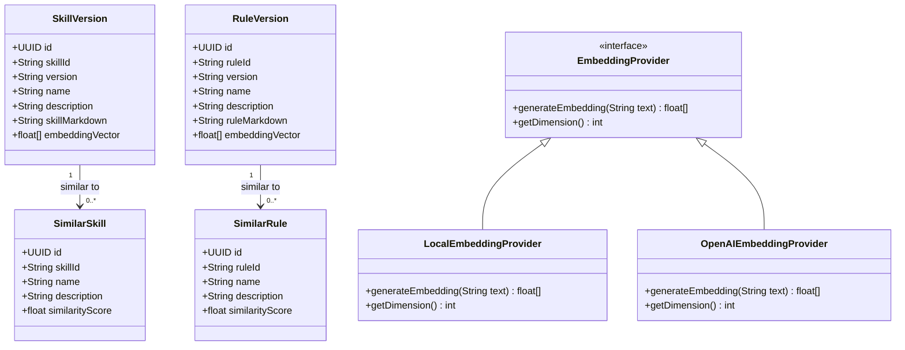

# Domain Entities: Embeddings for Skills and Rules

**Document Version:** 1.0
**Date:** 2026-04-16
**Author:** AI Functional Design Agent
**Status:** Draft

---

## Overview

Документ описывает доменные сущности для функциональности "Embeddings for Skills and Rules". Основная сущность — это расширение существующих entities `SkillVersion` и `RuleVersion` для поддержки векторных представлений (embeddings) с целью поиска похожих элементов.

---

## Domain Entities

### 1. EmbeddingVector (Value Object)

**Описание:** Значение-объект, представляющий векторное представление текстового контента.

**Атрибуты:**

| Атрибут | Тип | Описание | Constraints |
|---------|-----|----------|-------------|
| `vector` | `float[]` | Массив чисел с плавающей точкой | Размер: 384 (Sentence-BERT) или 1536 (OpenAI), nullable |
| `dimension` | `int` | Размерность вектора | Фиксировано: 384 или 1536 |
| `provider` | `String` | Провайдер генерации embedding | `LOCAL` (Sentence-BERT) или `OPENAI` |
| `generatedAt` | `Instant` | Время генерации | Автоматически при сохранении |

**Инварианты:**
- INV-1: Размер вектора должен соответствовать `dimension`
- INV-2: Все значения вектора должны быть в диапазоне [-1.0, 1.0]
- INV-3: `vector` может быть `null` (если контент пустой или генерация не удалась)

**Отношения:**
- Встраивается в `SkillVersion` как `embeddingVector`
- Встраивается в `RuleVersion` как `embeddingVector`

---

### 2. SimilarItem (DTO)

**Описание:** Результат поиска похожих элементов.

**Атрибуты:**

| Атрибут | Тип | Описание | Constraints |
|---------|-----|----------|-------------|
| `id` | `UUID` | Уникальный идентификатор версии | Not null |
| `itemId` | `String` | Бизнес-ключ (skillId/ruleId) | Not null |
| `version` | `String` | Версия (semver) | Not null |
| `name` | `String` | Название элемента | Not null |
| `description` | `String` | Описание элемента | Nullable |
| `similarityScore` | `float` | Коэффициент сходства (косинусное) | [0.0, 1.0], порог > 0.6 |
| `tags` | `List<String>` | Теги элемента | Nullable |
| `teamCode` | `String` | Код команды | Nullable |
| `scope` | `String` | Область видимости | Nullable |

**Инварианты:**
- INV-1: `similarityScore` должен быть в диапазоне [0.0, 1.0]
- INV-2: Элемент должен иметь статус `PUBLISHED`
- INV-3: Элемент не должен быть самим собой (исключение из результатов)

---

### 3. Extended SkillVersion Entity

**Описание:** Расширение существующей сущности `SkillVersion` для поддержки embeddings.

**Новые атрибуты:**

| Атрибут | Тип | Описание | Constraints |
|---------|-----|----------|-------------|
| `embeddingVector` | `float[]` | Векторное представление skillMarkdown | Nullable, columnDefinition="vector" |

**Инварианты:**
- INV-1: `embeddingVector` генерируется только из `skillMarkdown`
- INV-2: `embeddingVector` обновляется при изменении `skillMarkdown`
- INV-3: `embeddingVector` может быть `null` если `skillMarkdown` пустой или генерация не удалась

**Отношения:**
- *Many-to-One:* `SimilarSkill` ← `SkillVersion` (поиск похожих)

---

### 4. Extended RuleVersion Entity

**Описание:** Расширение существующей сущности `RuleVersion` для поддержки embeddings.

**Новые атрибуты:**

| Атрибут | Тип | Описание | Constraints |
|---------|-----|----------|-------------|
| `embeddingVector` | `float[]` | Векторное представление ruleMarkdown | Nullable, columnDefinition="vector" |

**Инварианты:**
- INV-1: `embeddingVector` генерируется только из `ruleMarkdown`
- INV-2: `embeddingVector` обновляется при изменении `ruleMarkdown`
- INV-3: `embeddingVector` может быть `null` если `ruleMarkdown` пустой или генерация не удалась

**Отношения:**
- *Many-to-One:* `SimilarRule` ← `RuleVersion` (поиск похожих)

---

### 5. EmbeddingGenerationRequest (Command)

**Описание:** Команда для генерации embedding.

**Атрибуты:**

| Атрибут | Тип | Описание | Constraints |
|---------|-----|----------|-------------|
| `entityId` | `UUID` | ID сущности (skill/rule version) | Not null |
| `entityType` | `EntityType` | Тип сущности (`SKILL` или `RULE`) | Not null |
| `markdown` | `String` | Markdown контент | Not blank |
| `provider` | `String` | Провайдер генерации | Default: `LOCAL` |

---

### 6. SimilarItemsSearchRequest (Query)

**Описание:** Запрос для поиска похожих элементов.

**Варианты:**

**Вариант 1: Поиск по ID элемента**
| Атрибут | Тип | Описание | Constraints |
|---------|-----|----------|-------------|
| `entityId` | `UUID` | ID текущего элемента | Not null |
| `entityType` | `EntityType` | Тип сущности (`SKILL` или `RULE`) | Not null |
| `threshold` | `float` | Порог сходства | Default: 0.6 |
| `limit` | `int` | Макс. количество результатов | Default: 10 |

**Вариант 2: Поиск по произвольному тексту**
| Атрибут | Тип | Описание | Constraints |
|---------|-----|----------|-------------|
| `text` | `String` | Текст для поиска | Not blank |
| `entityType` | `EntityType` | Тип сущности (`SKILL` или `RULE`) | Not null |
| `threshold` | `float` | Порог сходства | Default: 0.6 |
| `limit` | `int` | Макс. количество результатов | Default: 5 |

---

### 7. EmbeddingProvider (Strategy Interface)

**Описание:** Интерфейс для стратегий генерации embeddings.

**Методы:**
- `float[] generateEmbedding(String text)` — генерирует вектор из текста
- `int getDimension()` — возвращает размерность вектора

**Реализации:**
- `LocalEmbeddingProvider` — использует Sentence-BERT (384-dim)
- `OpenAIEmbeddingProvider` — использует OpenAI API (1536-dim)

---

## Entity Relationships



---

## Aggregate Roots

### SkillVersion Aggregate
- **Root:** `SkillVersion`
- **Entities:** Нет (embeddingVector — часть агрегата)
- **Value Objects:** `EmbeddingVector`
- **Repositories:** `SkillVersionRepository`

### RuleVersion Aggregate
- **Root:** `RuleVersion`
- **Entities:** Нет (embeddingVector — часть агрегата)
- **Value Objects:** `EmbeddingVector`
- **Repositories:** `RuleVersionRepository`

---

## Database Schema Changes

### Table: skills

```sql
-- Новая колонка
ALTER TABLE skills ADD COLUMN embedding_vector vector(384);

-- Индекс для быстрого поиска (IVFFlat)
CREATE INDEX idx_skills_embedding_vector ON skills
USING ivfflat (embedding_vector vector_cosine_ops)
WITH (lists = 100);
```

### Table: rules

```sql
-- Новая колонка
ALTER TABLE rules ADD COLUMN embedding_vector vector(384);

-- Индекс для быстрого поиска (IVFFlat)
CREATE INDEX idx_rules_embedding_vector ON rules
USING ivfflat (embedding_vector vector_cosine_ops)
WITH (lists = 100);
```

---

## Type Definitions

### EntityType (Enum)

```java
public enum EntityType {
    SKILL,
    RULE
}
```

### EmbeddingProviderType (Enum)

```java
public enum EmbeddingProviderType {
    LOCAL,      // Sentence-BERT
    OPENAI      // OpenAI API
}
```

---

**Document End**
