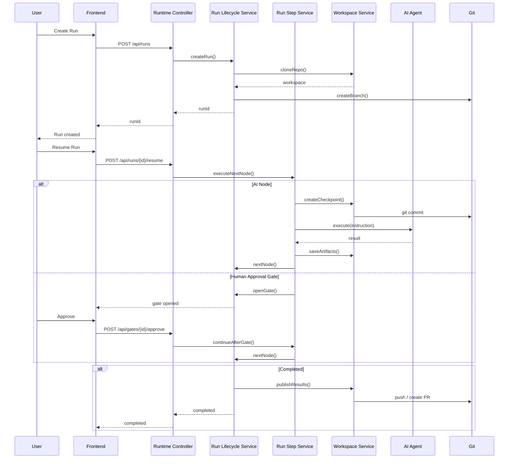
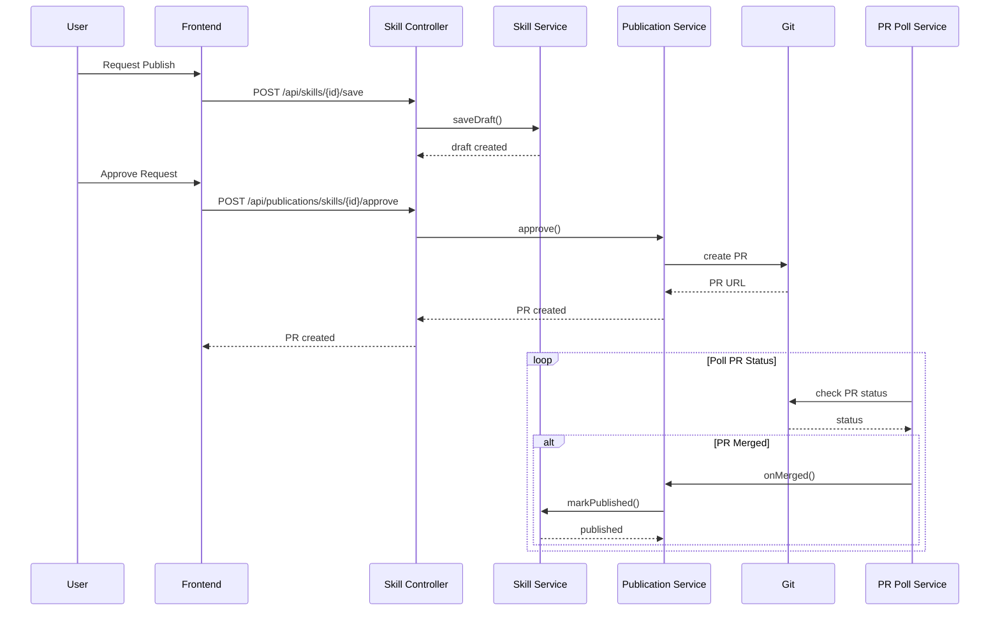

# System Architecture

## System Overview

Human Guided SDLC — это веб-приложение с классической трёхслойной архитектурой:

1. **Frontend (SPA)** — React 18 + Vite с Ant Design, обеспечивает UI и взаимодействие с пользователем
2. **Backend (REST API)** — Spring Boot 3.3 на Java 21, обеспечивает бизнес-логику и API
3. **Database** — PostgreSQL (production) / H2 (development), хранит все данные приложения

Система не использует микросервисы — это монолитное приложение с модульной внутренней структурой по принципам DDD (Domain-Driven Design).

## Architecture Diagram

```mermaid
graph TB
    subgraph "Frontend Layer"
        React[React SPA]
        Router[React Router]
        Pages[Pages: Flows, Rules, Skills, Run Console, etc.]
        Components[Components: FlowEditor, Gates, Artifacts, etc.]
    end

    subgraph "API Layer (REST)"
        AuthC[Auth Controller]
        FlowC[Flow Controller]
        RuleC[Rule Controller]
        SkillC[Skill Controller]
        RuntimeC[Runtime Controller]
        ProjectC[Project Controller]
        PubC[Publication Controller]
        BenchC[Benchmark Controller]
        SettingsC[Settings Controller]
    end

    subgraph "Application Layer (Business Logic)"
        AuthS[Auth Service]
        FlowS[Flow Service]
        RuleS[Rule Service]
        SkillS[Skill Service]
        RuntimeCmd[Runtime Command Service]
        RuntimeQ[Runtime Query Service]
        RunStep[Run Step Service]
        RunLife[Run Lifecycle Service]
        RunPub[Run Publish Service]
        Gate[Gate Service]
        Workspace[Workspace Service]
        PubS[Publication Service]
        BenchS[Benchmark Service]
        Catalog[Catalog Service]
    end

    subgraph "Domain Layer (JPA Entities)"
        User[User, Session]
        FlowEnt[FlowVersion]
        RuleEnt[RuleVersion]
        SkillEnt[SkillVersion, SkillFile]
        RunEnt[Run, NodeExecution, Gate, Artifact, AuditEvent]
        ProjectEnt[Project]
        PubEnt[PublicationRequest, PublicationJob, PublicationApproval]
        BenchEnt[BenchmarkCase, BenchmarkRun]
        SettingsEnt[SystemSetting]
        Idemp[IdempotencyRecord]
    end

    subgraph "Infrastructure Layer"
        FlowRepo[Flow Repository]
        RuleRepo[Rule Repository]
        SkillRepo[Skill Repository]
        RunRepo[Run Repository]
        GateRepo[Gate Repository]
        ArtifactRepo[Artifact Repository]
        AuditRepo[Audit Repository]
        ProjectRepo[Project Repository]
        PubRepo[Publication Repository]
        BenchRepo[Benchmark Repository]
        SettingsRepo[Settings Repository]
        IdempRepo[Idempotency Repository]
    end

    subgraph "External Systems"
        Git[(Git Repositories)]
        Catalog[External Catalog]
        AI[AI Agents: Claude, Qwen, GigaCode]
    end

    React -->|HTTP/REST| AuthC
    React -->|HTTP/REST| FlowC
    React -->|HTTP/REST| RuleC
    React -->|HTTP/REST| SkillC
    React -->|HTTP/REST| RuntimeC
    React -->|HTTP/REST| ProjectC
    React -->|HTTP/REST| PubC
    React -->|HTTP/REST| BenchC
    React -->|HTTP/REST| SettingsC

    AuthC --> AuthS
    FlowC --> FlowS
    RuleC --> RuleS
    SkillC --> SkillS
    RuntimeC --> RuntimeCmd
    RuntimeC --> RuntimeQ
    ProjectC --> ProjectS
    PubC --> PubS
    BenchC --> BenchS
    SettingsC --> SettingsS

    AuthS --> User
    FlowS --> FlowRepo
    RuleS --> RuleRepo
    SkillS --> SkillRepo
    RuntimeCmd --> RunStep
    RuntimeCmd --> RunLife
    RuntimeCmd --> Gate
    RuntimeCmd --> Workspace
    RuntimeQ --> RunRepo
    RuntimeQ --> GateRepo
    RuntimeQ --> ArtifactRepo
    RuntimeQ --> AuditRepo
    RunStep --> RunEnt
    RunLife --> RunEnt
    Gate --> GateRepo
    Workspace --> Git
    PubS --> PubEnt
    PubS --> Git
    BenchS --> BenchEnt
    SettingsS --> Catalog

    FlowRepo --> FlowEnt
    RuleRepo --> RuleEnt
    SkillRepo --> SkillEnt
    RunRepo --> RunEnt
    GateRepo --> GateEnt
    ArtifactRepo --> ArtifactEnt
    AuditRepo --> AuditEventEnt
    ProjectRepo --> ProjectEnt
    PubRepo --> PubEnt
    BenchRepo --> BenchEnt
    SettingsRepo --> SettingsEnt
    IdempRepo --> Idemp

    RunStep --> AI
    Workspace --> Git
    RunPub --> Git
    PubS --> Git
    Catalog --> Git
```

## Component Descriptions

### Frontend Layer

#### React SPA
- **Purpose:** Единое-page приложение для взаимодействия с системой
- **Responsibilities:**
  - Рендеринг UI страниц и компонентов
  - Управление routing (React Router)
  - Управление состоянием (AuthContext, ThemeContext)
  - Взаимодействие с backend API
- **Dependencies:** Backend REST API
- **Type:** Application (Client)

#### Pages
- **Purpose:** Страницы приложения
- **Responsibilities:**
  - Login
  - Overview (dashboard)
  - Flows (каталог и редактор)
  - Rules (каталог и редактор)
  - Skills (каталог и редактор)
  - Run Console (консоль запусков)
  - Gates Inbox (входящие гейты)
  - Requests (очередь публикации)
  - Benchmark (A/B тестирование)
  - Settings (настройки runtime)
  - Users (управление пользователями)
- **Dependencies:** Backend API, React Components
- **Type:** Application (UI)

#### Components
- **Purpose:** Переиспользуемые компоненты UI
- **Responsibilities:**
  - AppShell (layout)
  - FlowEditor (редактор flow с ReactFlow + Monaco)
  - NodeEditPanel (редактирование ноды)
  - ActionCenter (центр действий для gates)
  - ArtifactViewer (просмотрщик артефактов)
  - MarkdownPreview (рендер markdown + mermaid)
  - HumanFormViewer (визуализатор форм для gates)
- **Dependencies:** React, Ant Design, ReactFlow, Monaco Editor
- **Type:** Application (UI Library)

### Backend API Layer

#### Auth Controller
- **Purpose:** REST endpoints для аутентификации
- **Responsibilities:**
  - POST /api/auth/login
  - POST /api/auth/logout
  - GET /api/auth/me
- **Dependencies:** AuthService
- **Type:** Application (REST API)

#### Flow Controller
- **Purpose:** REST endpoints для управления flows
- **Responsibilities:**
  - GET /api/flows (список)
  - GET /api/flows/query (поиск)
  - GET /api/flows/{flowId} (детали)
  - GET /api/flows/{flowId}/versions (версии)
  - POST /api/flows/{flowId}/save (сохранение)
  - POST /api/flows/{flowId}/deprecate (деприкация)
- **Dependencies:** FlowService
- **Type:** Application (REST API)

#### Rule Controller
- **Purpose:** REST endpoints для управления rules
- **Responsibilities:**
  - GET /api/rules (список)
  - GET /api/rules/query (поиск)
  - GET /api/rules/{ruleId} (детали)
  - GET /api/rules/{ruleId}/versions (версии)
  - POST /api/rules/{ruleId}/save (сохранение)
  - POST /api/rules/{ruleId}/deprecate (деприкация)
- **Dependencies:** RuleService, RuleTemplateService
- **Type:** Application (REST API)

#### Skill Controller
- **Purpose:** REST endpoints для управления skills
- **Responsibilities:**
  - GET /api/skills (список)
  - GET /api/skills/query (поиск)
  - GET /api/skills/{skillId} (детали)
  - GET /api/skills/{skillId}/versions (версии)
  - GET /api/skills/{skillId}/versions/{version}/files (файлы)
  - POST /api/skills/{skillId}/save (сохранение)
  - POST /api/skills/{skillId}/approve (approve)
  - POST /api/skills/{skillId}/reject (reject)
- **Dependencies:** SkillService, SkillTemplateService
- **Type:** Application (REST API)

#### Runtime Controller
- **Purpose:** REST endpoints для выполнения flows
- **Responsibilities:**
  - POST /api/runs (создание run)
  - GET /api/runs/{runId} (детали)
  - POST /api/runs/{runId}/resume (продолжение)
  - POST /api/runs/{runId}/cancel (отмена)
  - GET /api/runs/{runId}/nodes (ноды)
  - GET /api/runs/{runId}/artifacts (артефакты)
  - GET /api/runs/{runId}/artifacts/{id}/content (контент)
  - GET /api/gates/inbox (inbox)
  - POST /api/gates/{gateId}/approve (approve)
  - POST /api/gates/{gateId}/request-rework (rework)
  - GET /api/runs/{runId}/audit (аудит)
- **Dependencies:** RuntimeCommandService, RuntimeQueryService
- **Type:** Application (REST API)

#### Project Controller
- **Purpose:** REST endpoints для управления проектами
- **Responsibilities:**
  - GET /api/projects (список)
  - POST /api/projects (создание)
  - PATCH /api/projects/{id} (обновление)
  - DELETE /api/projects/{id} (удаление)
- **Dependencies:** ProjectService
- **Type:** Application (REST API)

#### Publication Controller
- **Purpose:** REST endpoints для публикации
- **Responsibilities:**
  - GET /api/publications/requests (запросы)
  - GET /api/publications/jobs (jobs)
  - POST /api/publications/skills/{id}/versions/{v}/approve (approve)
  - POST /api/publications/skills/{id}/versions/{v}/reject (reject)
  - POST /api/publications/skills/{id}/versions/{v}/retry (retry)
- **Dependencies:** PublicationService
- **Type:** Application (REST API)

#### Benchmark Controller
- **Purpose:** REST endpoints для бенчмаркинга
- **Responsibilities:**
  - POST /api/benchmark/cases (создание case)
  - GET /api/benchmark/cases (список)
  - POST /api/benchmark/runs (запуск)
  - GET /api/benchmark/runs (список)
  - POST /api/benchmark/runs/{id}/verdict (verdict)
- **Dependencies:** BenchmarkService
- **Type:** Application (REST API)

### Application Layer

#### Runtime Command Service
- **Purpose:** Команды для управления runs
- **Responsibilities:**
  - createRun — создание run
  - resumeRun — продолжение run после gate
  - cancelRun — отмена run
  - submitInput — отправка input в gate
  - approveGate — approve gate
  - requestRework — запрос rework
- **Dependencies:** RunLifecycleService, RunStepService, GateDecisionService
- **Type:** Application (Business Logic)

#### Runtime Query Service
- **Purpose:** Запросы для получения данных о runs
- **Responsibilities:**
  - findRun — получение run
  - findNodeExecutions — получение нод
  - findArtifacts — получение артефактов
  - findGateInbox — получение inbox gates
  - findAuditEvents — поиск в аудите
- **Dependencies:** RunRepository, GateRepository, ArtifactRepository, AuditEventRepository
- **Type:** Application (Query)

#### Run Step Service
- **Purpose:** Выполнение одного шага run
- **Responsibilities:**
  - Выполнение ноды (ai, command, human_approval, human_input, terminal)
  - Создание checkpoint перед AI-нодой
  - Управление artifact-ами
  - Обработка ошибок и retry
- **Dependencies:** NodeExecutionRepository, ArtifactRepository, WorkspaceService
- **Type:** Application (Business Logic)

#### Run Lifecycle Service
- **Purpose:** Управление жизненным циклом run
- **Responsibilities:**
  - Создание run
  - Переход между статусами
  - Завершение run
  - Управление publish режимом
- **Dependencies:** RunRepository
- **Type:** Application (Business Logic)

#### Gate Service
- **Purpose:** Управление gates
- **Responsibilities:**
  - Открытие gate
  - Обработка input/approval
  - Rework с откатом к checkpoint
  - Gate chat
- **Dependencies:** GateRepository, WorkspaceService
- **Type:** Application (Business Logic)

#### Workspace Service
- **Purpose:** Управление workspace (git репозиторий)
- **Responsibilities:**
  - Клонирование репозитория
  - Создание checkpoint (git commit)
  - Откат к checkpoint (git reset)
  - Чтение/запись файлов
  - Git diff
  - Публикация (push/PR)
- **Dependencies:** Git (external)
- **Type:** Application (Infrastructure Wrapper)

#### Flow Service
- **Purpose:** Управление flows
- **Responsibilities:**
  - CRUD операций над flows
  - Парсинг YAML
  - Валидация
  - Версионирование
  - Публикация
- **Dependencies:** FlowRepository, FlowYamlParser, FlowValidator
- **Type:** Application (Business Logic)

#### Publication Service
- **Purpose:** Управление публикацией
- **Responsibilities:**
  - Создание publication request
  - Approval workflow
  - Создание PR в git
  - Polling статуса PR
  - Retry при ошибках
- **Dependencies:** PublicationRepository, Git
- **Type:** Application (Business Logic)

#### Catalog Service
- **Purpose:** Синхронизация каталога
- **Responsibilities:**
  - Клонирование catalog repo
  - Парсинг flows/rules/skills из git
  - Upsert в базу данных
  - Валидация
- **Dependencies:** Git, FlowService, RuleService, SkillService
- **Type:** Application (Business Logic)

### Domain Layer

#### JPA Entities
- **Purpose:** Доменная модель данных
- **Responsibilities:**
  - User, AuthSession — пользователи и сессии
  - FlowVersion — версии flows
  - RuleVersion — версии rules
  - SkillVersion, SkillFile — версии skills и файлы
  - RunEntity, NodeExecutionEntity, GateInstanceEntity, ArtifactVersionEntity — runs
  - AuditEventEntity — аудит
  - Project — проекты
  - PublicationRequest, PublicationJob, PublicationApproval — публикация
  - BenchmarkCaseEntity, BenchmarkRunEntity — бенчмарки
  - SystemSetting — настройки
  - IdempotencyRecord — идемпотентность
- **Dependencies:** Нет (чистая доменная модель)
- **Type:** Domain (Model)

### Infrastructure Layer

#### Repositories
- **Purpose:** Spring Data JPA репозитории
- **Responsibilities:**
  - UserRepository
  - FlowVersionRepository
  - RuleVersionRepository
  - SkillVersionRepository, SkillFileRepository
  - RunRepository, NodeExecutionRepository, GateRepository, ArtifactRepository, AuditEventRepository
  - ProjectRepository
  - PublicationRequestRepository, PublicationJobRepository, PublicationApprovalRepository
  - BenchmarkCaseRepository, BenchmarkRunRepository
  - SystemSettingRepository
  - IdempotencyRecordRepository
- **Dependencies:** JPA/Hibernate, Database
- **Type:** Infrastructure (Persistence)

## Data Flow

### Flow Execution Flow

### Publication Flow

## Integration Points

### External APIs

| Интеграция | Тип | Назначение |
|------------|-----|------------|
| **Git Repositories** | Bidirectional | Клонирование, чтение/запись файлов, создание checkpoint, публикация |
| **AI Coding Agents** | Unidirectional | Выполнение инструкций (Claude, Qwen, GigaCode) |
| **External Catalog** | Unidirectional | Синхронизация flows/rules/skills из git |

### Databases

| База данных | Тип | Назначение |
|-------------|-----|------------|
| **PostgreSQL** | Relational | Основное хранилище данных (production) |
| **H2** | In-Memory | Быстрый старт для разработки |

### Third-party Services

| Сервис | Назначение |
|--------|------------|
| **Spring Boot Actuator** | Health checks и метрики |
| **Liquibase** | Миграции базы данных |
| **Git** | Версионирование кода и checkpoint-ов |

## Infrastructure Components

### Deployment Model

**Local Development:**
- Backend: Spring Boot (./gradlew bootRun)
- Frontend: Vite dev server (npm run dev)
- Database: PostgreSQL via Docker Compose или H2 in-memory

**Production:**
- Backend: Spring Boot JAR
- Frontend: Static files (nginx или встроенный в Spring Boot)
- Database: PostgreSQL

### Networking

**Ports:**
- Frontend: 5173 (dev) / 80/443 (production)
- Backend: 8080
- PostgreSQL: 5432

**Security:**
- Сессионная аутентификация (Spring Security)
- CORS для frontend
- Role-based access control (@PreAuthorize)

### Storage

**Database:**
- 21 таблица (users, flows, rules, skills, runs, gates, artifacts, audits, etc.)
- Индексы на frequently queried полях
- Optimistic locking через resourceVersion

**File Storage:**
- Git репозитории (проекты)
- Artifacts хранятся в БД (base64) или в файловой системе (workspace)
- Catalog (flows/rules/skills) в БД + git

### Scalability

**Current:**
- Монолитное приложение
- Горизонтальное масштабирование через несколько инстансов
- Сессии хранятся в БД (можно вынести в Redis)

**Future:**
- Вынос scheduler-ов (publication polling, benchmark)
- Кэширование (Redis)
- Message queue для асинхронных задач
