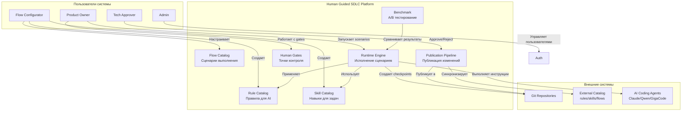

# Business Overview

## Business Context Diagram

## Business Description

**Business Description:**
Human Guided SDLC — это платформа для управляемого выполнения задач кодинг-агентом (AI coding agent). Система предоставляет контролируемый runtime для выполнения flows (программируемых сценариев) с точками человеческого контроля (gates), версионированием правил/инструкций и полным аудитом всех действий. Платформа позволяет командам разрабатывать ПО с помощью AI-агентов, сохраняя полный контроль над процессом через checkpoints, approval workflow и A/B бенчмаркинг.

**Ключевые бизнес-цели:**
1. **Контролируемое AI-разработка** — выполнение AI-агентом задач с человеческим надзором
2. **Версионирование знаний** — управление версиями flows, rules, skills с approval workflow
3. **Аудит и воспроизводимость** — полный аудит всех действий и способность откатиться к checkpoint
4. **Benchmarking** — A/A и A/B сравнение результатов работы разных AI-агентов
5. **Мультиагентность** — поддержка Claude, Qwen, GigaCode с единым интерфейсом

## Business Transactions

| Транзакция | Описание | Участники |
|------------|----------|-----------|
| **Create Flow** | Создание YAML-сценария выполнения задачи | Flow Configurator |
| **Publish Flow** | Публикация flow через approval workflow | Flow Configurator → Tech Approver |
| **Create Rule** | Создание правила для AI-агента | Flow Configurator |
| **Create Skill** | Создание навыка для конкретной задачи | Flow Configurator |
| **Run Flow** | Запуск flow на проекте | Product Owner |
| **Approve Gate** | Одобрение изменений на гейте | Product Owner, Tech Approver |
| **Request Rework** | Запрос доработки с откатом | Product Owner, Tech Approver |
| **Publish Results** | Публикация результатов run в git | Runtime (автоматически или после approval) |
| **Benchmark Run** | A/B тестирование AI-агентов | Flow Configurator, Product Owner |
| **Manage Users** | Управление пользователями и ролями | Admin |
| **Sync Catalog** | Синхронизация каталога rules/skills/flows | System, Flow Configurator |

## Business Dictionary

| Термин | Определение |
|--------|-------------|
| **Flow** | YAML-сценарий, описывающий граф шагов (нод), которые должен выполнить AI-агент |
| **Node** | Один шаг в flow: ai, human_approval, human_input, command, terminal |
| **Rule** | Markdown-документ с правилами, которые AI-агент обязан соблюдать во всех нодах flow |
| **Skill** | Markdown-документ с инструкцией для выполнения конкретной задачи в отдельной ноде |
| **Run** | Один запуск flow на конкретном проекте (репозитории) |
| **Gate** | Точка остановки в run, ожидающая действия человека (input или approval) |
| **Checkpoint** | Git-коммит, автоматически создаваемый перед AI-нодой для возможности отката |
| **Artifact** | Файл, созданный или изменённый в ходе выполнения ноды (project или run scope) |
| **Publication** | Процесс публикации flow/rule/skill в git и/или базу данных через approval workflow |
| **Benchmark** | A/A или A/B тестирование для сравнения результатов работы AI-агентов |

## Component Level Business Descriptions

### Auth Module
- **Purpose:** Управление аутентификацией, сессиями и ролями пользователей
- **Responsibilities:**
  - Логин/логаут с сессионной аутентификацией
  - Управление пользователями (CRUD)
  - Управление ролями (ADMIN, FLOW_CONFIGURATOR, PRODUCT_OWNER, TECH_APPROVER)
  - Seed-пользователи для быстрого старта

### Flow Module
- **Purpose:** Каталог и версионирование YAML-сценариев (flows)
- **Responsibilities:**
  - CRUD операций над flows
  - Версионирование (semver) с draft/published статусами
  - Парсинг и валидация YAML
  - Публикация через approval workflow
  - Поддержка coding agents (Claude, Qwen, GigaCode)
  - Теги, team/platform scope, risk level

### Rule Module
- **Purpose:** Каталог правил для AI-агентов
- **Responsibilities:**
  - CRUD операций над rules
  - Версионирование с draft/published статусами
  - Markdown-документы с правилами
  - Публикация через approval workflow
  - Применение ко всем AI-нодам flow целиком

### Skill Module
- **Purpose:** Каталог навыков для конкретных задач
- **Responsibilities:**
  - CRUD операций над skills
  - Версионирование с draft/published статусами
  - Markdown-документы с инструкциями
  - Управление файлами (skill markdown, context, schema, examples)
  - Публикация через approval workflow
  - Подключение к отдельным нодам flow

### Runtime Module
- **Purpose:** Исполнение flows с аудитами и gates
- **Responsibilities:**
  - Создание и запуск run
  - Выполнение нод (ai, command, human_approval, human_input, terminal)
  - Управление gates (input/approval)
  - Создание checkpoints перед AI-нодами
  - Управление артефактами (файлами)
  - Полный аудит всех действий
  - Публикация результатов (local, push, PR)
  - Rework с откатом к checkpoint

### Project Module
- **Purpose:** Управление проектами (репозиториями)
- **Responsibilities:**
  - CRUD операций над проектами
  - Связь с git-репозиторием (repoUrl, defaultBranch)
  - Архивирование проектов
  - История запусков

### Publication Module
- **Purpose:** Pipeline публикации flows/rules/skills
- **Responsibilities:**
  - Approval workflow (draft → pending → approved → published)
  - Управление publication requests и jobs
  - Создание PR в git
  - Polling статуса PR
  - Retry при ошибках

### Benchmark Module
- **Purpose:** A/A и A/B тестирование AI-агентов
- **Responsibilities:**
  - Создание benchmark cases
  - Запуск benchmark runs
  - Сравнение артефактов (diff)
  - Сбор вердиктов от людей
  - A/A тестирование (один агент)
  - A/B тестирование (два агента)

### Settings Module
- **Purpose:** Системные настройки
- **Responsibilities:**
  - Runtime настройки (agent commands, budgets)
  - Catalog настройки (repo URL, branch)
  - Git credentials
  - Sync catalog с внешним репозиторием

### Dashboard Module
- **Purpose:** Агрегированные метрики
- **Responsibilities:**
  - Overview с метриками
  - Recent runs
  - Gate inbox
  - Statistics

### Idempotency Module
- **Purpose:** Идемпотентность API
- **Responsibilities:**
  - Предотвращение дублирования операций
  - Hash-based проверка
  - Возврат кэшированного результата

### Common Module
- **Purpose:** Общие утилиты и исключения
- **Responsibilities:**
  - Стандартные исключения (NotFoundException, ValidationException, etc.)
  - Утилиты для работы с JSON, YAML
  - Общие DTO

### Platform Module
- **Purpose:** Spring Security конфигурация
- **Responsibilities:**
  - Security config
  - CORS
  - Session management
  - Role-based access control
