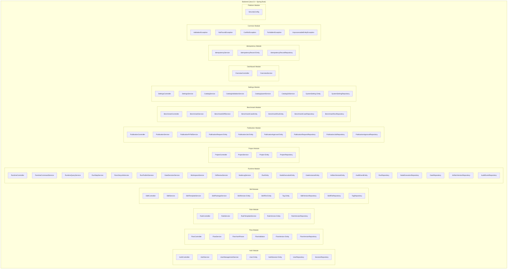
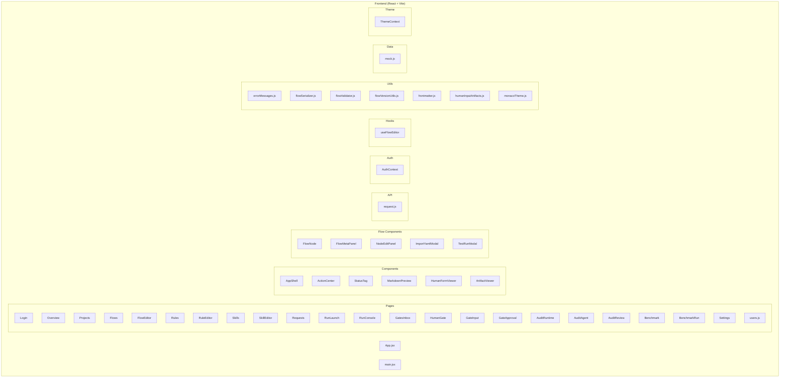

# Code Structure

## Build System

### Backend

**Type:** Gradle (Kotlin DSL)

**Configuration Files:**
- `backend/build.gradle.kts` — основной build файл
- `backend/settings.gradle.kts` — настройки проекта
- `backend/gradlew` — Gradle wrapper

**Key Settings:**
- Java 21 (source & target compatibility)
- Spring Boot 3.3.0
- Spring Dependency Management 1.1.5
- Lombok 1.18.42 (compileOnly + annotationProcessor)

**Build Commands:**
```bash
./gradlew build          # Сборка
./gradlew bootRun        # Запуск
./gradlew test           # Тесты
```

**Dependencies Management:**
- Maven Central
- Testcontainers BOM 1.19.8

### Frontend

**Type:** npm + Vite

**Configuration Files:**
- `frontend/package.json` — зависимости и скрипты
- `frontend/vite.config.js` — конфигурация Vite (если есть)

**Key Settings:**
- React 18.2.0
- Vite 5.2.0
- Ant Design 5.15.0
- TypeScript не используется (JavaScript JSX)

**Build Commands:**
```bash
npm install              # Установка зависимостей
npm run dev              # Dev server (localhost:5173)
npm run build            # Production build
npm run preview          # Preview production build
```

## Key Classes/Modules

### Backend Module Structure



### Frontend Module Structure



### Existing Files Inventory

#### Backend Java Files

**Auth Module:**
- `backend/src/main/java/ru/hgd/sdlc/auth/api/AuthController.java` — REST контроллер аутентификации
- `backend/src/main/java/ru/hgd/sdlc/auth/application/AuthService.java` — сервис аутентификации
- `backend/src/main/java/ru/hgd/sdlc/auth/application/UserManagementService.java` — сервис управления пользователями
- `backend/src/main/java/ru/hgd/sdlc/auth/domain/User.java` — сущность пользователя
- `backend/src/main/java/ru/hgd/sdlc/auth/domain/Role.java` — enum ролей
- `backend/src/main/java/ru/hgd/sdlc/auth/domain/AuthSession.java` — сущность сессии
- `backend/src/main/java/ru/hgd/sdlc/auth/infrastructure/UserRepository.java` — репозиторий пользователей
- `backend/src/main/java/ru/hgd/sdlc/auth/infrastructure/SessionRepository.java` — репозиторий сессий

**Flow Module:**
- `backend/src/main/java/ru/hgd/sdlc/flow/api/FlowController.java` — REST контроллер flows
- `backend/src/main/java/ru/hgd/sdlc/flow/application/FlowService.java` — сервис flows
- `backend/src/main/java/ru/hgd/sdlc/flow/application/FlowYamlParser.java` — парсер YAML
- `backend/src/main/java/ru/hgd/sdlc/flow/application/FlowValidator.java` — валидатор flow
- `backend/src/main/java/ru/hgd/sdlc/flow/domain/FlowVersion.java` — сущность версии flow
- `backend/src/main/java/ru/hgd/sdlc/flow/domain/FlowStatus.java` — enum статусов
- `backend/src/main/java/ru/hgd/sdlc/flow/domain/NodeModel.java` — модель ноды
- `backend/src/main/java/ru/hgd/sdlc/flow/infrastructure/FlowVersionRepository.java` — репозиторий flows

**Runtime Module:**
- `backend/src/main/java/ru/hgd/sdlc/runtime/api/RuntimeController.java` — REST контроллер runtime
- `backend/src/main/java/ru/hgd/sdlc/runtime/application/RuntimeCommandService.java` — сервис команд runtime
- `backend/src/main/java/ru/hgd/sdlc/runtime/application/RuntimeQueryService.java` — сервис запросов runtime
- `backend/src/main/java/ru/hgd/sdlc/runtime/application/RunStepService.java` — сервис выполнения шагов
- `backend/src/main/java/ru/hgd/sdlc/runtime/application/RunLifecycleService.java` — сервис жизненного цикла
- `backend/src/main/java/ru/hgd/sdlc/runtime/application/RunPublishService.java` — сервис публикации
- `backend/src/main/java/ru/hgd/sdlc/runtime/application/GateDecisionService.java` — сервис gates
- `backend/src/main/java/ru/hgd/sdlc/runtime/application/WorkspaceService.java` — сервис workspace
- `backend/src/main/java/ru/hgd/sdlc/runtime/domain/RunEntity.java` — сущность run
- `backend/src/main/java/ru/hgd/sdlc/runtime/domain/NodeExecutionEntity.java` — сущность выполнения ноды
- `backend/src/main/java/ru/hgd/sdlc/runtime/domain/GateInstanceEntity.java` — сущность gate
- `backend/src/main/java/ru/hgd/sdlc/runtime/domain/ArtifactVersionEntity.java` — сущность артефакта
- `backend/src/main/java/ru/hgd/sdlc/runtime/domain/AuditEventEntity.java` — сущность аудита

**Common Module:**
- `backend/src/main/java/ru/hgd/sdlc/common/ValidationException.java` — исключение валидации
- `backend/src/main/java/ru/hgd/sdlc/common/NotFoundException.java` — исключение "не найдено"
- `backend/src/main/java/ru/hgd/sdlc/common/ConflictException.java` — исключение конфликта
- `backend/src/main/java/ru/hgd/sdlc/common/ForbiddenException.java` — исключение доступа
- `backend/src/main/java/ru/hgd/sdlc/common/UnprocessableEntityException.java` — исключение обработки

#### Frontend Files

**Pages:**
- `frontend/src/pages/Login.jsx` — страница входа
- `frontend/src/pages/Overview.jsx` — дашборд
- `frontend/src/pages/Projects.jsx` — управление проектами
- `frontend/src/pages/Flows.jsx` — каталог flows
- `frontend/src/pages/FlowEditor.jsx` — редактор flow
- `frontend/src/pages/Rules.jsx` — каталог rules
- `frontend/src/pages/RuleEditor.jsx` — редактор rule
- `frontend/src/pages/Skills.jsx` — каталог skills
- `frontend/src/pages/SkillEditor.jsx` — редактор skill
- `frontend/src/pages/Requests.jsx` — очередь публикации
- `frontend/src/pages/RunLaunch.jsx` — запуск flow
- `frontend/src/pages/RunConsole.jsx` — консоль запусков
- `frontend/src/pages/GatesInbox.jsx` — входящие gates
- `frontend/src/pages/HumanGate.jsx` — человеческий gate
- `frontend/src/pages/GateInput.jsx` — input gate
- `frontend/src/pages/GateApproval.jsx` — approval gate
- `frontend/src/pages/AuditRuntime.jsx` — аудит runtime
- `frontend/src/pages/AuditAgent.jsx` — аудит агента
- `frontend/src/pages/AuditReview.jsx` — аудит ревью
- `frontend/src/pages/Benchmark.jsx` — бенчмарки
- `frontend/src/pages/BenchmarkRun.jsx` — запуск бенчмарка
- `frontend/src/pages/Settings.jsx` — настройки
- `frontend/src/pages/Users.jsx` — управление пользователями

**Components:**
- `frontend/src/components/AppShell.jsx` — главный layout
- `frontend/src/components/ActionCenter.jsx` — центр действий
- `frontend/src/components/StatusTag.jsx` — тег статуса
- `frontend/src/components/MarkdownPreview.jsx` — превью markdown
- `frontend/src/components/HumanFormViewer.jsx` — просмотрщик форм
- `frontend/src/components/ArtifactViewer.jsx` — просмотрщик артефактов

**Flow Components:**
- `frontend/src/components/flow/FlowNode.jsx` — нода flow
- `frontend/src/components/flow/FlowMetaPanel.jsx` — панель метаданных
- `frontend/src/components/flow/NodeEditPanel.jsx` — панель редактирования ноды
- `frontend/src/components/flow/ImportYamlModal.jsx` — модалка импорта YAML
- `frontend/src/components/flow/TestRunModal.jsx` — модалка тестового запуска

**API:**
- `frontend/src/api/request.js` — базовый API клиент
- `frontend/src/api/users.js` — API пользователей

**Hooks:**
- `frontend/src/hooks/useFlowEditor.js` — хук редактора flow

**Utils:**
- `frontend/src/utils/errorMessages.js` — локализация ошибок
- `frontend/src/utils/flowSerializer.js` — сериализация flow
- `frontend/src/utils/flowValidator.js` — валидация flow
- `frontend/src/utils/flowVersionUtils.js` — утилиты версионирования
- `frontend/src/utils/frontmatter.js` — парсинг frontmatter
- `frontend/src/utils/humanInputArtifacts.js` — артефакты input
- `frontend/src/utils/monacoTheme.js` — темы Monaco

## Design Patterns

### DDD Layered Architecture

**Location:** Все модули backend

**Purpose:** Разделение ответственности на 4 слоя

**Implementation:**
```
<module>/
├── api/            # REST контроллеры (DTO как record внутри)
├── application/    # Бизнес-логика (сервисы)
├── domain/         # JPA сущности, enums
└── infrastructure/ # Spring Data репозитории
```

**Benefits:**
- Чистое разделение слоёв
- Легко тестировать бизнес-логику
- Изоляция от инфраструктуры

### Repository Pattern

**Location:** `infrastructure/` каждого модуля

**Purpose:** Абстракция над персистентностью

**Implementation:**
```java
public interface FlowVersionRepository extends JpaRepository<FlowVersion, UUID> {
    Optional<FlowVersion> findByCanonicalName(String canonicalName);
    List<FlowVersion> findByFlowIdOrderByVersionDesc(String flowId);
}
```

**Benefits:**
- Spring Data JPA предоставляет CRUD автоматически
- Типобезопасность
- Легко мокать в тестах

### Service Layer Pattern

**Location:** `application/` каждого модуля

**Purpose:** Инкапсуляция бизнес-логики

**Implementation:**
```java
@Service
@Transactional
public class FlowService {
    private final FlowVersionRepository repository;
    private final FlowYamlParser parser;
    private final FlowValidator validator;

    public FlowVersion saveFlow(String flowId, String yaml) {
        FlowModel model = parser.parse(yaml);
        validator.validate(model);
        return repository.save(...)
    }
}
```

**Benefits:**
- Транзакционность (@Transactional)
- Композиция сервисов
- Переиспользование бизнес-логики

### DTO as Record Pattern

**Location:** Контроллеры в `api/` пакетах

**Purpose:** Минималистичные DTO без отдельных файлов

**Implementation:**
```java
@RestController
public class FlowController {
    public record CreateFlowRequest(
        String flowId,
        String title,
        String description
    ) {}

    public record FlowResponse(
        UUID id,
        String flowId,
        String version,
        FlowStatus status
    ) {}

    @PostMapping
    FlowResponse create(@RequestBody CreateFlowRequest request) {
        // ...
    }
}
```

**Benefits:**
- DTO рядом с использованием
- Меньше файлов
- Иммутабельность (record)

### Idempotency Pattern

**Location:** IdempotencyModule, все mutation endpoints

**Purpose:** Предотвращение дублирования операций

**Implementation:**
```java
@PostMapping
 ResponseEntity<?> create(
    @RequestHeader("Idempotency-Key") String key,
    @RequestBody CreateRequest request
) {
    return idempotencyService.executeOrReturnCached(key, "create", () -> {
        // логика создания
    });
}
```

**Benefits:**
- Безопасность при сетевых ошибках
- Соответствие RFC 9110

### Optimistic Locking Pattern

**Location:** Все JPA сущности

**Purpose:** Предотвращение конфликтов параллельного редактирования

**Implementation:**
```java
@Entity
public class FlowVersion {
    private long resourceVersion;

    @Version
    public long getResourceVersion() {
        return resourceVersion;
    }
}
```

**Benefits:**
- Автоматическая проверка конфликта
- JPA.managed

### Checkpoint Pattern

**Location:** Runtime, WorkspaceService

**Purpose:** Возможность отката к состоянию до AI-ноды

**Implementation:**
```java
if (node.isCheckpointBeforeRun()) {
    String commitSha = gitService.commitAll(workspaceRoot, "Checkpoint before node");
    nodeExecution.setCheckpointCommitSha(commitSha);
}
```

**Benefits:**
- Безопасность AI-изменений
- Возможность rework

### Gate Pattern

**Location:** Runtime, GateDecisionService

**Purpose:** Точки человеческого контроля в flow

**Implementation:**
```java
if (node.nodeKind == "human_approval") {
    Gate gate = gateService.openGate(runId, nodeId, GATE_KIND);
    run.setStatus(RunStatus.WAITING_GATE);
    // await approval
}
```

**Benefits:**
- Контроль AI-действий
- Rework с откатом

### Context Object Pattern

**Location:** ExecutionContext в NodeModel

**Purpose:** Передача артефактов между нодами

**Implementation:**
```java
executionContext:
  - user_request: "описание задачи"
  - artifact_ref:
      key: "source-code"
      path: "src/main/java/Main.java"
      transfer_mode: by_ref
```

**Benefits:**
- Декларативная композиция
- Оптимизация передачи данных

## Critical Dependencies

### Backend

#### Spring Boot 3.3.0
- **Version:** 3.3.0
- **Usage:** Основной фреймворк приложения
- **Purpose:** REST API, Security, JPA, Validation, Actuator
- **Why needed:** Стандарт для Java Enterprise приложений

#### Spring Security 6
- **Version:** (через spring-boot-starter-security)
- **Usage:** Аутентификация и авторизация
- **Purpose:** Сессионная аутентификация, role-based access control
- **Why needed:** Безопасность приложения

#### Jackson 2.17.1
- **Version:** 2.17.1
- **Usage:** JSON/YAML сериализация
- **Purpose:** Парсинг YAML flows, JSON API
- **Why needed:** Работа с конфигурациями и API

#### Liquibase Core
- **Version:** (через spring-boot-starter)
- **Usage:** Миграции БД
- **Purpose:** Версионирование схемы БД
- **Why needed:** Эволюция схемы БД без data loss

#### Lombok 1.18.42
- **Version:** 1.18.42
- **Usage:** Генерация кода (getters, setters, builders)
- **Purpose:** Сокращение бойлерплейта
- **Why needed:** Удобство разработки

#### PostgreSQL Driver
- **Version:** (через runtimeOnly)
- **Usage:** JDBC драйвер PostgreSQL
- **Purpose:** Подключение к PostgreSQL
- **Why needed:** Production database

#### H2 Database
- **Version:** (через runtimeOnly)
- **Usage:** In-memory database
- **Purpose:** Быстрый старт для разработки
- **Why needed:** Удобство локальной разработки

#### BouncyCastle 1.78.1
- **Version:** 1.78.1
- **Usage:** Криптография
- **Purpose:** Ed25519 поддержка
- **Why needed:** Git подписи

#### Testcontainers 1.19.8
- **Version:** 1.19.8
- **Usage:** Интеграционные тесты
- **Purpose:** Docker контейнеры для тестов
- **Why needed:** Реалистичные тесты

#### ArchUnit 1.3.0
- **Version:** 1.3.0
- **Usage:** Архитектурные тесты
- **Purpose:** Проверка правил архитектуры
- **Why needed:** Сохранение архитектуры

### Frontend

#### React 18.2.0
- **Version:** 18.2.0
- **Usage:** Основной UI фреймворк
- **Purpose:** Компонентный UI
- **Why needed:** Стандарт для React приложений

#### React Router DOM 6.22.0
- **Version:** 6.22.0
- **Usage:** Routing в SPA
- **Purpose:** Навигация между страницами
- **Why needed:** SPA навигация

#### Ant Design 5.15.0
- **Version:** 5.15.0
- **Usage:** UI библиотека компонентов
- **Purpose:** Готовые компоненты (таблицы, формы, модалки)
- **Why needed:** Скорость разработки, консистентный UI

#### ReactFlow 11.11.3
- **Version:** 11.11.3
- **Usage:** Визуальный редактор графов
- **Purpose:** Редактор flow (ноды и связи)
- **Why needed:** Визуальное редактирование flows

#### Monaco Editor 4.6.0
- **Version:** 4.6.0
- **Usage:** Редактор кода
- **Purpose:** Редактирование YAML, markdown, кода
- **Why needed:** Профессиональный редактор

#### YAML 2.4.5
- **Version:** 2.4.5
- **Usage:** Парсинг YAML
- **Purpose:** Парсинг flow YAML
- **Why needed:** Работа с конфигурациями

#### Mermaid 11.13.0
- **Version:** 11.13.0
- **Usage:** Рендер диаграмм
- **Purpose:** Визуализация диаграмм в markdown
- **Why needed:** Документация с диаграммами

#### Vite 5.2.0
- **Version:** 5.2.0
- **Usage:** Build tool
- **Purpose:** Dev server, production build
- **Why needed:** Быстрая сборка и HMR
