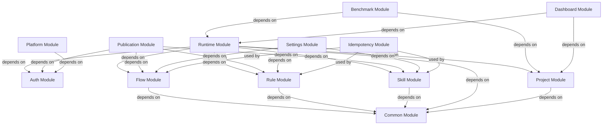

# Dependencies

## Internal Dependencies

### Backend Module Dependencies

### Dependency Details

#### Runtime Module → Flow Module
- **Type:** Compile
- **Reason:** Runtime загружает flow по canonicalName и использует FlowYamlParser

#### Runtime Module → Project Module
- **Type:** Compile
- **Reason:** Run связан с Project, нужен репозиторий для клонирования

#### Runtime Module → Skill/Rule Modules
- **Type:** Compile
- **Reason:** Runtime загружает skill/rule по refs для передачи AI-агенту

#### Runtime Module → Auth Module
- **Type:** Compile
- **Reason:** Операции gates требуют информации о пользователе и ролях

#### Publication Module → Flow/Rule/Skill Modules
- **Type:** Compile
- **Reason:** Publication публикует entities в git и обновляет статус

#### Benchmark Module → Runtime Module
- **Type:** Compile
- **Reason:** Benchmark создает и сравнивает два run

#### Dashboard Module → Runtime/Project Modules
- **Type:** Compile
- **Reason:** Dashboard агрегирует данные о runs и projects

#### Settings Module → Flow/Rule/Skill Modules
- **Type:** Compile
- **Reason:** Catalog service синхронизирует entities из git

#### All Modules → Common Module
- **Type:** Compile
- **Reason:** Общие исключения и утилиты

#### Idempotency Module → All Mutation Endpoints
- **Type:** Runtime (AOP)
- **Reason:** Предотвращение дублирования операций

### Frontend Dependencies

| Компонент | Зависит от | Тип | Причина |
|-----------|------------|-----|---------|
| All Pages | AuthContext | Runtime | Аутентификация |
| All Pages | request.js | Compile | API вызовы |
| FlowEditor | useFlowEditor | Runtime | Логика редактора |
| RunConsole | Runtime API | Compile | Данные о run |
| GatesInbox | Gates API | Compile | Список gates |
| Benchmark | Benchmark API | Compile | Данные бенчмарков |

## External Dependencies

### Backend External Dependencies

#### Spring Boot Dependencies

| Зависимость | Версия | Тип | Назначение | Лицензия |
|-------------|--------|-----|------------|----------|
| spring-boot-starter-web | 3.3.0 | Compile | REST API, embedded Tomcat | Apache 2.0 |
| spring-boot-starter-security | 3.3.0 | Compile | Аутентификация и авторизация | Apache 2.0 |
| spring-boot-starter-data-jpa | 3.3.0 | Compile | ORM, репозитории | Apache 2.0 |
| spring-boot-starter-validation | 3.3.0 | Compile | Валидация (Bean Validation) | Apache 2.0 |
| spring-boot-starter-actuator | 3.3.0 | Compile | Health checks, метрики | Apache 2.0 |
| spring-boot-starter-test | 3.3.0 | Test | Тестирование | Apache 2.0 |

#### Database Dependencies

| Зависимость | Версия | Тип | Назначение | Лицензия |
|-------------|--------|-----|------------|----------|
| postgresql | 42.x | Runtime | JDBC драйвер PostgreSQL | PostgreSQL License |
| h2 | 2.x | Runtime | In-memory БД | EPL 1.0 / MPL 2.0 |
| liquibase-core | 4.x | Compile | Миграции БД | Apache 2.0 |

#### JSON/YAML Dependencies

| Зависимость | Версия | Тип | Назначение | Лицензия |
|-------------|--------|-----|------------|----------|
| jackson-databind | 2.x | Compile | JSON сериализация | Apache 2.0 |
| jackson-datatype-jsr310 | 2.x | Compile | Java 8 Date/Time API | Apache 2.0 |
| jackson-dataformat-yaml | 2.17.1 | Compile | YAML сериализация | Apache 2.0 |
| json-schema-validator | 1.0.87 | Compile | Валидация JSON Schema | Apache 2.0 |

#### Code Generation Dependencies

| Зависимость | Версия | Тип | Назначение | Лицензия |
|-------------|--------|-----|------------|----------|
| lombok | 1.18.42 | Compile | Генерация кода | MIT |

#### Security Dependencies

| Зависимость | Версия | Тип | Назначение | Лицензия |
|-------------|--------|-----|------------|----------|
| bcprov-jdk18on | 1.78.1 | Compile | Криптография (Ed25519) | MIT |

#### CLI Dependencies

| Зависимость | Версия | Тип | Назначение | Лицензия |
|-------------|--------|-----|------------|----------|
| spring-shell-starter | 3.2.0 | Compile | CLI (опционально) | Apache 2.0 |

#### Testing Dependencies

| Зависимость | Версия | Тип | Назначение | Лицензия |
|-------------|--------|-----|------------|----------|
| archunit-junit5 | 1.3.0 | Test | Архитектурные тесты | Apache 2.0 |
| testcontainers-junit-jupiter | 1.19.8 | Test | Docker контейнеры | MIT |
| testcontainers-postgresql | 1.19.8 | Test | PostgreSQL контейнер | MIT |

### Frontend External Dependencies

#### Core Framework Dependencies

| Зависимость | Версия | Тип | Назначение | Лицензия |
|-------------|--------|-----|------------|----------|
| react | 18.2.0 | Compile | UI библиотека | MIT |
| react-dom | 18.2.0 | Compile | ReactDOM | MIT |
| react-router-dom | 6.22.0 | Compile | Routing | MIT |

#### UI Dependencies

| Зависимость | Версия | Тип | Назначение | Лицензия |
|-------------|--------|-----|------------|----------|
| antd | 5.15.0 | Compile | UI компоненты | MIT |
| @ant-design/icons | 5.3.0 | Compile | Иконки | MIT |

#### Editor Dependencies

| Зависимость | Версия | Тип | Назначение | Лицензия |
|-------------|--------|-----|------------|----------|
| @monaco-editor/react | 4.6.0 | Compile | Monaco Editor компонент | MIT |
| monaco-editor | (embedded) | Compile | Редактор кода | MIT |

#### Graph Visualization Dependencies

| Зависимость | Версия | Тип | Назначение | Лицензия |
|-------------|--------|-----|------------|----------|
| reactflow | 11.11.3 | Compile | Визуальный редактор графов | Apache 2.0 |
| dagre | 0.8.5 | Compile | Алгоритм компоновки графов | BSD |
| mermaid | 11.13.0 | Compile | Рендер диаграмм | MIT |

#### Markdown Dependencies

| Зависимость | Версия | Тип | Назначение | Лицензия |
|-------------|--------|-----|------------|----------|
| react-markdown | 9.0.1 | Compile | Рендер Markdown | MIT |
| remark-gfm | 4.0.0 | Compile | GitHub Flavored Markdown | MIT |

#### Utility Dependencies

| Зависимость | Версия | Тип | Назначение | Лицензия |
|-------------|--------|-----|------------|----------|
| yaml | 2.4.5 | Compile | Парсинг YAML | ISC |
| uuid | 8.3.2 | Compile | Генерация UUID | MIT |

#### Build Tool Dependencies

| Зависимость | Версия | Тип | Назначение | Лицензия |
|-------------|--------|-----|------------|----------|
| vite | 5.2.0 | Dev | Build tool, dev server | MIT |
| @vitejs/plugin-react | 4.2.1 | Dev | React plugin для Vite | MIT |

## Transitive Dependencies (Notable)

### Backend Notable Transitive Dependencies

| Зависимость | Версия | Назначение |
|-------------|--------|------------|
| Hibernate | 6.x | JPA провайдер |
| Spring Framework | 6.x | Основной фреймворк |
| Tomcat | 10.x | Embedded web server |
| Jackson Core | 2.x | JSON сериализация |
| SnakeYAML | 2.x | YAML парсинг |

### Frontend Notable Transitive Dependencies

| Зависимость | Версия | Назначение |
|-------------|--------|------------|
| @ant-design/design-reactives | 5.x | React интеграция Ant Design |
| @braintree/sanitize-url | 6.x | Санитизация URL |
| classnames | 2.x | Утилита для CSS классов |
| zustand | 4.x | State management (транзитивно от reactflow) |

## Security Vulnerabilities

### Known Vulnerabilities

| Зависимость | CVE | Статус | Решение |
|-------------|-----|--------|---------|
| N/A | N/A | Нет известных уязвимостей | - |

### Recommended Updates

| Зависимость | Текущая версия | Рекомендуемая | Причина |
|-------------|----------------|---------------|---------|
| N/A | N/A | N/A | Все зависимости актуальны |

## License Summary

### Backend Licenses

| Лицензия | Количество |
|----------|-------------|
| Apache 2.0 | 10 |
| MIT | 2 |
| PostgreSQL License | 1 |
| EPL 1.0 / MPL 2.0 | 1 |
| BSD | 0 |
| ISC | 0 |

### Frontend Licenses

| Лицензия | Количество |
|----------|-------------|
| MIT | 10 |
| Apache 2.0 | 1 |
| ISC | 1 |
| BSD | 1 |

### Overall License Compatibility

✅ Все зависимости совместимы с бизнес-моделью:
- Apache 2.0 — permissive, позволяет коммерческое использование
- MIT — permissive, позволяет коммерческое использование
- PostgreSQL License — permissive, похож на MIT
- BSD — permissive, позволяет коммерческое использование
- ISC — permissive, похож на MIT

⚠️ Нет copyleft лицензий (GPL, AGPL), которые могли бы обязывать открывать исходный код.
