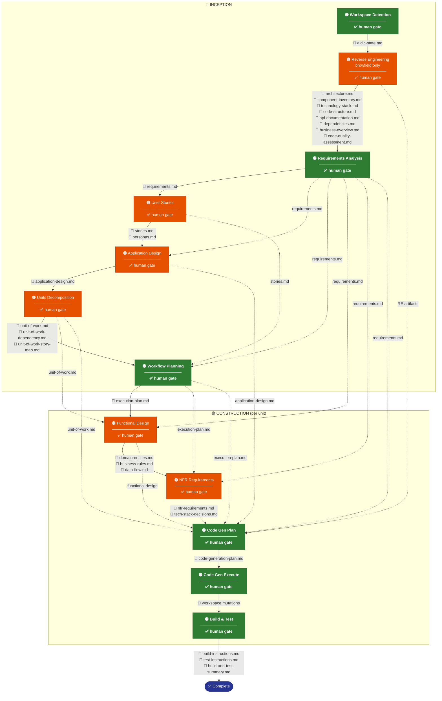

# AIDLC Pipeline — стадии и поток артефактов

**Легенда:**
- 🟢 **всегда** выполняется
- 🟠 **условно** (зависит от типа проекта / решения AI)
- `→` сплошная стрелка — основная цепочка выполнения
- `-.->` пунктир — кросс-стадийное потребление артефакта

---

## Полный пайплайн

---

## Таблица артефактов: кто создаёт → кто потребляет

| Артефакт | Создаётся в | Потребляется в |
|---|---|---|
| `aidlc-state.md` | Workspace Detection | Reverse Engineering |
| `architecture.md` | Reverse Engineering | Requirements Analysis, **Code Gen Plan** |
| `component-inventory.md` | Reverse Engineering | Requirements Analysis |
| `technology-stack.md` | Reverse Engineering | Requirements Analysis |
| `code-structure.md` | Reverse Engineering | **Code Gen Plan** |
| `api-documentation.md` | Reverse Engineering | **Code Gen Plan** |
| `dependencies.md` | Reverse Engineering | **Code Gen Plan** |
| `business-overview.md` | Reverse Engineering | Requirements Analysis |
| `code-quality-assessment.md` | Reverse Engineering | Requirements Analysis |
| `requirements.md` | Requirements Analysis | User Stories, Application Design, **Workflow Planning**, Functional Design, NFR Requirements, **Code Gen Plan** |
| `stories.md` + `personas.md` | User Stories | Application Design, Workflow Planning |
| `application-design.md` | Application Design | Units Decomposition, **Code Gen Plan** |
| `unit-of-work.md` + 2 | Units Decomposition | Workflow Planning, Functional Design, **Code Gen Plan** |
| `execution-plan.md` | Workflow Planning | Functional Design, NFR Requirements, **Code Gen Plan** |
| `domain-entities.md` | Functional Design | **Code Gen Plan** |
| `business-rules.md` | Functional Design | **Code Gen Plan** |
| `data-flow.md` | Functional Design | **Code Gen Plan** |
| `nfr-requirements.md` | NFR Requirements | **Code Gen Plan** |
| `tech-stack-decisions.md` | NFR Requirements | **Code Gen Plan** |
| `code-generation-plan.md` | Code Gen Plan | Code Gen Execute |
| workspace mutations | Code Gen Execute | Build & Test |
| `build-and-test-summary.md` + 2 | Build & Test | — |

> **Паттерн:** `requirements.md` и RE-артефакты — самые "широкие" артефакты пайплайна.
> Все дороги ведут в **Code Gen Plan** — он агрегирует все предыдущие артефакты.
