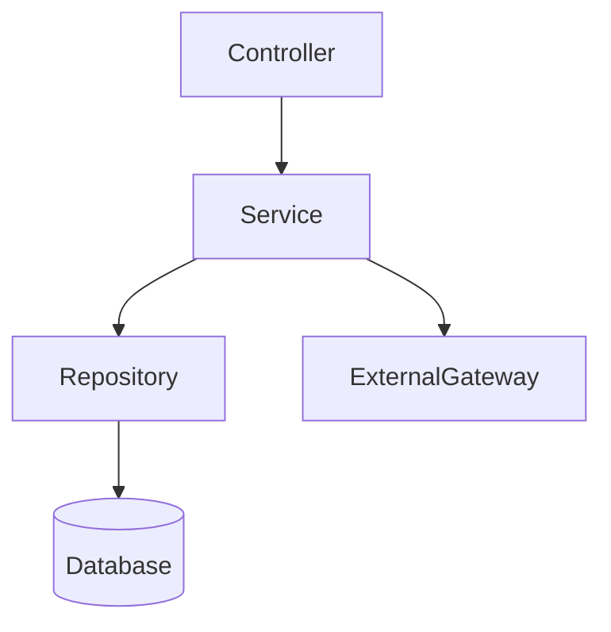

# AIDLC Application Design — Artifacts

## Goal
Produce high-level structural design that bridges requirements and code generation:
clear component boundaries, interface contracts, and orchestration patterns.
Detailed business logic is deferred to Functional Design.

---

## Step 1 — Load and Validate

1. Read `aidlc-docs/inception/plans/design-questions.md` — confirm all `[Answer]:` filled.
2. Read `aidlc-docs/inception/requirements/requirements.md`.
3. Check for ambiguous or contradictory answers; list as design risks.
4. Load reverse engineering: code-structure.md (brownfield — use existing class names).

---

## Step 2 — Identify Components

For each distinct functional area in the requirements:
- Name (use domain language)
- Type: Controller / Service / Repository / Model / Utility / Gateway
- Primary responsibility (one sentence)
- Public interface: list method signatures (name, parameters, return type)
- Dependencies: which other components it calls

---

## Step 3 — Design Service Layer

For each service:
- What use cases it orchestrates
- Transaction boundary (does it own a DB transaction?)
- How it coordinates components
- Error handling strategy

---

## Output Format

Save as `aidlc-docs/inception/application-design/application-design.md`
(this is the consolidated document; individual sections are clearly headed):

```markdown
# Application Design

## Design Overview
[2–3 sentences: architectural approach and key structural decisions]

---

## Components

### [ComponentName]
- **Type**: Controller / Service / Repository / Model / Utility / Gateway
- **Responsibility**: [one sentence]
- **Methods**:
  | Method | Parameters | Returns | Purpose |
  |--------|-----------|---------|---------|
  | `methodName(param: Type)` | `param: ParamType` | `ReturnType` | [purpose] |
- **Dependencies**: [ComponentA, ComponentB]

---

## Service Layer

### [ServiceName]
- **Orchestrates**: [use cases handled]
- **Transaction Boundary**: [yes/no — which operations]
- **Coordination Pattern**: [sequence of calls]
- **Error Handling**: [strategy]

---

## Component Dependency Map



## Dependency Table
| From | To | Type | Reason |
|------|----|------|--------|

---

## Design Decisions
- **Decision 1**: [what was decided and why]
- **Decision 2**: ...

## Design Risks
- [Risk 1]: [description and mitigation]
```

---

## Constraints

- Do NOT write implementation code — only interface contracts and structural design.
- Do NOT define detailed business rules — that is Functional Design's scope.
- Brownfield: use existing class names and package structure from code-structure.md.
- Diagram must use valid Mermaid syntax.
