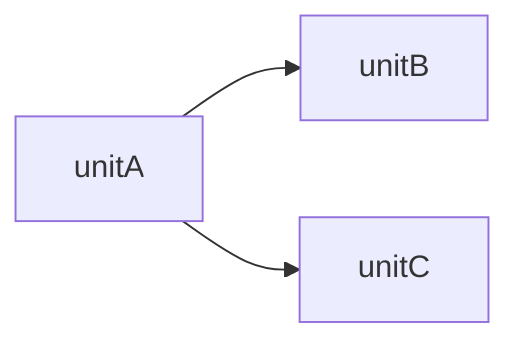

# AIDLC Units Decomposition — Artifacts

## Goal
Define clear, approved unit boundaries with story assignments and dependency
order so each unit can be designed and built independently.

---

## Step 1 — Load and Validate

1. Read `aidlc-docs/inception/plans/units-questions.md` — confirm all `[Answer]:` filled.
2. Read `aidlc-docs/inception/application-design/application-design.md`.
3. Read `aidlc-docs/inception/user-stories/stories.md` (if available) or requirements.md.
4. Flag ambiguous answers as unit boundary risks.

---

## Step 2 — Define Units

For each unit:
- **Name**: short identifier used as folder name in construction phase
- **Type**: Service (independently deployable) or Module (logical grouping)
- **Boundary**: what capabilities and data it owns
- **Components**: which application design components it includes
- **Technology**: if this unit uses a different tech stack, specify here
- **Stories assigned**: list US-* IDs or FR-* IDs covered by this unit

---

## Step 3 — Map Dependencies

Identify all inter-unit dependencies:
- Which unit must be built first (shared models, API contracts, events)
- What is the recommended build sequence
- What can be built in parallel

---

## Output Format — unit-of-work.md

Save as `aidlc-docs/inception/application-design/unit-of-work.md`:

```markdown
# Units of Work

## Deployment Model
[Microservices — each unit deploys independently / Monolith — single deployment with modules]

## Unit Definitions

### [unit-name]
- **Type**: Service / Module
- **Boundary**: [capabilities and data owned]
- **Components Included**: [list from application-design.md]
- **Technology**: [same as project / specific stack]
- **Stories Covered**: US-001, US-002, FR-3, FR-4
- **Build Priority**: [1 = build first, 2 = second, etc.]

### [unit-name-2]
...
```

## Output Format — unit-of-work-dependency.md

Save as `aidlc-docs/inception/application-design/unit-of-work-dependency.md`:

```markdown
# Unit Dependency Matrix

## Dependency Diagram


## Dependency Table
| Unit | Depends On | Dependency Type | Reason |
|------|-----------|-----------------|--------|
| [unit-b] | [unit-a] | Compile-time / Runtime | [shared model X] |

## Build Sequence
1. [unit-a] — no dependencies
2. [unit-b] — depends on unit-a API contract
3. [unit-c] — can be built in parallel with unit-b
```

## Output Format — unit-of-work-story-map.md

Save as `aidlc-docs/inception/application-design/unit-of-work-story-map.md`:

```markdown
# Story-to-Unit Mapping

| Story / Requirement | Unit | Rationale |
|---------------------|------|-----------|
| US-001: [title] | [unit-name] | [why this unit owns this story] |
| FR-5: [title] | [unit-name-2] | |

## Unassigned Items
[Any stories or requirements not yet assigned — must be resolved before construction]
```

---

## Constraints

- Every user story and functional requirement must be assigned to exactly one unit.
- Do not create units without assigned stories — every unit must have work.
- Dependency diagram must use valid Mermaid syntax.
- Unit names must be filesystem-safe (lowercase, hyphens, no spaces).
