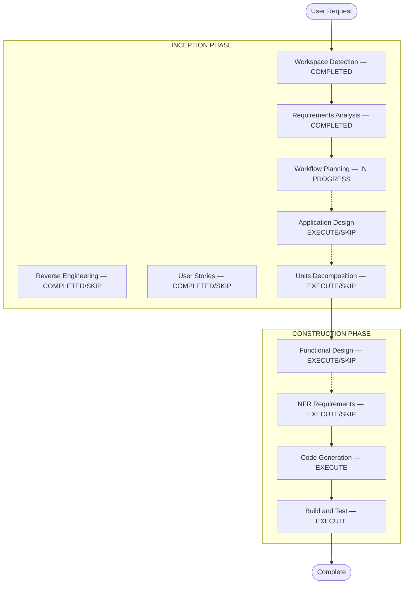

# AIDLC Workflow Planning

## Goal
Create an approved, visualised execution plan that the team and AI agent will
follow for the entire Construction phase — so there are no surprises about which
stages run and why.

---

## Step 1 — Load All Prior Context

Load every artifact produced so far:
- `aidlc-docs/inception/reverse-engineering/` (if brownfield)
- `aidlc-docs/inception/requirements/requirements.md`
- `aidlc-docs/inception/user-stories/stories.md` and `personas.md` (if available)

---

## Step 2 — Impact Analysis

Assess the scope of change across these dimensions:

| Dimension | Question |
|-----------|----------|
| User-facing | Does this affect the user experience? |
| Structural | Does this change system architecture? |
| Data model | Are there schema or data changes? |
| API | Are there interface or contract changes? |
| NFR | Are there performance/security/scalability impacts? |

For brownfield: identify related components (CDK/infra, shared models, clients, test
packages) that must also be updated. Map the change sequence.

---

## Step 3 — Risk Assessment

Assign risk level: Low / Medium / High / Critical.

Evaluate: isolation of the change, rollback complexity, unknowns in the codebase,
and cross-team impact.

---

## Step 4 — Determine Which Stages to Execute

For each Construction-phase stage, decide EXECUTE or SKIP:

| Stage | Execute IF | Skip IF |
|-------|-----------|---------|
| Application Design | New components / service layer needed | Changes within existing boundaries |
| Units Decomposition | Multiple services / complex decomposition | Single simple unit |
| Functional Design | New data models / complex business logic | Simple logic changes |
| NFR Requirements | Performance / security / scalability concerns | Existing NFR setup sufficient |
| Code Generation | Always | — |
| Build and Test | Always | — |

---

## Step 5 — Build Multi-Package Sequence (Brownfield Only)

If multiple packages must be updated:
1. Identify the critical path (what blocks what)
2. Determine parallelisation opportunities
3. Define testing checkpoints
4. Specify rollback strategy

---

## Output Format

Save as `aidlc-docs/inception/plans/execution-plan.md`:

```markdown
# Execution Plan

## Impact Analysis Summary
- **User-facing changes**: [Yes/No — description]
- **Structural changes**: [Yes/No — description]
- **Data model changes**: [Yes/No — description]
- **API changes**: [Yes/No — description]
- **NFR impact**: [Yes/No — description]

## Risk Assessment
- **Risk Level**: [Low / Medium / High / Critical]
- **Rollback Complexity**: [Easy / Moderate / Difficult]
- **Key Uncertainties**: [list]

## Workflow Visualization



## Stages to Execute

### INCEPTION PHASE
- [x] Workspace Detection (COMPLETED)
- [x/skip] Reverse Engineering
- [x] Requirements Analysis (COMPLETED)
- [x/skip] User Stories
- [x] Workflow Planning (IN PROGRESS)
- [ ] Application Design — EXECUTE/SKIP — **Rationale**: [why]
- [ ] Units Decomposition — EXECUTE/SKIP — **Rationale**: [why]

### CONSTRUCTION PHASE
- [ ] Functional Design — EXECUTE/SKIP — **Rationale**: [why]
- [ ] NFR Requirements — EXECUTE/SKIP — **Rationale**: [why]
- [ ] Code Generation — EXECUTE (always)
- [ ] Build and Test — EXECUTE (always)

## Package Change Sequence (Brownfield Only)
1. [Package] — [reason for this position]
2. [Package] — depends on #1

## Success Criteria
- **Primary Goal**: [main objective]
- **Key Deliverables**: [list]
- **Quality Gates**: [list]
```

---

## Constraints

- Visualisation must use valid Mermaid `flowchart TD` syntax.
- Skipped stages must have explicit rationale.
- Do not skip Code Generation or Build and Test — they always execute.
- Apply styling: always-execute nodes in green `#4CAF50`, skipped in grey `#BDBDBD`,
  conditional-execute in orange `#FFA726`.
