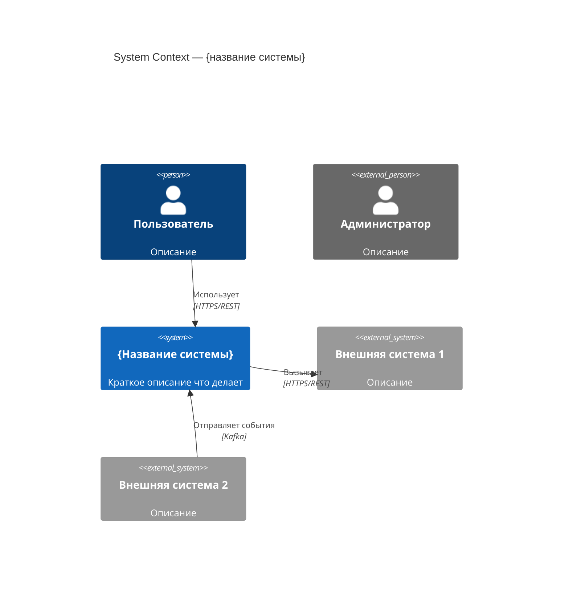
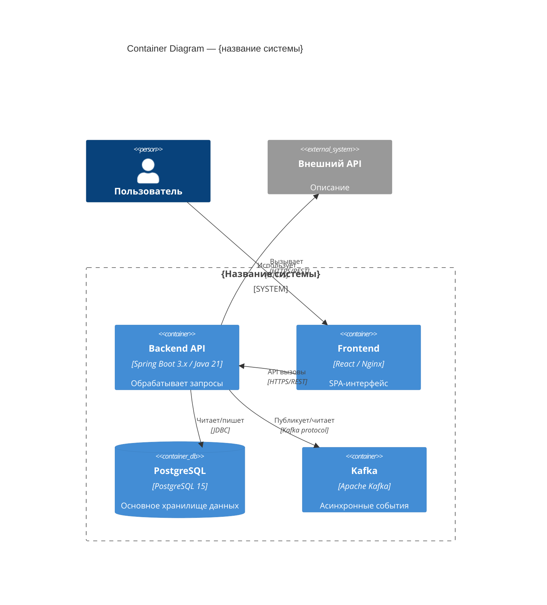
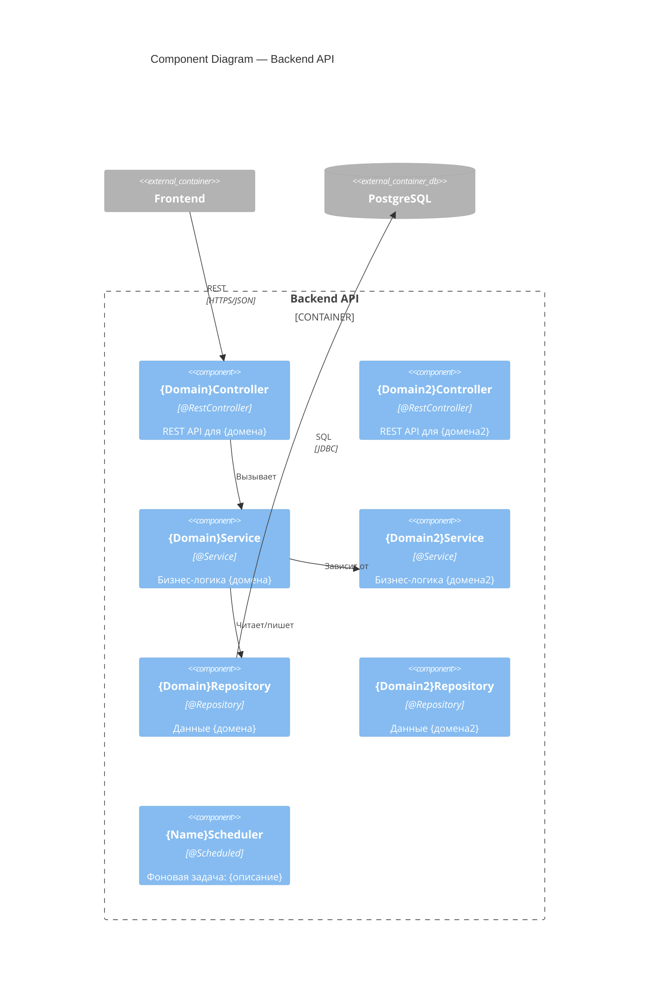

# Restore C4 architecture diagrams for Java project

## Goal
По кодовой базе восстановить архитектурную документацию в нотации C4,
представив её в виде Mermaid-диаграмм и текстовых описаний.

---

## C4 Model — уровни

| Уровень | Что описывает | Аудитория |
|---------|--------------|-----------|
| **C1 — System Context** | Система в окружении: пользователи, внешние системы | Все, в т.ч. нетехнические |
| **C2 — Container** | Развёртываемые единицы: сервисы, БД, брокеры | Разработчики, DevOps |
| **C3 — Component** | Spring-компоненты внутри контейнера | Разработчики |

---

## Шаг 1 — Изучение проекта

**Технический стек:**
- Прочитай `build.gradle` / `pom.xml` — все зависимости
- Прочитай `application.yml` — datasource, kafka/rabbit, внешние URL, порты
- Найди Docker/docker-compose файлы — инфраструктурные компоненты
- Найди `@SpringBootApplication` — точки входа

**Контейнеры (C2):**
- Модули Gradle / Maven — отдельные развёртываемые JAR/сервисы?
- БД: тип (PostgreSQL, MySQL, H2), имя схемы
- Брокеры сообщений: Kafka topics, RabbitMQ exchanges
- Внешние HTTP-сервисы: URL из конфига, RestTemplate/WebClient/Feign клиенты
- Хранилища файлов: S3, локальная ФС
- Кэш: Redis, Caffeine

**Компоненты Spring (C3):**
- Все `@RestController` — список с их URL prefix
- Все `@Service` — список с их зонами ответственности
- Все `@Repository` / JPA-репозитории — список с агрегатами
- `@Scheduled` бины — фоновые задачи
- `@KafkaListener` / `@RabbitListener` — консьюмеры сообщений
- `@Configuration` — ключевые конфигурационные бины

**Пользователи системы:**
- Кто вызывает API: пользователи, другие сервисы, CI/CD
- Роли и типы доступа

---

## Шаг 2 — Построение диаграмм

### C1 — System Context



### C2 — Container



### C3 — Component (для Backend API)



---

## Формат вывода

Записать в файл `architecture.md`:

```markdown
# Архитектура системы {название}

## Обзор
{2–3 абзаца: назначение системы, основные технологии, масштаб}

## Технологический стек

| Компонент | Технология | Версия |
|-----------|-----------|--------|
| Backend   | Java / Spring Boot | ... |
| Database  | PostgreSQL | ... |
| ...       | ... | ... |

---

## C1 — System Context

{Mermaid C4Context диаграмма}

### Описание взаимодействий
- **{Актор/система}** → **{система}**: {описание}
- ...

---

## C2 — Container Diagram

{Mermaid C4Container диаграмма}

### Контейнеры

| Контейнер | Технология | Ответственность |
|-----------|-----------|-----------------|
| Backend API | Spring Boot | ... |
| ... | ... | ... |

---

## C3 — Component Diagram (Backend API)

{Mermaid C4Component диаграмма}

### Компоненты

| Компонент | Тип | Ответственность |
|-----------|-----|-----------------|
| {Name}Controller | @RestController | ... |
| {Name}Service | @Service | ... |
| ... | ... | ... |

---

## Ключевые потоки данных

### Поток 1: {название сценария}
1. {актор} → {компонент}: {действие}
2. {компонент} → {компонент}: {действие}
3. ...

---

## Известные ограничения и технический долг
- {ограничение/проблема}: {описание}
```

---

## Ограничения

- Использовать только то, что реально найдено в проекте — не выдумывать компоненты
- Если компонент непонятен — описать как "Unknown / TBD" и указать где он встречается
- Не писать код
- Mermaid-синтаксис должен быть валидным (можно проверить на mermaid.live)
