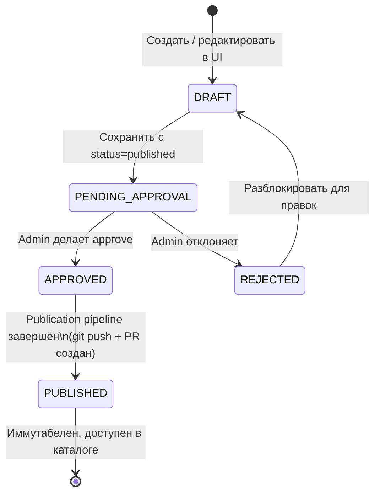
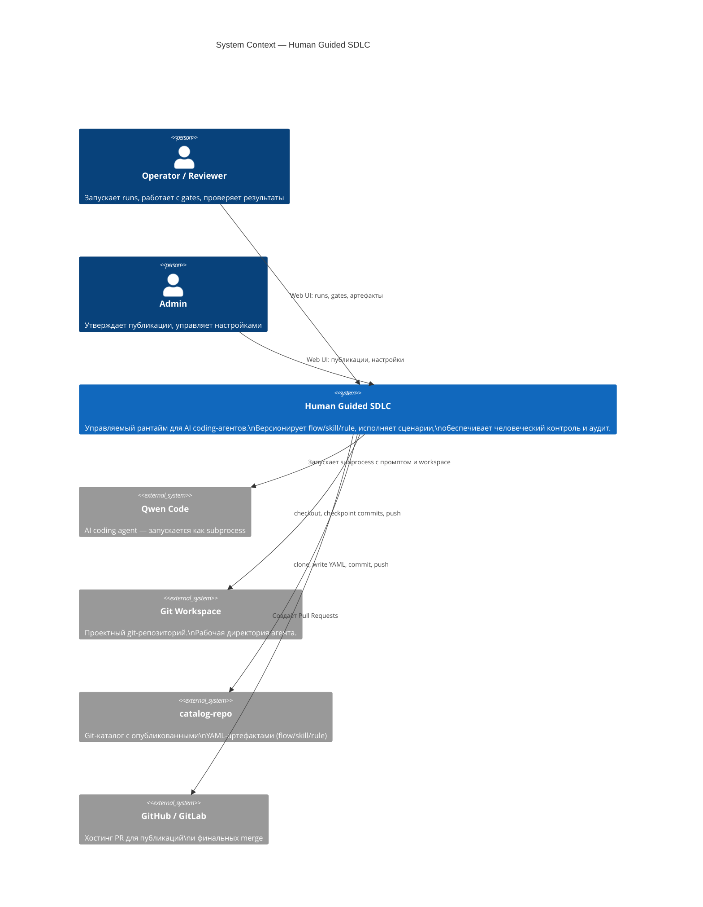
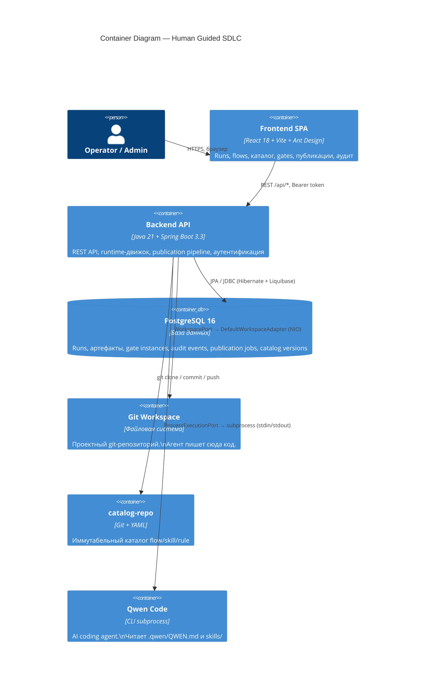
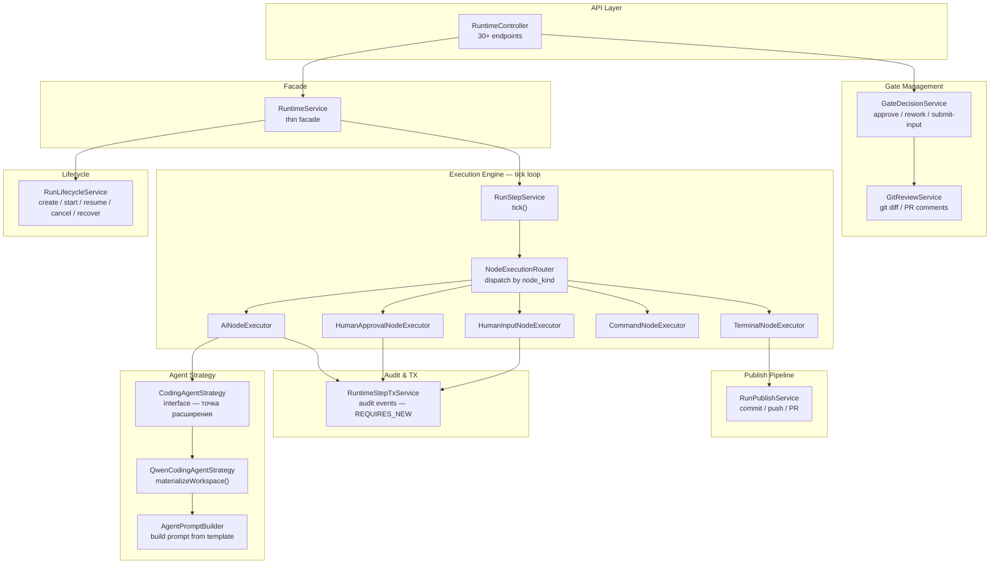
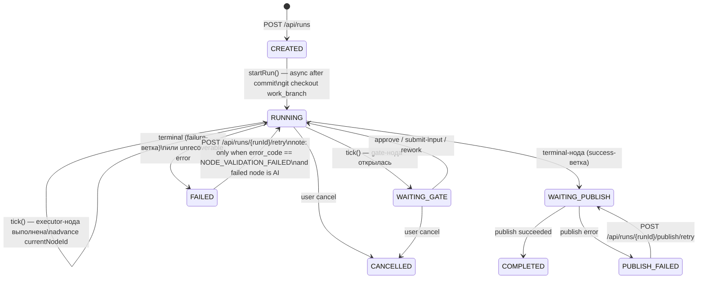
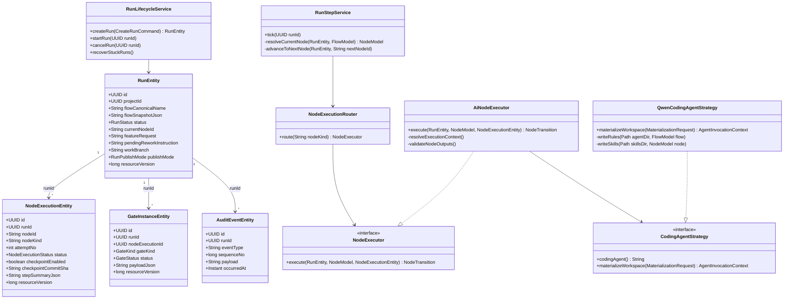
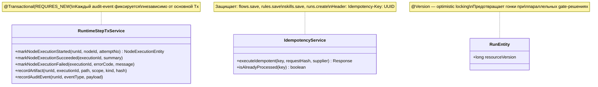
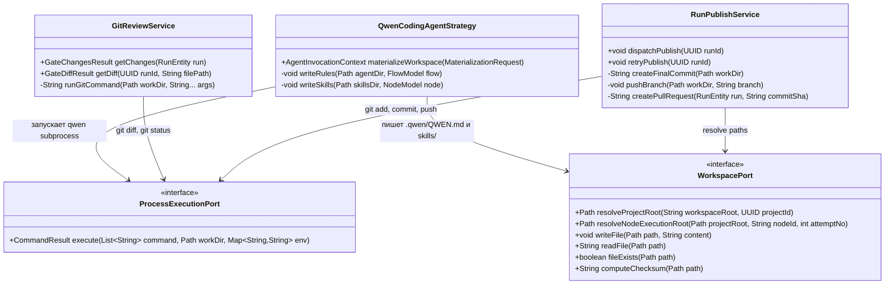

# Погружение в Human Guided SDLC

---

## Содержание

**Часть I — Концепция**

1. [Зачем это нужно: проблема и решение](#1-зачем-это-нужно-проблема-и-решение)
2. [Основные понятия системы](#2-основные-понятия-системы)
3. [Flow — программируемый сценарий для агента](#3-flow--программируемый-сценарий-для-агента)
4. [Каталог: как хранятся и управляются Flow, Rule, Skill](#4-каталог-как-хранятся-и-управляются-flow-rule-skill)
5. [Клиентский путь: от задачи до результата](#5-клиентский-путь-от-задачи-до-результата)

**Часть II — Реализация**

6. [C4 Архитектура системы](#6-c4-архитектура-системы)
7. [Runtime — движок исполнения](#7-runtime--движок-исполнения)
8. [Каталог — техническая реализация](#8-каталог--техническая-реализация)
9. [Ключевые классы](#9-ключевые-классы)

---

# Часть I — Концепция

---

## 1. Зачем это нужно: проблема и решение

### Проблема с обычным coding-агентом

Когда разработчик работает с AI coding-агентом напрямую — через IDE или CLI — он получает мощный инструмент, но только для себя и только здесь и сейчас. Это создаёт несколько проблем для команды или организации:

**Непредсказуемость поведения.** Агент каждый раз получает разный промпт, руководствуется разными правилами (или не руководствуется никакими). Один разработчик настроил агент одним образом, другой — иначе. Результаты несравнимы.

**Нет точек контроля.** Агент делает изменения в коде, и либо человек принимает всё сразу, либо разбирается самостоятельно. Нет структурированного момента «стоп, проверь вот это».

**Невозможно делегировать.** Личная сессия с агентом не передаётся команде. Нельзя сказать «возьми мой сценарий работы и повтори его на другом проекте» или «Аня запускает, Борис проверяет».

**Нет аудита.** Что агент сделал, почему принял то или иное решение, что было до и после — всё это теряется.

### Что даёт HGD SDLC

**Human Guided SDLC** — это управляемый рантайм для AI coding-агентов. Не просто «добавить человека в процесс», а построить **контролируемую систему**, в которой:

| Свойство | Что это значит на практике |
|----------|---------------------------|
| **Управляемость поведения** | Правила (Rules) задаются явно и применяются к каждому запуску. Инструкции (Skills) версионируются. Один и тот же агент всегда работает по одним правилам |
| **Структурированный контроль результата** | После каждой значимой ноды — точка проверки (Gate). Человек видит git-diff, артефакты, логи. Принимает или отправляет на доработку с конкретной инструкцией |
| **Воспроизводимость** | Flow — это повторяемый сценарий. Запущенный сегодня и через месяц даст сопоставимый результат, потому что правила и инструкции версионированы |
| **Командная работа** | Роли разделены: кто-то пишет flow, кто-то запускает, кто-то проверяет. Сценарий живёт в каталоге, а не в голове одного человека |
| **Наблюдаемость** | Каждое действие агента, каждое решение оператора пишется в аудит-лог с монотонной последовательностью |

> **Суть:** HGD SDLC позволяет «запрограммировать» то, как агент решает задачу, зафиксировать это в виде flow, передать команде и при этом оставаться полностью в контроле на каждом шаге.

---

## 2. Основные понятия системы

Прежде чем идти дальше, важно усвоить несколько ключевых понятий.

### Глоссарий

**Flow** — декларативный YAML-сценарий: граф нод, описывающий что должен делать агент и где нужна проверка человека. Это центральная сущность системы — «программа» для агента.

**Rule** — Markdown-документ с правилами, которые агент обязан соблюдать в данном flow. Например: «использовать DDD-слоёвку», «не писать бизнес-логику в контроллерах». Применяется ко всем AI-нодам flow целиком.

**Skill** — Markdown-документ с инструкцией для конкретной задачи. Например: «как строить C4-диаграммы», «как писать unit-тесты в этом проекте». Подключается к отдельной ноде.

**Run** — один запуск flow на конкретном проекте. Имеет статус, текущую ноду, историю выполнения, артефакты.

**Node (нода)** — один шаг в flow. Бывает пяти типов: `ai`, `human_approval`, `human_input`, `command`, `terminal`.

**Gate** — точка остановки в run, ожидающая действия человека. Создаётся нодами типа `human_approval` и `human_input`. Пока gate открыт — run не движется.

**Artifact (артефакт)** — файл, созданный или изменённый в ходе выполнения ноды. Бывает `scope=project` (файл в рабочей директории проекта) или `scope=run` (временный файл конкретного запуска).

**Checkpoint** — git-коммит, автоматически создаваемый перед запуском AI-ноды. Позволяет откатить workspace к состоянию «до агента» если результат не устроил.

**Catalog** — git-репозиторий с опубликованными версиями flow, rule, skill. Артефакты в каталоге иммутабельны и версионированы.

**Project** — проект (git-репозиторий) в котором будет весить разработка с применением данной системы.

### Как понятия связаны между собой

```
Catalog (git-repo)
├── Flow@1.0  ──── ссылается на ──→  Rule@1.0  (правила для всего flow)
│                                    Skill@1.0  (инструкции для ноды)
│
Project (git-repo с кодом)
└── Run  ──── исполняет ──→  Flow@1.0 (слепок на момент создания)
      │
      ├── Node: ai  ──→ checkpoint + агент → Artifact
      ├── Node: human_approval  ──→ Gate  ← оператор: approve / rework
      ├── Node: human_input     ──→ Gate  ← оператор: вводит данные
      └── Node: terminal  ──→  commit / PR
```

---

## 3. Flow — программируемый сценарий для агента

Flow — это не просто «список шагов». Это способ зафиксировать **как именно** нужно решать конкретный тип задачи, и сделать это решение воспроизводимым.

### Почему flow, а не просто промпт

Один большой промпт «реализуй фичу» — это чёрный ящик: агент получает всё сразу и делает что захочет. Flow разбивает процесс на управляемые шаги:

- Сначала агент **задаёт уточняющие вопросы** → человек **отвечает** (human_input)
- Потом агент **пишет требования** → человек **проверяет** (human_approval, с rework если нужно)
- Потом агент **пишет план** → человек **одобряет** (human_approval)
- Потом агент **реализует** → человек **ревьюит код** (human_approval)

На каждом шаге человек видит ровно то, что сделал агент, и принимает осознанное решение. Если что-то не так — отправляет на доработку с конкретной инструкцией.

### Типы нод

**`ai`** — запуск coding-агента. Агент получает промпт, материализованный из правил, инструкций и контекста, и работает в рабочей директории проекта.

```
Что задаётся:
- instruction     — что конкретно нужно сделать на этом шаге
- skill_refs      — какие инструкции дать агенту дополнительно
- execution_context — какие файлы/данные передать в контекст
- produced_artifacts — что агент должен создать
- expected_mutations — какие файлы должен изменить
- checkpoint_before_run — сделать git-коммит до запуска

Переходы:
- on_success → следующая нода при успехе
- on_failure → нода при ошибке агента
```

**`human_approval`** — точка ревью. Останавливает run, оператор видит git-diff, артефакты, лог. Решает: принять или отправить на доработку.

```
Что задаётся:
- on_approve → нода при одобрении
- on_rework  → нода для повторного выполнения
  - next_node     — какую ноду запустить заново
  - keep_changes  — оставить изменения агента (true) или откатить (false)
```

**`human_input`** — точка ввода данных оператором. Агент создаёт файл (например, список вопросов), оператор его редактирует и отправляет.

```
Что задаётся:
- execution_context с modifiable=true — какие файлы оператор может редактировать
- on_submit → нода после отправки
```

**`command`** — выполнение shell-команды в рабочей директории. Например, запуск тестов или линтера.

```
Что задаётся:
- instruction — команда (выполняется в bash -lc)
- on_success  → нода при успехе (ошибка → run FAILED)
```

**`terminal`** — завершение flow. Если пришли через ветку `on_failure` — run помечается как FAILED. Иначе — run публикует результаты (commit или PR) и завершается COMPLETED.

### Как данные передаются между нодами — артефакты

Каждая нода может **создавать** файлы (`produced_artifacts`) и **принимать** файлы из других нод через `execution_context`.

```
Нода A: ai
  → produced_artifact: scope=run, path=questions.md
         ↓
Нода B: human_input
  → execution_context: artifact_ref(scope=run, node_id=A, path=questions.md, modifiable=true)
  → оператор редактирует questions.md
         ↓
Нода C: ai
  → execution_context: artifact_ref(scope=run, node_id=B, path=questions.md, transfer_mode=by_value)
  → агент видит answers в промпте inline
```

`transfer_mode` управляет тем, как артефакт попадает к агенту:
- `by_ref` — агент получает путь к файлу и читает его сам
- `by_value` — содержимое файла встраивается прямо в промпт (лимит 64KB)

### Пример минимального flow

```yaml
id: implement-and-review
version: "1.0"
canonical_name: implement-and-review@1.0
title: Реализация с ревью
start_node_id: implement
rule_refs:
  - java-backend-rules@1.0     # правила применяются ко всем AI-нодам

nodes:

  - id: implement
    title: Реализация
    type: ai
    checkpoint_before_run: true  # git commit перед агентом → можно откатить
    instruction: |
      Реализуй функцию согласно запросу пользователя.
    skill_refs:
      - write-unit-tests@1.0     # инструкция: как писать тесты в этом проекте
    execution_context:
      - type: user_request       # запрос пользователя → секция Task промпта
    produced_artifacts:
      - path: src/Foo.java
        scope: project
        required: true           # ошибка если файл не создан
    on_success: review
    on_failure: done

  - id: review
    title: Ревью результата
    type: human_approval
    on_approve: done
    on_rework:
      next_node: implement       # повторить ноду implement
      keep_changes: false        # откатить workspace к checkpoint

  - id: done
    title: Завершение
    type: terminal
```

### Матрица переходов

| Событие | Результат |
|---------|-----------|
| AI-нода — успех | → `on_success` |
| AI-нода — ошибка | → `on_failure` (если задан), иначе run FAILED |
| Command — успех | → `on_success` |
| Command — ошибка | run FAILED |
| Human input — валидные данные | → `on_submit` |
| Human input — невалидные данные | gate остаётся открытым |
| Human approval — approve | → `on_approve` |
| Human approval — rework (keep) | → `on_rework`, workspace не меняется |
| Human approval — rework (discard) | `git reset --hard` + `git clean -fd`, → `on_rework` |
| Terminal через success-ветку | run → WAITING\_PUBLISH → COMPLETED |
| Terminal через failure-ветку | run FAILED |

---

## 4. Каталог: как хранятся и управляются Flow, Rule, Skill

### Зачем нужен каталог

Каталог — это библиотека проверенных сценариев. Вместо того чтобы каждый разработчик писал свои промпты, команда поддерживает набор версионированных flow, правил и инструкций, которые можно использовать повторно.

Ключевые свойства:
- **Версионирование:** `my-flow@1.0` и `my-flow@2.0` — разные артефакты, оба доступны
- **Иммутабельность:** опубликованная версия никогда не изменяется
- **Approval workflow:** перед публикацией артефакт проходит ревью

### Жизненный цикл артефакта



### Rule — правила для агента

Rule — это Markdown-документ, который полностью инжектируется в контекст агента для всего flow. Задаёт **ограничения и соглашения**: архитектурные паттерны, требования к безопасности, стиль кода.

**Параметры Rule:**

| Поле | Обязательно | Описание |
|------|:-----------:|----------|
| `canonical_name` | Да | Уникальный ключ: `имя@версия` |
| `version` | Да | Semver строка |
| `kind` | Да | Всегда `rule` |
| `description` | Нет | Краткое описание назначения |
| `status` | Да | `draft` / `published` |
| тело (Markdown) | Да | Сам текст правил |

Как связывается с flow: `rule_refs: [java-backend-rules@1.0]` в заголовке flow. Все rule применяются к каждой AI-ноде — агент видит их как «системный контекст».

### Skill — инструкция для конкретной задачи

Skill — Markdown-документ с узкоспециализированной инструкцией. Если Rule отвечает на вопрос «как вообще нужно писать код в этом проекте», то Skill — «как конкретно выполнять эту задачу».

**Параметры Skill:**

| Поле | Обязательно | Описание |
|------|:-----------:|----------|
| `canonical_name` | Да | Уникальный ключ: `имя@версия` |
| `version` | Да | Semver строка |
| `kind` | Да | Всегда `skill` |
| `tags` | Нет | Теги для поиска в каталоге |
| `description` | Нет | Краткое описание |
| `status` | Да | `draft` / `published` |
| тело (Markdown) | Да | Инструкции |
| дополнительные файлы | Нет | Skill может иметь несколько файлов (primary + attachments) |

Как связывается с flow: `skill_refs: [write-unit-tests@1.0]` в конкретной ноде. Агент получает skill как отдельный файл рядом с промптом.

### Flow — параметры YAML

Полный разбор всех полей flow YAML:

```yaml
# ── ЗАГОЛОВОК ────────────────────────────────────────────────────
id: my-flow                      # Уникальный slug (без пробелов)
version: "1.0"                   # Semver
canonical_name: my-flow@1.0     # <id>@<version> — ключ для запуска
title: Моё описание
description: |
  Что делает этот flow.
status: published                # draft | published

# ── СТАРТОВАЯ НОДА ───────────────────────────────────────────────
start_node_id: first-step

# ── ГЛОБАЛЬНЫЕ ПРАВИЛА ───────────────────────────────────────────
rule_refs:                       # Применяются ко всем AI-нодам
  - java-backend-rules@1.0

# ── ГЛОБАЛЬНАЯ ПОЛИТИКА ВАЛИДАЦИИ ────────────────────────────────
fail_on_missing_declared_output: true   # Ошибка если required artifact не создан
fail_on_missing_expected_mutation: false # Ошибка если required mutation не изменилась

# ── НОДЫ ─────────────────────────────────────────────────────────
nodes:
  - id: first-step
    title: Первый шаг
    type: ai                     # ai | human_approval | human_input | terminal | command

    execution_context:
      - type: user_request       # Запрос пользователя → секция Task в промпте
      - type: artifact_ref       # Файл из workspace или другой ноды
        scope: project           # project (workspace root) | run (output другой ноды)
        path: docs/spec.md
        node_id: prev-step       # Только для scope=run: откуда брать артефакт
        required: false
        transfer_mode: by_ref    # by_ref (путь) | by_value (inline content, лимит 64KB)

    instruction: |               # Только для ai/command
      Реализуй функцию...

    skill_refs:                  # Только для ai
      - write-unit-tests@1.0

    produced_artifacts:          # Что нода создаёт
      - path: src/Foo.java
        scope: project           # project | run
        required: true

    expected_mutations:          # Файлы которые нода должна изменить
      - path: README.md
        scope: project
        required: true

    checkpoint_before_run: true  # Только для ai: git commit перед запуском

    on_success: next-step        # Переходы (набор зависит от типа ноды)
    on_failure: done
```

---

## 5. Клиентский путь: от задачи до результата

### Роли в системе

| Раздел / действие | FLOW_CONFIGURATOR | PRODUCT_OWNER | TECH_APPROVER | ADMIN |
|------|------|------|------|------|
| Overview | ✓ | ✓ | ✓ | ✓ |
| Projects (просмотр) | ✓ | ✓ | ✓ | ✓ |
| Projects (создание) | ✓ | ✓ | — | ✓ |
| Flows (просмотр) | ✓ | ✓ | ✓ | ✓ |
| Flows (редактирование) | ✓ | — | — | ✓ |
| Rules (просмотр) | ✓ | ✓ | ✓ | ✓ |
| Rules (редактирование) | ✓ | — | — | ✓ |
| Skills (просмотр) | ✓ | ✓ | ✓ | ✓ |
| Skills (редактирование) | ✓ | — | — | ✓ |
| Requests (просмотр очереди) | ✓ | ✓ | ✓ | ✓ |
| Requests (approve/reject/retry) | — | — | ✓ | ✓ |
| Run Launch | ✓ | ✓ | ✓ | ✓ |
| Runs | ✓ | ✓ | ✓ | ✓ |
| Runtime Settings | ✓ | ✓ | ✓ | ✓ |
| Users | — | — | — | ✓ |

### Сквозной пример: «Добавь фичу с вопросами, требованиями и ревью»

Допустим, есть flow из 7 нод. Вот что видит и делает оператор на каждом шаге:

**Шаг 1. Запуск Run**

Оператор открывает **RunLaunch** — выбирает проект, flow, вводит feature request:
```
Добавь кнопку "Экспорт" в таблицу пользователей.
Кнопка должна скачивать CSV.
```
Нажимает «Запустить». Система создаёт Run и сразу начинает выполнение.

**Шаг 2. AI-нода: агент задаёт вопросы**

Агент анализирует запрос и создаёт файл `questions.md`. Run останавливается на gate `human_input`.

**Шаг 3. Gate: оператор отвечает на вопросы**

Оператор открывает **GatesInbox** → видит открытый gate → открывает **HumanGate**. Перед ним файл `questions.md` для редактирования:

```markdown
1. Нужна ли пагинация в CSV или весь список?
2. Какие колонки включать?
3. Нужна ли авторизация для скачивания?
```

Оператор заполняет ответы, нажимает «Отправить».

**Шаг 4–5. AI-ноды: требования и план**

Агент последовательно создаёт `requirements.md` и `plan.md`. Каждый файл виден в RunConsole по мере готовности.

**Шаг 6. Gate: оператор одобряет план**

Оператор видит план реализации. Если план нужно скорректировать — нажимает «Rework» и пишет инструкцию: _«Добавь в план шаг с unit-тестами для сервиса экспорта»_. Run возвращается к ноде плана, агент получает уточнение в промпте.

**Шаг 7. AI-нода: реализация**

Агент реализует фичу. Перед этим автоматически создаётся **checkpoint** (git commit). Агент пишет код, тесты, меняет файлы.

**Шаг 8. Gate: ревью кода**

Оператор видит **полный git-diff** от checkpoint до текущего состояния:
- Список изменённых файлов
- Построчный diff по каждому файлу

Если код устраивает — **Approve**. Если нет — **Rework (discard)**: workspace откатится к checkpoint, агент перезапустится с уточнением.

**Шаг 9. Завершение**

Terminal-нода делает финальный commit и, если выбран режим `PR`, создаёт pull request в целевую ветку. Run становится **COMPLETED**, PR-ссылка доступна в UI.

```
RunConsole показывает:
  ✓ ai-analyze-request    [SUCCEEDED, 23s]
  ✓ human-answer-questions [GATE_APPROVED]
  ✓ ai-write-requirements [SUCCEEDED, 41s]
  ✓ ai-build-plan         [SUCCEEDED, 35s]
  ✓ approve-plan          [GATE_APPROVED, rework x1]
  ✓ ai-implement          [SUCCEEDED, 2m 14s]
  ✓ approve-implementation[GATE_APPROVED]
  ✓ terminal              → PR #47 создан
```

---

# Часть II — Реализация

---

## 6. C4 Архитектура системы

### Уровень 1 — Context



### Уровень 2 — Container



### Уровень 3 — Component: Runtime



**Модульная DDD-структура backend:**

```
ru.hgd.sdlc/
├── auth/          # Аутентификация, сессионные Bearer-токены, роли
├── flow/          # CRUD и версионирование flows, FlowYamlParser
├── rule/          # CRUD и версионирование rules
├── skill/         # CRUD и версионирование skills
├── runtime/       # Движок исполнения (основной модуль)
├── publication/   # Pipeline публикации в catalog-repo
├── project/       # Проекты — контейнеры для runs
├── settings/      # Системные настройки (git, workspace, catalog)
├── idempotency/   # Идемпотентность мутирующих API-вызовов
├── dashboard/     # Агрегированные метрики
├── common/        # Исключения, конвертеры, утилиты
└── platform/      # Spring Security, TaskExecutor, бины
```

Каждый модуль изолирован по слоям:
```
<module>/
├── api/            # REST-контроллеры, DTO (request/response records)
├── application/    # Бизнес-логика (сервисы, стратегии)
├── domain/         # JPA-сущности, enum-ы
└── infrastructure/ # Spring Data репозитории, внешние адаптеры
```

---

## 7. Runtime — движок исполнения

### Жизненный цикл Run



> **Retry AI node validation** (`POST /api/runs/{runId}/retry`): доступен только когда `run.status=FAILED` и `run.error_code=NODE_VALIDATION_FAILED` и последняя failed нода имеет `node_kind=ai`. Создаёт новый `node_execution` с `attempt_no = previous + 1`. `run_id` не меняется.

**Ключевые поля RunEntity:**

| Поле | Тип | Описание |
|------|-----|----------|
| `id` | UUID | Идентификатор run |
| `flow_snapshot_json` | TEXT | Слепок YAML flow на момент создания (иммутабелен) |
| `status` | RunStatus | Текущий статус state machine |
| `current_node_id` | String | ID текущей ноды |
| `feature_request` | TEXT | Запрос пользователя — секция Task в промпте |
| `pending_rework_instruction` | TEXT | Инструкция к доработке — секция Clarification |
| `work_branch` | String | Ветка где работает агент |
| `target_branch` | String | Целевая ветка для финального PR |
| `publish_mode` | Enum | LOCAL (только commit) / PR (commit + push + PR) |
| `workspace_root` | String | Путь к рабочей директории проекта |
| `resource_version` | long | Optimistic locking (@Version) |

### Tick-loop — основной цикл движка

```
tick(runId):
  1. Загрузить RunEntity из БД
  2. Парсить flow_snapshot_json → FlowModel
  3. Найти NodeModel по current_node_id
  4. NodeExecutionRouter.route(nodeKind) → NodeExecutor
  5. executor.execute(run, node, execution) → NodeTransition
  6. run.currentNodeId = transition.targetNodeId
  7. Если не gate и не terminal → tick() снова (async)
```

### Как клеится промпт

Промпт для AI-ноды собирается `AgentPromptBuilder` по шаблону `prompt-template.md` с локализацией из `prompt-texts.ru.yaml`.

**Структура промпта (что и откуда):**

```
┌────────────────────────────────────────────────────────┐
│ [TASK]                                                  │
│ Task:                          ← run.featureRequest    │
│ Добавь кнопку "Экспорт"...                             │
│                                                        │
│ [CLARIFICATION]  — только если есть rework-инструкция  │
│ Clarification:                 ← run.pendingReworkInstruction │
│ Кнопка должна быть красной...                          │
│                                                        │
│ [INSTRUCTION]                                          │
│ Instruction:                   ← node.instruction     │
│ Реализуй согласно требованиям...                       │
│                                                        │
│ [INPUTS]  — только если есть artifact_ref контекст     │
│ Available inputs:              ← resolved execution_context │
│ - docs/spec.md                 by_ref: путь к файлу    │
│ - [inline 2048 bytes]          by_value: контент       │
│                                                        │
│ [EXPECTED RESULTS]                                     │
│ Expected result:               ← produced_artifacts +  │
│ - src/Foo.java (required)        expected_mutations    │
│ - Summary (всегда)                                     │
│                                                        │
│ [FOOTER]  — всегда                                     │
│ Всегда записывай summary...    ← prompt-texts.ru.yaml  │
└────────────────────────────────────────────────────────┘
```

**Алгоритм сборки:**

```
AiNodeExecutor.execute()
  │
  ├─ 1. resolveExecutionContext(run, node)
  │       artifact_ref, scope=project → файл из workspace root
  │       artifact_ref, scope=run     → файл из последнего SUCCEEDED attempt node_id
  │       transfer_mode=by_ref   → путь в промпт
  │       transfer_mode=by_value → inline content в промпт (лимит 64KB)
  │
  ├─ 2. QwenCodingAgentStrategy.materializeWorkspace()
  │       a. rule_refs flow → читает RuleVersion.content → пишет .qwen/QWEN.md
  │          audit: rules_materialized
  │       b. skill_refs ноды → читает SkillVersion.content → пишет .qwen/skills/<id>.md
  │          audit: skills_materialized
  │       c. AgentPromptBuilder.build(AgentInput) → итоговый промпт
  │
  ├─ 3. DefaultProcessExecutionAdapter.execute(["qwen", ...], workDir)
  │       stdout/stderr → .hgsdlc/nodes/<nodeId>/attempt-<n>/agent.*.log
  │
  └─ 4. validateNodeOutputs()
          required produced_artifacts → проверить наличие
          required expected_mutations → проверить checksum изменился
          → ArtifactVersionEntity в БД
          audit: artifact_recorded
```

**Что меняет промпт глобально:** `backend/src/main/resources/runtime/prompt-texts.ru.yaml` — заголовки секций, footer, шаблоны для inputs/expected_results. Изменение этого файла влияет на все AI-ноды без правки flow YAML.

### Checkpoint и git-флоу

**Полный git-путь run:**

```
[Создание Run]
  └─ git checkout <work_branch>

[AI-нода, checkpoint_before_run: true]
  ├─ git add -A
  ├─ git commit -m "checkpoint: before <nodeId> attempt-<n>"
  │     → NodeExecutionEntity.checkpointCommitSha = "abc123"
  └─ запуск агента → агент меняет файлы

[Human Approval Gate]
  ├─ GitReviewService: git diff <checkpointSha>..HEAD
  └─ payload с diff → HumanGate.jsx (оператор видит изменения)

[Approve]
  └─ workspace не меняется

[Rework, keepChanges=false]
  ├─ git reset --hard <checkpointCommitSha>
  └─ git clean -fd     → workspace чистый, агент запустится заново

[Rework, keepChanges=true]
  └─ workspace не меняется, агент продолжит поверх

[Terminal → Publish LOCAL]
  ├─ git add -A
  └─ git commit -m "hgsdlc: complete run <runId>"

[Terminal → Publish PR]
  ├─ git add -A
  ├─ git commit -m "hgsdlc: complete run <runId>"
  ├─ git push origin <work_branch>
  └─ create PR: work_branch → target_branch
```

**Ошибки при rework (discard):**

| Код | Причина |
|-----|---------|
| `CHECKPOINT_NOT_FOUND_FOR_REWORK` | target-нода не имеет `checkpoint_before_run: true` |
| `REWORK_RESET_FAILED` | SHA не найден в git-истории |

### Rework — как инструкция попадает в промпт

```
POST /gates/{gateId}/rework
  body: { instruction: "Кнопка должна быть красной", keepChanges: false }
  │
  ├─ если target == start_node_id:
  │       run.featureRequest += "\n---\n" + instruction
  │       → попадает в секцию Task
  │
  └─ иначе:
          run.pendingReworkInstruction = instruction
          → попадает в секцию Clarification (отдельно от Task)

  → run.status = RUNNING
  → run.currentNodeId = on_rework.next_node
  → tick()
```

Разделение Task / Clarification позволяет агенту понять: что была **изначальная задача**, а что **уточнение после ревью**.

---

## 8. Каталог — техническая реализация

### Publication pipeline

```
[Operator сохраняет с status=published]
  └─ PublicationRequest(status=PENDING_APPROVAL)

[Admin делает approve через /api/publications/.../approve]
  └─ при достижении required_approvals → PublicationJob запускается

PublicationService.dispatchPublish():
  1. git clone <catalog-repo-url>
  2. Сформировать путь:
       flows/<id>/<version>/FLOW.yaml
       rules/<id>/<version>/RULE.md
       skills/<id>/<version>/SKILL.md
  3. Записать YAML или Markdown
  4. git add + git commit
  5. git push origin <publication-branch>
  6. Создать Pull Request (GitHub/GitLab API)
  7. PublicationJob → status=COMPLETED, PR URL сохранён
```

Структура catalog-repo после публикации:
```
catalog-repo/
├── flows/
│   └── restore-architecture-flow/
│       └── 1.0/
│           ├── FLOW.yaml
│           └── metadata.yaml
├── rules/
│   └── java-backend-layering-and-validation/
│       └── 1.0/
│           └── RULE.md
└── skills/
    └── restore-c4-architecture/
        └── 1.0/
            └── SKILL.md
```

### Workspace artifact paths

```
<workspace_root>/<project_id>/              ← project root
├── .qwen/
│   ├── QWEN.md                             ← конкатенированные rules
│   └── skills/
│       └── restore-c4-architecture@1.0.md ← skill файлы
├── .hgsdlc/
│   └── nodes/
│       └── <nodeId>/
│           └── attempt-<n>/                ← scope=run артефакты
│               ├── questions.md
│               ├── agent.stdout.log
│               └── agent.stderr.log
└── <project source code>                   ← scope=project артефакты
```

---

## 9. Ключевые классы

### Движок воркфлоу



### Управление транзакциями и идемпотентностью



### Взаимодействие с Git и файлами



---

## Быстрый старт

```bash
# Backend
cd backend && ./gradlew bootRun

# Frontend
cd frontend && npm install && npm run dev
# → http://localhost:5173   (admin / admin)
```

### Ключевые файлы для изучения

| Что изучить | Файл |
|-------------|------|
| Lifecycle Run | [RunLifecycleService.java](../backend/src/main/java/ru/hgd/sdlc/runtime/application/service/RunLifecycleService.java) |
| Tick-loop | [RunStepService.java](../backend/src/main/java/ru/hgd/sdlc/runtime/application/service/RunStepService.java) |
| Сборка промпта | [AgentPromptBuilder.java](../backend/src/main/java/ru/hgd/sdlc/runtime/application/AgentPromptBuilder.java) |
| Материализация workspace | [QwenCodingAgentStrategy.java](../backend/src/main/java/ru/hgd/sdlc/runtime/application/QwenCodingAgentStrategy.java) |
| Gate decisions | [GateDecisionService.java](../backend/src/main/java/ru/hgd/sdlc/runtime/application/service/GateDecisionService.java) |
| Publish pipeline | [RunPublishService.java](../backend/src/main/java/ru/hgd/sdlc/runtime/application/service/RunPublishService.java) |
| Механика переходов (детально) | [docs/refactoring-run-step-service.md](refactoring/refactoring-run-step-service.md) |
| Реальный flow | [catalog-repo/.../FLOW.yaml](../catalog-repo/flows/restore-architecture-flow/1.0/FLOW.yaml) |
