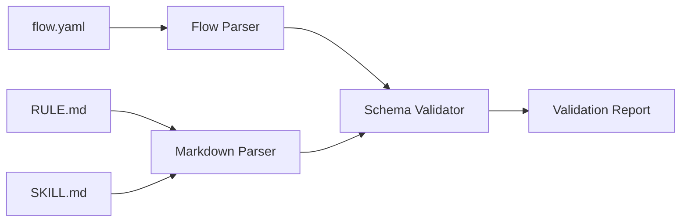

# T1 Implementation Plan — Core Model and Validation

## Overview

**Цель:** Реализовать разбор и валидацию flow/rule/skill артефактов, обеспечив стабильный вход для всех остальных подсистем.

**Ключевой инвариант:** валидируется только структура и frontmatter, body остается opaque и не ломается при повторном сохранении.

---

## 1. Scope T1 для Phase 0

### Входит в scope

| Компонент | Описание |
|-----------|----------|
| Flow YAML Parser | Разбор `flow.yaml` в типизированную модель |
| Markdown Parser | Разбор `RULE.md` и `SKILL.md` с frontmatter |
| JSON Schemas | Набор схем для flow и node типов |
| Validation Service | Единый сервис валидации |
| Error Model | Структурированные ошибки с путями |

### НЕ входит в scope (Phase 0)

| Компонент | Причина |
|-----------|---------|
| UI round-trip writer | В v5 нет требований к writer |
| Compiled IR | В v5 отсутствует IR layer |
| Schema evolution tooling | Достаточно статичных схем |
| Full AST preservation | Body считается opaque |

---

## 2. Conceptual Architecture

### 2.1 Data Flow



### 2.2 Key Invariants

| Инвариант | Объяснение |
|-----------|------------|
| Flow должен быть валиден перед publish | Нельзя публиковать неконсистентную структуру |
| Node schema соответствует типу | AI/Command/Gate имеют разные поля |
| Ошибки имеют path + message | Клиентский UI строится на структурных ошибках |

---

## 3. Implementation Slices

### Slice 1: Schema Loader (2h)
### Slice 2: Flow YAML Parser (3h)
### Slice 3: Markdown Parser (2h)
### Slice 4: Validation Service (3h)
### Slice 5: Error Model (2h)
### Slice 6: Fixtures and Tests (3h)

**Total: ~15 hours**

---

## 4. Backend Module Structure

```
backend/src/main/java/ru/hgd/sdlc/
└── flow/
    ├── domain/
    │   ├── FlowModel.java
    │   ├── NodeModel.java
    │   └── ValidationError.java
    ├── parser/
    │   ├── FlowYamlParser.java
    │   └── MarkdownFrontmatterParser.java
    ├── validation/
    │   ├── SchemaRegistry.java
    │   └── FlowValidator.java
    └── fixtures/
```

---

## 5. Proposed DB Schema

Не требуется для T1.

---

## 6. Validation Rules (Must)

1. Flow содержит обязательные поля.
2. `start_node_id` существует.
3. Все ссылки на nodes валидны.
4. AI node требует `skill_refs` и `instruction`.
5. Command node требует `command_engine` и `command_spec`.
6. Gate node требует соответствующие поля.

---

## 7. Tests

1. Unit: parse flow.yaml into model.
2. Unit: parse RULE.md frontmatter.
3. Unit: invalid node schema returns error with path.
4. Integration: validate fixtures in `backend/src/test/resources/fixtures`.

---

## 8. Definition of Done

1. Все схемы валидируют базовые fixtures.
2. Ошибки возвращают JSON: `path`, `message`, `severity`.
3. Валидация занимает < 200ms на artifact.

---

## 9. Risks & Mitigations

| Риск | Контрмера |
|------|-----------|
| Нестабильность парсинга YAML | Использовать строгий парсер + тесты |
| Несогласованные схемы | Centralized schema registry |

---

## 10. Recommended Implementation Order

1. Schema loader
2. Flow parser
3. Markdown parser
4. Validator + errors
5. Fixtures and tests

---

## 11. Repository File Structure

```
backend/src/main/resources/schemas/
  flow.schema.json
  node-ai.schema.json
  node-command.schema.json
  node-human-input-gate.schema.json
  node-human-approval-gate.schema.json
  rule.schema.json
  skill.schema.json
```

---

## Summary

T1 вводит единый контур валидации, который является фундаментом для publish, runtime и UI. Без валидной структуры остальные слои не должны стартовать.
