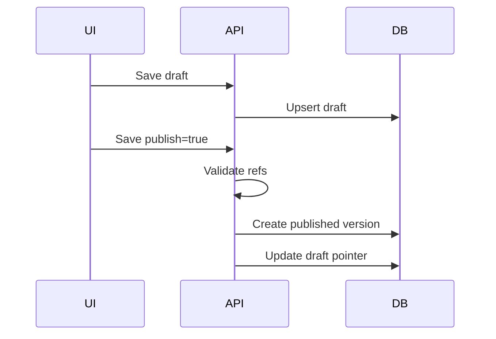

# T2 Implementation Plan — Versioning and Publish

## Overview

**Цель:** Обеспечить механизм draft/published версий для flow/rule/skill с авто-инкрементом patch и строгими ссылками.

**Ключевой инвариант:** run может стартовать только на published flow version, ссылающейся только на published rule/skills.

---

## 1. Scope T2 для Phase 0

### Входит в scope

| Компонент | Описание |
|-----------|----------|
| Draft Save | Обновление draft версий |
| Publish Save | Валидация + инкремент версии |
| canonical_name | Формат `{id}@{semver}` |
| Optimistic Lock | `resource_version` на save |
| Reference Checks | Flow publish требует published rule/skills |

### НЕ входит в scope (Phase 0)

| Компонент | Причина |
|-----------|---------|
| Multi-tenant access control | Пока single-tenant |
| Release packages | В v5 нет release pipeline |
| Signed provenance | Не требуется в v1 |

---

## 2. Conceptual Architecture



---

## 3. Implementation Slices

### Slice 1: Versioning Model (2h)
### Slice 2: canonical_name Generation (1h)
### Slice 3: Publish Workflow (3h)
### Slice 4: Reference Validation (2h)
### Slice 5: Optimistic Locking (2h)
### Slice 6: Integration Tests (3h)

**Total: ~13 hours**

---

## 4. Backend Module Structure

```
backend/src/main/java/ru/hgd/sdlc/
└── registry/
    ├── domain/
    │   ├── VersionedArtifact.java
    │   └── CanonicalName.java
    ├── application/
    │   ├── FlowPublishService.java
    │   ├── RulePublishService.java
    │   └── SkillPublishService.java
    └── infrastructure/
        ├── FlowRepository.java
        ├── RuleRepository.java
        └── SkillRepository.java
```

---

## 5. Proposed DB Schema

Add columns:

| Column | Purpose |
|--------|---------|
| `status` | draft/published |
| `resource_version` | optimistic lock |
| `canonical_name` | stable identity |

---

## 6. API Surface

- `POST /api/flows/{id}/save`
- `POST /api/rules/{id}/save`
- `POST /api/skills/{id}/save`

Payload:

- `content`
- `publish`
- `resource_version`

---

## 7. Tests

1. Unit: version increment patch.
2. Unit: canonical_name format enforced.
3. Integration: publish fails if refs not published.
4. Integration: optimistic lock rejects stale version.

---

## 8. Definition of Done

1. Publish creates immutable version and canonical_name.
2. Run creation accepts only published flow.
3. Draft updates do not mutate published versions.

---

## 9. Risks & Mitigations

| Риск | Контрмера |
|------|-----------|
| Конфликт при параллельном save | Optimistic locking |
| Нарушение ссылок | Strict ref validation |

---

## 10. Recommended Implementation Order

1. Version model
2. Publish workflow
3. Ref validation
4. Optimistic lock
5. Tests

---

## Summary

T2 обеспечивает стабильную версионированную основу для run и предотвращает execution по нестабильным или несовместимым версиям.
