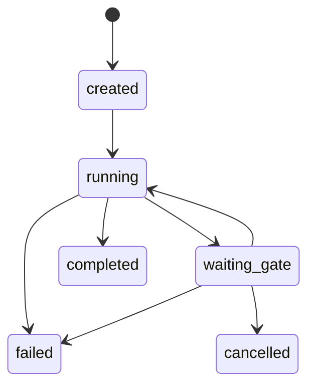

# T3 Implementation Plan — Run Orchestrator and State Machine

## Overview

**Цель:** Реализовать управление run, state machine и concurrency guard для `project + target_branch`.

**Ключевой инвариант:** все transitions идут через единый transition engine и аудитируются.

---

## 1. Scope T3 для Phase 0

### Входит в scope

| Компонент | Описание |
|-----------|----------|
| Run lifecycle | created → running → waiting_gate → completed | 
| Node execution | queued → running → succeeded/failed |
| Concurrency guard | 1 активный run на `project + target_branch` |
| Restart policy | policy-driven retry |
| Audit events | на все state transitions |

### НЕ входит в scope (Phase 0)

| Компонент | Причина |
|-----------|---------|
| Leases | отсутствуют в v5 |
| Budgets | отсутствуют в v5 |
| CAS/Projections | отсутствуют в v5 |

---

## 2. Conceptual Architecture



---

## 3. Implementation Slices

### Slice 1: Run Aggregate Model (2h)
### Slice 2: Transition Guard (2h)
### Slice 3: Concurrency Guard (2h)
### Slice 4: Node Execution Tracking (3h)
### Slice 5: Restart Policy Handler (2h)
### Slice 6: Audit Events (2h)

**Total: ~13 hours**

---

## 4. Backend Module Structure

```
backend/src/main/java/ru/hgd/sdlc/
└── runtime/
    ├── domain/
    │   ├── RunState.java
    │   ├── NodeExecution.java
    │   └── TransitionRule.java
    ├── application/
    │   ├── RunOrchestrator.java
    │   └── RestartHandler.java
    └── infrastructure/
        ├── RunRepository.java
        └── NodeExecutionRepository.java
```

---

## 5. Proposed DB Schema

Add columns:

| Column | Purpose |
|--------|---------|
| `run_version` | optimistic lock |
| `current_node_id` | state pointer |
| `attempt_no` | retry tracking |

---

## 6. Tests

1. Unit: invalid transition rejected.
2. Unit: concurrency guard returns conflict.
3. Integration: restart applies retry policy.
4. Integration: audit events emitted.

---

## 7. Definition of Done

1. Run transitions are validated by one engine.
2. Concurrency guard enforced on run creation.
3. Restart policy applied on `running` node.
4. Audit events persisted for each transition.

---

## 8. Risks & Mitigations

| Риск | Контрмера |
|------|-----------|
| Дублирующие transitions | Centralized guard |
| Потеря run при restart | Persisted state + retry policy |

---

## Summary

T3 фиксирует единый контролируемый lifecycle run, на котором строится всё выполнение flow.
