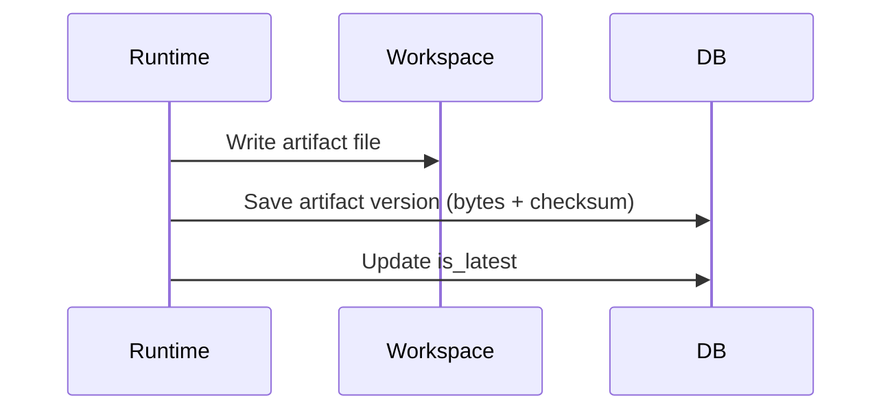

# T5 Implementation Plan — Artifacts and Storage

## Overview

**Цель:** Реализовать immutable versioning артефактов и хранение контента в БД.

**Ключевой инвариант:** каждая новая запись создает новую artifact version, история не теряется.

---

## 1. Scope T5 для Phase 0

### Входит в scope

| Компонент | Описание |
|-----------|----------|
| Artifact versioning | `artifact_version_no` и `is_latest` |
| Content persistence | `content_text` как raw bytes |
| Checksum | sha256 на каждый артефакт |
| Path resolver | `.hgsdlc/{runId}/{nodeId}/artifacts` |

### НЕ входит в scope (Phase 0)

| Компонент | Причина |
|-----------|---------|
| External blob store | v1 хранит в БД |
| Retention policies | Пока без lifecycle |

---

## 2. Conceptual Architecture



---

## 3. Implementation Slices

### Slice 1: Path Resolver (1h)
### Slice 2: Artifact Repository (3h)
### Slice 3: Checksum Calculation (2h)
### Slice 4: Version Increment + is_latest (2h)
### Slice 5: Gate Integration (2h)

**Total: ~10 hours**

---

## 4. Backend Module Structure

```
backend/src/main/java/ru/hgd/sdlc/
└── artifact/
    ├── ArtifactService.java
    ├── ArtifactRepository.java
    ├── ArtifactPathResolver.java
    └── ArtifactChecksum.java
```

---

## 5. Proposed DB Schema

Table: `artifacts`

Fields:

- `content_text` bytea
- `artifact_version_no`
- `attempt_no`
- `is_latest`

---

## 6. Tests

1. Unit: version increment on rework.
2. Unit: is_latest toggled correctly.
3. Integration: checksum stored matches content.
4. Integration: gate references correct artifact version.

---

## 7. Definition of Done

1. Artifacts are immutable versions.
2. Checksums stored and queryable.
3. Gate review references exact versions.

---

## Summary

T5 обеспечивает устойчивое хранение артефактов и дает воспроизводимость review.
