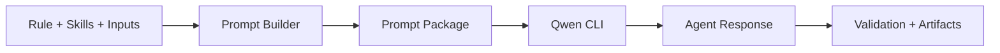

# T6 Implementation Plan — Agent Integration and Prompt Package

## Overview

**Цель:** Интеграция Qwen CLI, детерминированный prompt package и валидация ответа агента.

**Ключевой инвариант:** prompt package хранится в БД и соответствует конкретной node execution attempt.

---

## 1. Scope T6 для Phase 0

### Входит в scope

| Компонент | Описание |
|-----------|----------|
| Prompt package builder | Секции по спецификации |
| Qwen CLI runner | headless execution |
| Materialization | `.qwen/QWEN.md` и `.qwen/skills` |
| Response validation | `agent-response.schema.json` |

### НЕ входит в scope (Phase 0)

| Компонент | Причина |
|-----------|---------|
| Multi-agent | Только Qwen |
| Tool enforcement | Только allowlist command nodes |

---

## 2. Conceptual Architecture



---

## 3. Implementation Slices

### Slice 1: Prompt Builder (3h)
### Slice 2: Prompt Checksum (1h)
### Slice 3: Qwen Runner (3h)
### Slice 4: Response Parser (2h)
### Slice 5: Response Validator (2h)

**Total: ~11 hours**

---

## 4. Backend Module Structure

```
backend/src/main/java/ru/hgd/sdlc/
└── agent/
    ├── QwenRunner.java
    ├── PromptBuilder.java
    ├── PromptChecksum.java
    ├── AgentResponseParser.java
    └── AgentResponseValidator.java
```

---

## 5. Proposed DB Schema

Fields:

- `prompt_checksum`
- `prompt_package_json`
- `agent_response_json`
- `stdout_text`, `stderr_text`

---

## 6. Tests

1. Unit: prompt sections ordered.
2. Unit: checksum stable.
3. Integration: Qwen invoked with expected args.
4. Integration: invalid response fails node.

---

## 7. Definition of Done

1. Prompt package stored and queryable.
2. Qwen execution captured in DB.
3. Invalid response returns error and fails node.

---

## Summary

T6 связывает runtime с агентом и обеспечивает проверяемую, детерминированную связку prompt → response.
