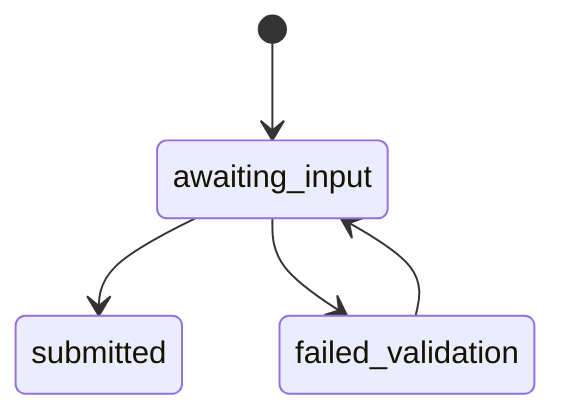
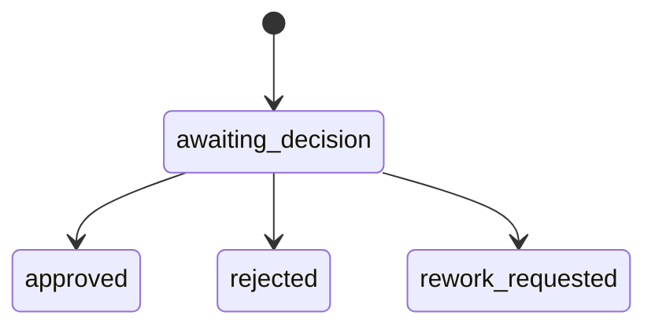

# T7 Implementation Plan — Gates and Review UI

## Overview

**Цель:** Реализовать human_input и human_approval gates, а также UI для прохождения gates.

**Ключевой инвариант:** gate решения всегда привязаны к конкретным версиям артефактов.

---

## 1. Scope T7 для Phase 0

### Входит в scope

| Компонент | Описание |
|-----------|----------|
| Gate lifecycle | awaiting_input / awaiting_decision |
| Gate API | submit/approve/reject/rework |
| Review UI | gate screens + run console |
| Optimistic locking | gate_version required |

### НЕ входит в scope (Phase 0)

| Компонент | Причина |
|-----------|---------|
| Custom workflow UI | Достаточно базового |
| Multi-step approval | Один approver |

---

## 2. Conceptual Architecture





---

## 3. Implementation Slices

### Slice 1: Gate Model + Repository (2h)
### Slice 2: Gate Service Logic (3h)
### Slice 3: Gate API Endpoints (2h)
### Slice 4: UI Gate Input Screen (3h)
### Slice 5: UI Gate Approval Screen (3h)

**Total: ~13 hours**

---

## 4. Backend Module Structure

```
backend/src/main/java/ru/hgd/sdlc/
└── gate/
    ├── GateService.java
    ├── GateRepository.java
    ├── GateDecisionHandler.java
    └── GateValidation.java
```

---

## 5. UI Structure

```
frontend/src/
  pages/
    RunConsole.jsx
    GateInput.jsx
    GateApproval.jsx
```

---

## 6. Tests

1. Unit: input validation rules.
2. Unit: rework route selection.
3. Integration: optimistic locking enforced.
4. UI: approval flow smoke test.

---

## 7. Definition of Done

1. Gates block execution until resolved.
2. Gate decision includes artifact version references.
3. UI resumes open gates after restart.

---

## Summary

T7 обеспечивает человеческое вмешательство с гарантией непротиворечивого review.
