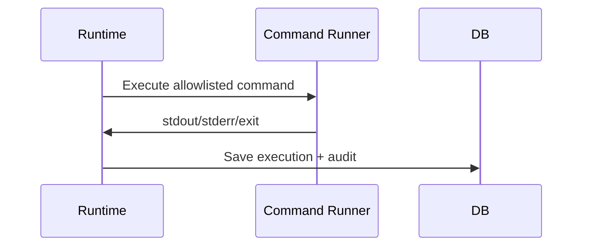

# T8 Implementation Plan — External Commands, Audit, and Hardening

## Overview

**Цель:** Реализовать External Command nodes, полный аудит, delta summary и idempotency.

**Ключевой инвариант:** никакой командный узел не исполняется вне allowlist.

---

## 1. Scope T8 для Phase 0

### Входит в scope

| Компонент | Описание |
|-----------|----------|
| External Command | allowlist enforcement |
| Audit events | runtime/agent/review |
| Delta summary | computed after executor |
| Idempotency | Idempotency-Key + resource_version |

### НЕ входит в scope (Phase 0)

| Компонент | Причина |
|-----------|---------|
| Push/PR automation | v1 не требует |
| Advanced telemetry | базовые audit события |

---

## 2. Conceptual Architecture



---

## 3. Implementation Slices

### Slice 1: Allowlist Validator (2h)
### Slice 2: Command Executor (3h)
### Slice 3: Audit Writer (2h)
### Slice 4: Delta Summary Builder (2h)
### Slice 5: Idempotency Middleware (2h)

**Total: ~11 hours**

---

## 4. Backend Module Structure

```
backend/src/main/java/ru/hgd/sdlc/
└── command/
    ├── AllowlistValidator.java
    ├── CommandExecutor.java
    └── CommandResult.java
└── audit/
    ├── AuditWriter.java
    └── AuditQueryService.java
```

---

## 5. Proposed DB Schema

Tables:

- `audit_events`
- `node_executions` (stdout/stderr/exit)

---

## 6. Tests

1. Unit: allowlisted command passes.
2. Unit: non-allowlisted command rejected.
3. Integration: stdout/stderr stored in DB.
4. Integration: idempotency prevents duplicate run creation.

---

## 7. Definition of Done

1. External Command nodes are allowlist-enforced.
2. Audit endpoints return runtime/agent/review data.
3. Idempotency enforced on mutation endpoints.

---

## Summary

T8 завершает минимально безопасный execution kernel с audit и command enforcement.
