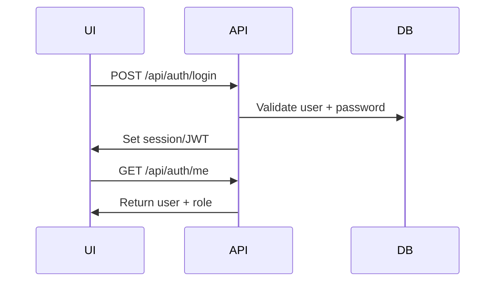

# T9 Implementation Plan — Authentication and Authorization Services

## Overview

**Цель:** Реализовать базовую аутентификацию и авторизацию backend сервисов, соответствующих v5 требованиям по ролям и доступу.

**Ключевой инвариант:** все защищённые endpoints требуют валидной сессии/токена, а операции с run/gate/publish выполняются только разрешёнными ролями.

---

## 1. Scope T9 для Phase 0

### Входит в scope

| Компонент | Описание |
|-----------|----------|
| Auth API | `/api/auth/login`, `/api/auth/logout`, `/api/auth/me` |
| User store | таблица users + роли |
| Session/JWT | server-side session или JWT (v1) |
| RBAC | enforcement на API уровне |
| Password hashing | BCrypt/Argon2 |

### НЕ входит в scope (Phase 0)

| Компонент | Причина |
|-----------|---------|
| SSO/OIDC | v1 допускает stub auth |
| MFA | не требуется |
| Fine-grained permissions | достаточно ролей |
| Audit for auth events | optional, но можно добавить позже |

---

## 2. Conceptual Architecture



---

## 3. Roles and Policies (v5)

| Role | Allowed Actions |
|------|-----------------|
| FLOW_CONFIGURATOR | edit/save flow/rule/skill, publish |
| PRODUCT_OWNER | start run, submit human_input |
| TECH_APPROVER | approve/reject/rework gates |

Base policies:

1. `POST /api/runs` — только PRODUCT_OWNER
2. Gate approve/reject/rework — только TECH_APPROVER
3. Save/publish flow/rule/skill — только FLOW_CONFIGURATOR
4. Read-only endpoints — любая аутентифицированная роль

---

## 4. Implementation Slices

### Slice 1: User Model + Repository (2h)
### Slice 2: Password Hashing (1h)
### Slice 3: Auth Controller (2h)
### Slice 4: Session/JWT Middleware (2h)
### Slice 5: RBAC Guard (3h)
### Slice 6: Integration Tests (3h)

**Total: ~13 hours**

---

## 5. Backend Module Structure

```
backend/src/main/java/ru/hgd/sdlc/
└── auth/
    ├── domain/
    │   ├── User.java
    │   ├── Role.java
    │   └── AuthSession.java
    ├── application/
    │   ├── AuthService.java
    │   └── RolePolicy.java
    ├── infrastructure/
    │   ├── UserRepository.java
    │   ├── SessionStore.java
    │   └── PasswordHasher.java
    └── api/
        ├── AuthController.java
        └── AuthRequest/Response DTOs
```

---

## 6. Proposed DB Schema

```sql
create table users (
  id uuid primary key,
  username varchar(128) not null unique,
  display_name varchar(255) not null,
  role varchar(64) not null,
  password_hash varchar(255) not null,
  enabled boolean not null default true,
  created_at timestamptz not null
);
```

Optionally for sessions (if not JWT):

```sql
create table sessions (
  id uuid primary key,
  user_id uuid not null references users(id),
  token varchar(255) not null unique,
  expires_at timestamptz not null,
  created_at timestamptz not null
);
```

---

## 7. API Contracts

### 7.1 Login

`POST /api/auth/login`

Request:

```json
{ "username": "alice", "password": "secret" }
```

Response:

```json
{ "token": "...", "user": { "id": "...", "username": "alice", "role": "FLOW_CONFIGURATOR" } }
```

### 7.2 Logout

`POST /api/auth/logout`

### 7.3 Me

`GET /api/auth/me`

Response:

```json
{ "id": "...", "username": "alice", "role": "FLOW_CONFIGURATOR" }
```

---

## 8. Tests

1. Unit: password hashing verify.
2. Unit: login succeeds with valid credentials.
3. Unit: login fails with invalid credentials.
4. Integration: role guard blocks unauthorized endpoint.
5. Integration: token/session invalidated after logout.

---

## 9. Definition of Done

1. Auth endpoints functional.
2. All protected endpoints enforce RBAC.
3. Sessions or JWT verified on each request.
4. Login/logout tested via integration tests.

---

## 10. Risks & Mitigations

| Риск | Контрмера |
|------|-----------|
| Слабое хранение паролей | BCrypt/Argon2 |
| RBAC обходится | Centralized guard + tests |
| Нестабильные сессии | Short TTL + refresh strategy |

---

## 11. Recommended Implementation Order

1. User model + repository
2. Password hasher
3. Auth controller
4. Session/JWT middleware
5. RBAC guard
6. Integration tests

---

## Summary

T9 вводит базовую аутентификацию и авторизацию, необходимую для безопасного запуска run и прохождения gates в v1.
