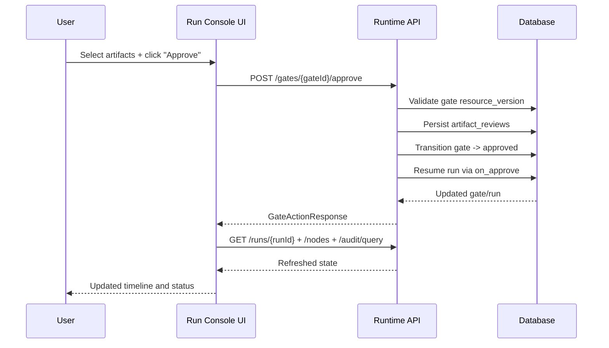
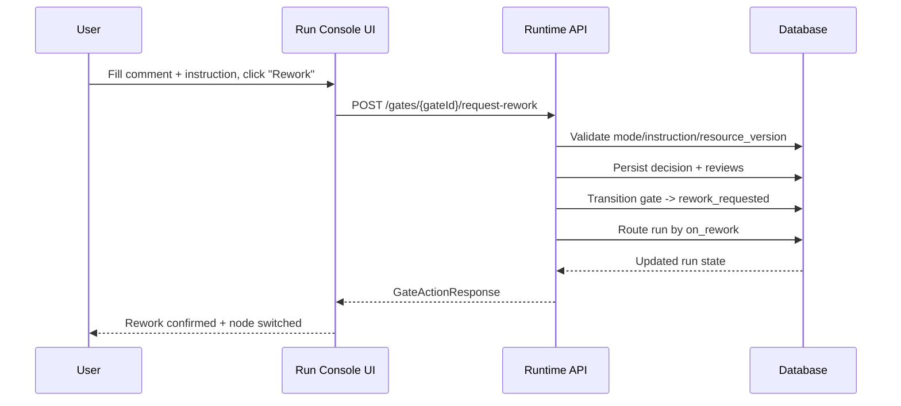
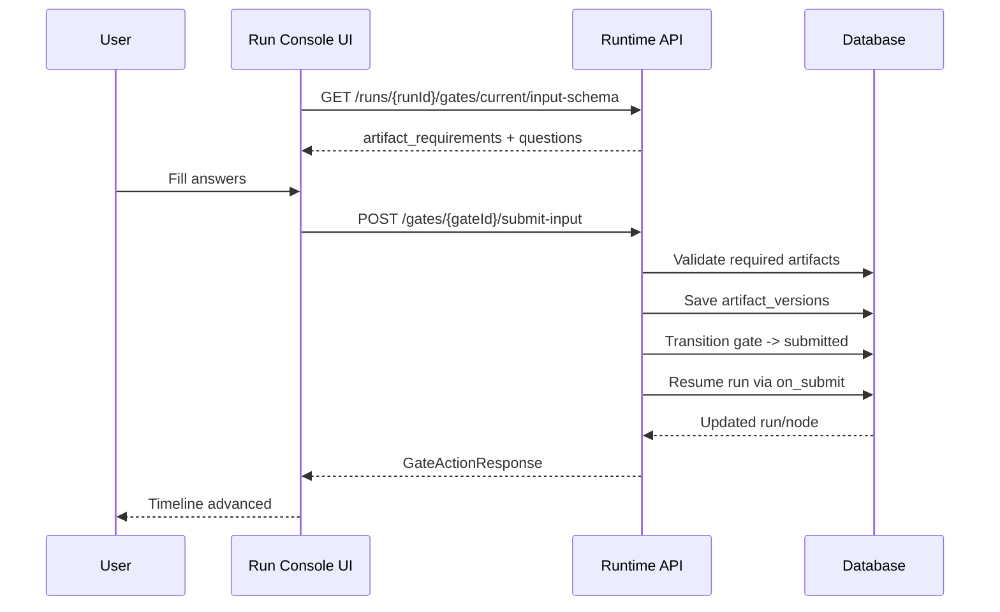

# Plan: Run Console Operator Workbench

## 1. Цель
Сделать `Run Console` основным рабочим местом оператора для трех ключевых задач без перехода на отдельные страницы:
1. Просмотр и ревью выходных артефактов с последующим `approve/rework`.
2. Удобный аудит по нодам и событиям (фильтрация, детализация, навигация).
3. Ввод ответов для `human_input`-нод с пониманием, в какой артефакт ожидается ответ.

## 2. Scope и результат

### In scope
- Новый UX `Run Console` (режим Operator Workbench).
- Backend API для содержимого артефактов, диффов, фильтрации аудита и описания ожидаемого input.
- Минимальные изменения схемы БД для поддержки артефактного ревью и быстрых фильтров аудита.
- Состояния UI для gate workflow (`approve`, `rework`, `submit-input`) в одном экране.
- Набор e2e/integration тестов на критические сценарии.

### Out of scope (phase-2+)
- Полноценный код-редактор уровня IDE.
- Коллаборативный одновременный ревью несколькими пользователями.
- Полнотекстовый поиск по большим бинарным артефактам.

### Определение готовности (DoD)
- Оператор может выполнить `approve/rework/submit-input` из `Run Console` без перехода на `/gate-*`.
- Оператор видит содержимое релевантных артефактов и дифф между версиями.
- Аудит фильтруется по `node/event type/actor/time` и открывает карточку события < 300 мс при 1k событий.
- Все новые API покрыты тестами, миграции применяются без потери данных.

## 3. Пользовательские сценарии

### US-1: Ревью артефактов
Как ревьюер, я открываю run, выбираю ноду/файл, смотрю содержимое/дифф и принимаю решение (`approve` или `rework`) с комментарием.

### US-2: Аудит по ноде/событию
Как оператор, я выбираю ноду в timeline и вижу только связанные события, могу открыть полные детали payload и перейти к связанным артефактам.

### US-3: Ввод ответов в human_input
Как оператор, я вижу ожидаемые input-артефакты (ключ, путь, формат), ввожу ответ в UI и отправляю в правильный артефакт.

## 4. Текущее состояние (as-is)
- `Run Console` уже грузит `run/nodes/artifacts/audit`, но артефакты отображаются метаданными.
- `approve/rework/input` вынесены в отдельные страницы gate.
- Аудит отображается списком collapse, без прикладной фильтрации/связки с timeline.

## 5. Целевая UX-модель (to-be)

## 5.1 IA страницы `Run Console`
Трехпанельный layout:
1. Левая панель: `Node Timeline` + фильтры (статус, gate-only, failed-only).
2. Центральная панель (табы):
   - `Review`: дерево артефактов + viewer/diff + mark reviewed.
   - `Audit`: таблица/лента событий с фильтрами и карточкой события.
   - `Overview`: KPI run + summary.
3. Правая панель: `Action Center`:
   - текущий gate,
   - decision form (`approve/rework`) или input form (`submit-input`),
   - validation/errors/last action status.

## 5.2 UX-правила
- Если run в `waiting_gate`, `Action Center` раскрыт по умолчанию.
- Если gate отсутствует, панель действий показывает read-only статус.
- Все destructive/action кнопки имеют confirm.
- После action UI делает optimistic lock refresh (через `resource_version`).

## 6. Backend изменения

## 6.1 Новые API

### GET `/api/runs/{runId}/artifacts/{artifactVersionId}/content`
Назначение: получить контент текстового артефакта (или метаданные для бинарного).

Response (text):
```json
{
  "artifact_version_id": "uuid",
  "content_type": "text/markdown",
  "encoding": "utf-8",
  "is_binary": false,
  "content": "..."
}
```

Response (binary):
```json
{
  "artifact_version_id": "uuid",
  "is_binary": true,
  "download_url": "/api/artifacts/.../download"
}
```

### GET `/api/runs/{runId}/artifacts/{artifactVersionId}/diff?base={baseArtifactVersionId}`
Назначение: получить unified diff между версиями.

Response:
```json
{
  "artifact_version_id": "uuid",
  "base_artifact_version_id": "uuid",
  "format": "unified",
  "diff": "@@ -1,3 +1,4 @@ ..."
}
```

### GET `/api/runs/{runId}/audit/query`
Параметры:
- `node_id` (optional)
- `event_type` (optional, multi)
- `actor_type` (optional)
- `from` / `to` (optional)
- `cursor` / `limit`

Назначение: серверная фильтрация аудита и пагинация.

### GET `/api/runs/{runId}/gates/current/input-schema`
Назначение: явное описание ожидаемого input для UI.

Response:
```json
{
  "gate_id": "uuid",
  "artifact_requirements": [
    {
      "artifact_key": "answers",
      "path": "answers.md",
      "scope": "run",
      "format": "markdown",
      "required": true,
      "description": "Ответы на вопросы для human_input"
    }
  ],
  "questions": [
    "..."
  ]
}
```

## 6.2 Изменения существующих API
- `GET /api/runs/{runId}/artifacts`: добавить `node_execution_id`, `created_by`, `review_state` (derived).
- `POST /api/gates/{gateId}/approve` и `/request-rework`: поддержать `reviewed_artifact_version_ids` как обязательный для `human_approval` (валидация по конфигу).

## 7. Изменения БД

## 7.1 Новые таблицы

### `artifact_reviews`
```sql
create table artifact_reviews (
  id uuid primary key,
  run_id uuid not null,
  gate_id uuid not null,
  artifact_version_id uuid not null,
  reviewer_id varchar(128) not null,
  decision varchar(32) not null, -- approved | rejected | commented
  comment text null,
  created_at timestamp not null,
  unique (gate_id, artifact_version_id, reviewer_id)
);

create index idx_artifact_reviews_run_gate on artifact_reviews(run_id, gate_id);
create index idx_artifact_reviews_artifact on artifact_reviews(artifact_version_id);
```

### `gate_input_requirements`
```sql
create table gate_input_requirements (
  id uuid primary key,
  gate_id uuid not null,
  artifact_key varchar(128) not null,
  path varchar(512) not null,
  scope varchar(32) not null,
  format varchar(32) not null default 'markdown',
  required boolean not null default true,
  description text null,
  created_at timestamp not null,
  unique (gate_id, artifact_key, path)
);

create index idx_gate_input_requirements_gate on gate_input_requirements(gate_id);
```

## 7.2 Изменения существующих таблиц

### `audit_events`
Добавить денормализующие индексы для фильтрации:
```sql
create index idx_audit_events_run_node_time on audit_events(run_id, node_execution_id, event_time desc);
create index idx_audit_events_run_event_type_time on audit_events(run_id, event_type, event_time desc);
create index idx_audit_events_run_actor_time on audit_events(run_id, actor_type, event_time desc);
```

### `artifact_versions`
(опционально) добавить `content_type` для быстрого определения типа контента.
```sql
alter table artifact_versions add column content_type varchar(128) null;
create index idx_artifact_versions_run_node on artifact_versions(run_id, node_id, created_at desc);
```

## 7.3 Миграционная стратегия
1. Добавить таблицы и индексы backward-compatible.
2. Заполнить `gate_input_requirements` из `gate.payload` для активных gate через migration job.
3. Включить чтение новых полей с fallback к старой payload-модели.
4. После стабилизации сделать `reviewed_artifact_version_ids` обязательным в бизнес-валидации.

## 8. Frontend изменения

## 8.1 Новые компоненты
- `RunConsoleLayout` (3-панельный контейнер).
- `ArtifactExplorer` (дерево файлов/группировка по node).
- `ArtifactViewer` (text/json/markdown viewer).
- `ArtifactDiffViewer` (unified diff).
- `AuditExplorer` (фильтры + список + детальная карточка).
- `ActionCenter` (approve/rework/input forms).

## 8.2 Изменения страницы
- Расширить [RunConsole.jsx](/Users/nick/IdeaProjects/human-guided-development/frontend/src/pages/RunConsole.jsx):
  - убрать дублирование `Latest artifacts`;
  - добавить вкладки `Review` и продвинутую `Audit`;
  - встроить формы gate-действий;
  - добавить устойчивый refresh-state (`live`, `stale`, `error`).

## 8.3 Состояние и данные
Новые client states:
- `selectedNodeId`
- `selectedArtifactVersionId`
- `artifactContentCache`
- `auditFilters`
- `auditCursor`
- `actionDraft` (approve/rework/input)

## 8.4 Валидации UI
- `Approve` disabled, если policy требует хотя бы 1 reviewed artifact.
- `Rework` требует `instruction`.
- `Submit input` требует все required артефакты.
- Ошибка optimistic lock (`409`) -> автоперезагрузка gate и уведомление.

## 9. Диаграммы последовательности

## 9.1 Approve из Run Console


## 9.2 Rework из Run Console


## 9.3 Submit input из Run Console


## 10. Этапы реализации

## Phase 0: Design + Contracts (2-3 дня)
- Утвердить wireframe `Run Console Operator Workbench`.
- Зафиксировать API contracts (OpenAPI/markdown).
- Утвердить миграции и индексы.

## Phase 1: Data foundation (4-6 дней)
- Реализовать content/diff endpoints для артефактов.
- Реализовать `audit/query` с cursor pagination.
- Добавить таблицы `artifact_reviews`, `gate_input_requirements`.
- Интеграционные тесты API.

## Phase 2: UI workbench MVP (5-7 дней)
- Новый layout страницы.
- Вкладка `Review` + content viewer.
- Вкладка `Audit` с базовыми фильтрами.
- `Action Center` с approve/rework/input.

## Phase 3: UX hardening (3-5 дней)
- Diff viewer и reviewed artifacts marker.
- Ошибки/конфликты/optimistic lock UX.
- Производительность (virtual list для audit/events).
- E2E smoke на критические сценарии.

## 11. Backlog задач (конкретно)

### Backend
1. Добавить endpoint контента артефакта.
2. Добавить endpoint diff артефактов.
3. Добавить endpoint `audit/query` с фильтрами и cursor.
4. Добавить endpoint `gates/current/input-schema`.
5. Реализовать таблицу `artifact_reviews` и сервис записи review.
6. Реализовать таблицу `gate_input_requirements` + fallback на payload.
7. Добавить индексы для audit и artifacts.
8. Обновить policy-валидации gate действий.
9. Добавить интеграционные тесты и negative cases (`409/422/403`).

### Frontend
1. Рефактор `RunConsole.jsx` в контейнер + дочерние компоненты.
2. Реализовать `ArtifactExplorer` и `ArtifactViewer`.
3. Реализовать `ArtifactDiffViewer`.
4. Реализовать `AuditExplorer` с фильтрами/детализацией.
5. Реализовать `ActionCenter` для `approve/rework/input`.
6. Добавить обработку optimistic lock и retry.
7. Добавить deep-link (`runId`, `nodeId`, `eventId`, `artifactVersionId`).
8. Добавить e2e сценарии.

## 12. Тест-план

### Интеграционные
- approve с валидными reviewed artifacts.
- rework без instruction -> `422`.
- submit-input без required artifact -> `422`.
- conflict по `expected_gate_version` -> `409`.

### E2E
- Happy path approve из Run Console.
- Happy path rework из Run Console.
- Happy path input submit из Run Console.
- Фильтрация аудита по node и event type.
- Открытие diff и возврат к action center.

### Нагрузочные (минимум)
- 1000+ audit events в run: время первичной загрузки, фильтра и скролла.

## 13. Риски и mitigation
- Риск: большие артефакты тормозят UI.
  - Mitigation: lazy loading + лимиты + streaming/download fallback.
- Риск: неструктурированные payload для human_input.
  - Mitigation: `gate_input_requirements` как явный контракт.
- Риск: гонки при одновременных действиях ревьюеров.
  - Mitigation: strict optimistic locking + явные conflict messages.

## 14. Метрики успеха
- Время до принятия решения по gate (median) -30%.
- Доля gate-операций без перехода на отдельные страницы >= 90%.
- Ошибки операторов (неверный артефакт/input) -50%.
- CSAT внутренних пользователей по Run Console >= 4/5.

## 15. Артефакты реализации
- Технический дизайн: этот документ.
- API контракт: `docs/spec/api-run-console-workbench.md` (создать в Phase 0).
- UI wireframes: `docs/spec/ui-run-console-workbench.md` (создать в Phase 0).
- Migration scripts: `backend/src/main/resources/db/migration/*`.

