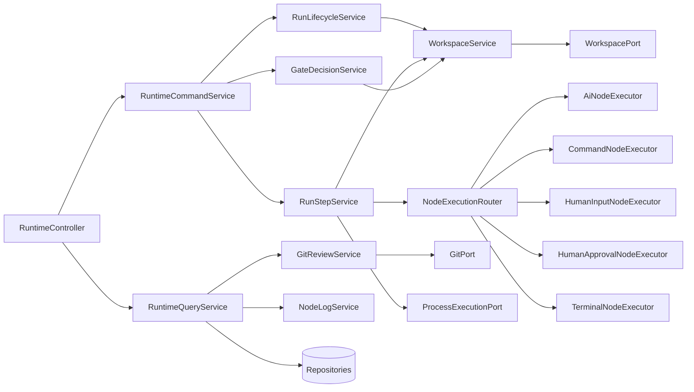
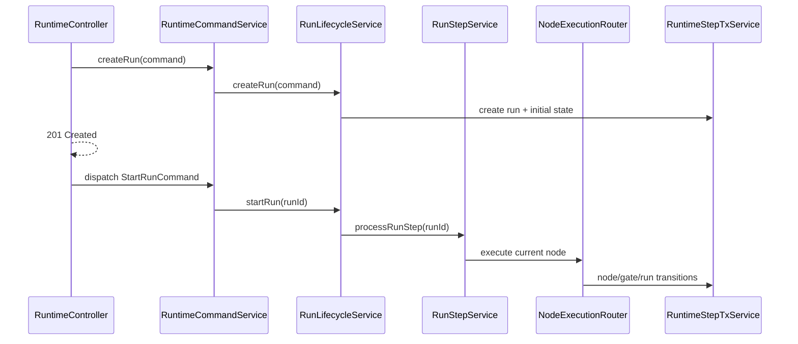
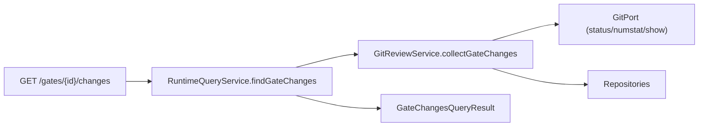

# Runtime Refactoring Plan (CQRS, крупные сервисы)

## 1. Контекст и цель

Этот план предполагает рефакторинг **с нуля** после отката текущих изменений.

Цель:
- убрать `RuntimeService` как монолит (god-class),
- сохранить читаемость (без сотен мелких классов-оберток),
- разделить write/read сценарии (CQRS),
- сохранить текущее поведение API и runtime-движка 1:1.

Не цель:
- менять бизнес-правила flow/gate/node,
- менять контракты REST API,
- менять формат audit/prompt/trace.

---

## 2. Целевая структура (крупнозернистая)

### 2.1 Пакеты

```text
runtime/
  api/
  application/
    command/
    query/
    service/
    port/
  infrastructure/
    process/
    git/
    fs/
```

### 2.2 Классы и ответственность

| Класс | Слой | Ответственность | Публичные методы |
|---|---|---|---|
| `RuntimeCommandService` | application/service | Единая write-точка входа из controller/dispatcher | `createRun`, `startRun`, `resumeRun`, `cancelRun`, `submitInput`, `approveGate`, `requestRework`, `recoverActiveRuns`, `processRunStep` |
| `RuntimeQueryService` | application/service | Единая read-точка входа для query-эндпоинтов | `findRun`, `findRuns`, `findCurrentGate`, `findGateInbox`, `findGateChanges`, `findGateDiff`, `findNodeExecutions`, `findArtifacts`, `findArtifactContent`, `findAuditEvent(s)`, `findNodeLog` |
| `RunLifecycleService` | application/service | Жизненный цикл run (create/start/resume/cancel/recover) | `createRun`, `startRun`, `resumeRun`, `cancelRun`, `recoverActiveRuns` |
| `RunStepService` | application/service | Цикл исполнения шага и переходов run | `processRunStep` |
| `GateDecisionService` | application/service | Решения человека по gate (submit/approve/rework) | `submitInput`, `approveGate`, `requestRework` |
| `WorkspaceService` | application/service | Работа с workspace/path/file/checksum для run | методы резолва путей, чтения/записи, materialize helpers |
| `GitReviewService` | application/service | Query-логика git changes/diff/head/show/numstat | `collectGateChanges`, `buildGateDiff` |
| `NodeLogService` | application/service | Чтение и парсинг stdout/log для node (ai/command) | `readNodeLog` |
| `NodeExecutionRouter` | application/service | Диспетчер node-kind -> executor | `executeNode(run,node,execution)` |
| `AiNodeExecutor` | application/service | Выполнение AI node | `execute(...)` |
| `CommandNodeExecutor` | application/service | Выполнение command node | `execute(...)` |
| `HumanInputNodeExecutor` | application/service | Открытие/обработка human_input gate | `execute(...)` |
| `HumanApprovalNodeExecutor` | application/service | Открытие human_approval gate | `execute(...)` |
| `TerminalNodeExecutor` | application/service | Завершение terminal node/run | `execute(...)` |

---

## 3. Диаграммы

### 3.1 Высокоуровневая CQRS схема



### 3.2 Последовательность write-сценария (`create -> start -> processStep`)



### 3.3 Query-сценарий (`gate changes`)



---

## 4. Карта переноса методов из RuntimeService

> Ниже перечислены **группы методов** из `RuntimeService`, которые переносим в новые классы.

### 4.1 В `RuntimeQueryService`

| Переносимые методы | Комментарий |
|---|---|
| `findCurrentGate` | read-only |
| `listInboxGates` | read-only + role filter |
| `getAuditEvent` | read-only |
| `queryAuditEvents` | read-only + filter/paging |
| `getArtifactContent` (если используется в сервисе) | read-only |
| `getGateChanges` | delegate в `GitReviewService` |
| `getGateDiff` | delegate в `GitReviewService` |
| `getNodeLog` | delegate в `NodeLogService` |

### 4.2 В `RunLifecycleService`

| Переносимые методы | Комментарий |
|---|---|
| `prepareWorkspace` | подготовка project/run scope |
| `recoverActiveRuns` | recovery RUNNING/WAITING_GATE |
| `createRun`/`startRun`/`resumeRun`/`cancelRun` | если в текущей ветке они в `RuntimeService` или разбросаны |
| `runTickSafely` | оставить рядом с start/recover orchestration |

### 4.3 В `RunStepService`

| Переносимые методы | Комментарий |
|---|---|
| `tick` (переименовать в `processRunStep`) | главный цикл |
| `executeCurrentNode` | создание execution + routing |
| `dispatchNodeExecution` | переход к router |
| `applyTransition` | central transition rule |
| `failRun` | единое завершение с ошибкой |
| `createNodeExecution` | начало попытки исполнения |
| `createCheckpointBeforeExecution` | checkpoint для ai/command |
| `completeTerminalNode` | завершение terminal |
| `resolveTerminalStatus` | выбор финального статуса |
| `isRunCancelled`, `isRunTerminal` | control helpers |
| `parseFlowSnapshot`, `requireNode` | flow/node validation |

### 4.4 В `GateDecisionService`

| Переносимые методы | Комментарий |
|---|---|
| `submitInput` | полный сценарий human_input submit |
| `approveGate` | human_approval approve |
| `requestRework` | human_approval rework |
| `enforceGateRole` | security/rbac check |
| `resolveReworkTarget` | transition target for rework |
| `shouldKeepChangesOnRework` | keep/discard policy |
| `rollbackWorkspaceToCheckpoint` | git reset to checkpoint |
| `validateSubmittedArtifact` | input validation |
| `validateHumanInputOutputs` | required/non-empty/changed validation |
| `resolveHumanInputEditableArtifacts` | editable artifact resolution |
| `createHumanInputOutputFiles` | materialize editable outputs |
| `recordArtifactVersion` | artifact versioning |

### 4.5 В `WorkspaceService`

| Переносимые методы | Комментарий |
|---|---|
| `resolveRunWorkspaceRoot(...)` | path composition |
| `resolveProjectScopeRoot`, `resolveRunScopeRoot` | scope roots |
| `resolveProjectRoot`, `resolveNodeExecutionRoot` | execution roots |
| `resolvePath`, `resolveProducedArtifactPath`, `resolveArtifactRefPath` | path mapping |
| `relativizeRunScopePath` | run-scope rel path |
| `createDirectories`, `writeFile`, `readFileContent` | fs ops |
| `decodeBase64`, `fileChecksumOrNull`, `fileSize` | payload/hash helpers |
| `writeContextManifest` | context manifest writing |
| `ensureRuntimeMetadataIgnored`, `ensureWorkspacePrepared` | workspace hygiene |

### 4.6 В `GitReviewService`

| Переносимые методы | Комментарий |
|---|---|
| `listGitChanges` | git status + numstat aggregation |
| `readUntrackedNumstat` | untracked stats |
| `expandGitPaths` | resolve/normalize paths |
| `runGitQuery` | query wrapper |
| `readHeadFileContent`, `readCurrentFileContent` | diff source/content |
| `parseGitStatusPaths`, `parseGitNumstat` | parsers |
| `normalizeNumstatPath`, `inferGitStatus`, `sanitizeGitPath` | normalization |
| `getGateChanges`, `getGateDiff` | public query service methods |

### 4.7 В `NodeLogService`

| Переносимые методы | Комментарий |
|---|---|
| `getNodeLog` | public log query |
| `readRawNodeLog`, `readAiNodeLog` | source-specific reading |
| `consumedLineDelimitedBytes` | stream chunking |
| `parseAiStreamChunk` | jsonl stream parsing |
| `appendAiStreamLine` | stream text extraction |
| `extractAiStreamText` и `extract*` helpers | ai payload parsing |

---

## 5. Порты и адаптеры

### 5.1 Порты

| Порт | Что выносится из RuntimeService | Где будет использоваться |
|---|---|---|
| `ProcessExecutionPort` | `executeCommand`, `runProcess`, process IO детали | `RunStepService`, `AiNodeExecutor`, `CommandNodeExecutor` |
| `GitPort` | `runGitCommand`, `runGitCheckout`, query git команды | `GitReviewService`, `GateDecisionService`, `RunLifecycleService` |
| `WorkspacePort` | fs/path операции (создание, запись, чтение, checksum) | `WorkspaceService`, `GateDecisionService`, `NodeLogService` |
| `ClockPort` | `Instant.now()` точки | lifecycle, audit, transitions |
| `IdentityPort` | `resolveActorId` и policy для system/human | gate decisions, audit |

### 5.2 Адаптеры

| Порт | Реализация по умолчанию |
|---|---|
| `ProcessExecutionPort` | `DefaultProcessExecutionAdapter` |
| `GitPort` | `DefaultGitAdapter` |
| `WorkspacePort` | `DefaultWorkspaceAdapter` |
| `ClockPort` | `SystemClockAdapter` |
| `IdentityPort` | `DefaultIdentityAdapter` |

---

## 6. Пошаговый rollout (PR-план) с тестами

## Этап A. Baseline и safety-net

1. Зафиксировать API snapshots для критичных endpoint.
2. Собрать regression pack по runtime сценариям.
3. Добавить contract tests на payload ключевых ответов.

Тесты этапа:
- controller integration tests: runs/gates/audit/artifacts/logs.
- regression flow tests: ai success/failure, gate submit/approve/rework, terminal.

Критерий готовности:
- baseline стабилен и воспроизводим.

## Этап B. Каркас крупных сервисов

1. Создать классы из раздела 2 без изменения поведения.
2. Подключить `RuntimeController` к `RuntimeCommandService`/`RuntimeQueryService`.
3. Временно делегировать в `RuntimeService`.

Тесты этапа:
- `ContextLoads`.
- full regression pack из этапа A.

Критерий готовности:
- поведение 1:1, только архитектурный каркас изменен.

## Этап C. Query-side migration

1. Перенести read-логику в `RuntimeQueryService` + `GitReviewService` + `NodeLogService`.
2. Перевести все `Find*QueryHandler` на `RuntimeQueryService`.
3. Удалить/депрекейтнуть read-методы из `RuntimeService`.

Тесты этапа:
- unit: `NodeLogService` (ai/raw parsing), `GitReviewService` (status/numstat parsing).
- integration: `/gates/{id}/changes`, `/gates/{id}/diff`, `/runs/{id}/audit*`, `/runs/{id}/nodes/{id}/log`.
- snapshot compare с baseline.

Критерий готовности:
- query-path полностью вне `RuntimeService`.

## Этап D. Gate commands migration

1. Перенести `submitInput/approveGate/requestRework` в `GateDecisionService`.
2. Перенести валидации и rollback helpers.
3. `RuntimeCommandService` вызывает `GateDecisionService`.

Тесты этапа:
- integration на 3 gate endpoint.
- unit на rework keep/discard, expected version mismatch, required artifact validation.
- regression по audit events и transition labels.

Критерий готовности:
- gate write-path полностью вне `RuntimeService`.

## Этап E. Step engine migration

1. Перенести step loop и transitions в `RunStepService`.
2. Ввести `NodeExecutionRouter` + executors.
3. Убрать giant switch/if из `RuntimeService`.

Тесты этапа:
- unit: router dispatch, unknown node kind, transition/failure branches.
- integration: end-to-end flow run до terminal.
- soak: несколько последовательных `processRunStep` для одного run.

Критерий готовности:
- шаговый движок изолирован и тестируется отдельно.

## Этап F. Lifecycle migration

1. Перенести lifecycle в `RunLifecycleService`.
2. `RuntimeCommandDispatcher` работает через `RuntimeCommandService`.
3. Recovery логика вызывается через lifecycle service.

Тесты этапа:
- create/start/resume/cancel/recover integration.
- idempotency create.
- concurrency test: конфликт активного run по project+branch.

Критерий готовности:
- write orchestration вне `RuntimeService`.

## Этап G. Ports/adapters migration

1. Ввести порты из раздела 5.
2. Переключить сервисы на порты.
3. Добавить default adapters.

Тесты этапа:
- unit на сервисы с моками портов.
- integration на адаптеры (git/process/fs happy+error paths).

Критерий готовности:
- application слой не зависит от cli/fs напрямую.

## Этап H. Финализация

1. Удалить или оставить временный thin `RuntimeService` facade.
2. Перенести все nested result/command records из `RuntimeService` в отдельные DTO.
3. Добавить ArchUnit правила.
4. Обновить docs/ADR.

Тесты этапа:
- полный regression pack.
- architecture tests (ArchUnit).

Критерий готовности:
- новая архитектура закреплена тестами и правилами.

---

## 7. Архитектурные правила (обязательно)

1. `api` зависит только от `RuntimeCommandService` и `RuntimeQueryService`.
2. `query` не импортит `command`.
3. `command` не импортит `query`.
4. Application services используют порты, а не прямые CLI/FS детали.
5. `RuntimeStepTxService` остается transactional boundary для write-side.

---

## 8. Definition of Done (финальный)

1. `RuntimeService` не является центром orchestration/read/write логики.
2. Все read endpoint обслуживаются через `RuntimeQueryService`.
3. Все write endpoint обслуживаются через `RuntimeCommandService`.
4. Runtime step engine изолирован в `RunStepService` + router + executors.
5. Внешние эффекты закрыты портами.
6. Полный regression pack зеленый, включая baseline snapshot сравнение.
7. Добавлены архитектурные тесты, предотвращающие обратный drift в god-class.

