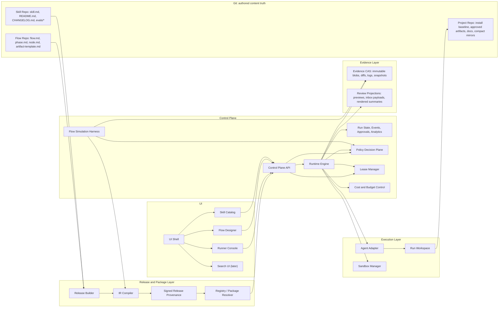
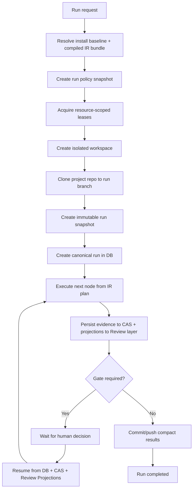
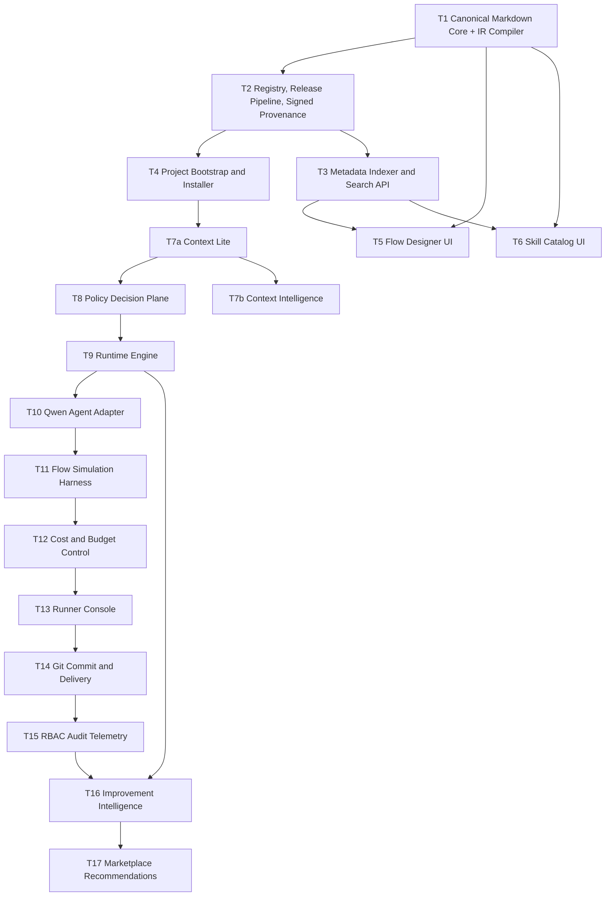

# [requirements v2]

# Human-Guided Development Platform

## 1. Цель

Построить **enterprise-платформу управляемого SDLC**, в которой:

* flow и skills являются **каноническими Git-артефактами в Markdown**
* UI умеет **без потерь** редактировать и визуализировать эти артефакты
* Markdown-пакеты **компилируются в executable IR**, а runtime работает по **compiled IR**, а не по сырому Markdown
* flow можно **искать, версионировать, публиковать, устанавливать в проект**
* после установки flow запускается **визуальный runtime**
* runtime работает с **executor nodes** и **human gates**
* все действия аудируются
* после рестарта выполнение продолжается **по каноническому state в control plane DB**
* `state.md` и `audit.md` являются **человекочитаемыми зеркалами**, а не каноном
* все ожидания на человеке и все промежуточные результаты используют **durable checkpointing**
* durable execution evidence хранится в **Evidence CAS**, а review-facing представления — в **Review Projections**
* активная установленная конфигурация проекта (**install baseline**) отделена от **immutable run snapshot**
* результат коммитится и пушится в проектный репозиторий
* platform gates **не заменяют** Git PR governance, а дополняют её
* execution capabilities, approvals, promotions, delivery и sandbox permissions принимаются через **Policy Decision Plane**
* output contracts являются **typed artifact contracts**, а не просто путями к Markdown-файлам
* система поддерживает **resource-scoped leases**
* платформа поддерживает **budgeted execution** по времени, стоимости, объёму изменений и объёму evidence
* перед production-run flow можно прогонять через **Flow Simulation Harness**
* released packages имеют **signed provenance**

---

## 1.1 В чём суть и ключевые отличия

Существующие подходы класса adaptive workflow / AI-DLC уже умеют:

* фазовый процесс
* approval-oriented execution
* structured questions в Markdown
* установку правил и steering в workspace агента

Но здесь ключевое отличие — не просто “улучшенный prompt workflow”, а **внешний stateful control plane**, где есть:

* canonical run state в DB
* append-only event chain
* deterministic control-flow resume
* Evidence CAS для долговечных execution facts
* Review Projections для UI/review опыта
* Policy Decision Plane
* signed release provenance
* typed artifact contracts
* resource-scoped leases
* compiled IR как executable semantics для release

Это не “надежда на дисциплину агента”, а **управляемое исполнение с проверяемой фактологией и enterprise-governance**.

---

## 1.2 Ключевые принципы системы

1. **Git — канон авторского контента**
2. **Compiled IR — канон executable semantics конкретного release**
3. **Control Plane DB — канон execution state**
4. **Evidence CAS — канон immutable execution evidence**
5. **Review Projections — derived review/read UX**
6. **Install baseline отделён от historical run snapshot**
7. **Checkpoint обязателен перед любым wait state**
8. **Platform gates дополняют, а не заменяют Git PR governance**
9. **Portable core ≠ полная переносимость skill**
10. **Improvement intelligence сначала manual-first**
11. **Policy decisions должны быть явными, аудируемыми и воспроизводимыми**
12. **Runtime исполняет compiled IR, а не интерпретирует Markdown на лету**

---

## 2. Допущения

1. В компании есть корпоративный Git и единая ролевая модель. SSO может быть корпоративным или заменяться stub IdP для dev/demo.
2. По умолчанию coding agent — `qwen-coder-cli`, но архитектура должна поддерживать и другие adapter overlays.
3. Flow и skills хранятся в отдельных Git-репозиториях.
4. UI, API и runtime разворачиваются как внутренний web-продукт.
5. На первом этапе один run работает в рамках одного проекта и одной целевой **run branch**, а не напрямую в общей target branch.
6. По умолчанию для одного `project + target branch` одновременно разрешён только **один активный delivery-intent**, но параллельные runs могут существовать при отсутствии конфликтующих lease-ресурсов.
7. Все промежуточные outputs, diffs, logs, snapshots и durable evidence сохраняются в **Evidence CAS**.
8. Все previews, reviewer inbox payloads и UI-ready renderings хранятся в **Review Projections**.
9. UI стартует как модульный монолит; MFE включаются позже.
10. Platform gates не отменяют обязательные Git-hosted PR checks, CODEOWNERS и branch protections.
11. Security policies enforce-ятся технически через sandbox/network/tool controls, а не только текстовыми инструкциями.
12. Runtime должен использовать **compiled IR bundle**, собранный release pipeline, а не re-parse исходного Markdown на каждый шаг.
13. Любой release package должен иметь **signed provenance**.
14. Любой run должен исполняться с **budget envelope**.

---

## 3. Общая архитектура



---

## 3.1 Жизненный цикл run



---

## 3.2 Ownership model: что где является каноном

### 3.2.1 Authored content truth

Git-репозитории flow/skills являются каноном для:

* flow content
* skill content
* changelog
* evals
* released source revisions

### 3.2.2 Executable semantics truth

Release package + compiled IR являются каноном для:

* нормализованной структуры flow
* разрешённых зависимостей
* execution graph
* typed artifact contracts
* effective package metadata
* executable semantics конкретного release

### 3.2.3 Install baseline truth

Проектный репозиторий хранит **active install baseline**:

* текущий установленный flow
* текущие skill snapshots
* lock-файлы
* install manifest
* install provenance refs

### 3.2.4 Execution truth

Control Plane DB является каноном для:

* runs
* node states
* events
* approvals
* policy decisions
* lease states
* usage facts
* current execution status

### 3.2.5 Evidence truth

**Evidence CAS** является каноном для:

* immutable checkpoints
* diffs/patches
* raw logs
* immutable run snapshots
* evidence manifests
* archived execution artifacts

### 3.2.6 Review truth

**Review Projections** являются derived-слоем для:

* rendered previews
* reviewer inbox payloads
* questionnaire renderings
* compact summaries
* projection-specific redacted views

### 3.2.7 Mirrors

`state.md`, `audit.md`, `run-summary.md` и другие derived markdown-файлы являются **зеркалами**, регенерируемыми из DB + CAS + Review Projections.

---

# 4. Глобальные системные требования

## 4.1 Функциональные требования

### 4.1.1 Canonical Markdown + Compiled IR

1. Flow описывается Markdown-структурой:

   * `flow.md`
   * `phase.md`
   * `node.md`
   * `artifact-template.md`
   * `flow.lock.md`

2. Skill описывается пакетом:

   * `skill.md`
   * `README.md`
   * `CHANGELOG.md`
   * `evals/*`

3. Release pipeline обязан компилировать Markdown package в:

   * `flow.ir.json`
   * `skill.ir.json`
   * `release-manifest.json`
   * `provenance.json`
   * signature artifacts

4. Runtime исполняет только:

   * installed release package
   * compiled IR
   * resolved policy snapshot

5. Historical run не должен зависеть от повторной интерпретации Markdown текущими версиями parser/writer.

---

### 4.1.2 Install baseline и run snapshot

1. В проект после install должна попадать `.sdlc/`, содержащая:

   * active install baseline
   * project context
   * approved artifacts
   * compact runtime mirrors
   * install metadata
   * provenance refs

2. Каждый run должен сохранять:

   * canonical state в DB
   * append-only события
   * approvals
   * evidence refs
   * review projection refs
   * policy decision refs
   * список использованных skills по node
   * immutable run snapshot id
   * compiled IR bundle ref
   * provenance ref
   * budget envelope snapshot

3. Active install baseline не может быть единственным источником воспроизведения historical run.

---

### 4.1.3 Human gates

1. Human gate должен поддерживать:

   * `approve`
   * `reject`
   * `request_rework`

2. Gate должен поддерживать как минимум:

   * `approval`
   * `questionnaire`

3. Approval gate не может быть auto-approved.

4. Gate обязан работать по **approval-by-checksum** для связанных артефактов.

5. После рестарта runtime должен восстановиться по DB state + events, а preview/inbox — по Review Projections.

6. Перед переводом run в любой `waiting_gate` runtime обязан:

   * записать mandatory evidence в CAS
   * записать preview/inbox payloads в Review Projections

---

### 4.1.4 Typed artifact contracts

1. Output contract задаётся не только путями, а typed artifact contracts, включающими:

   * `artifact_id`
   * `logical_role`
   * `mime_type`
   * `schema_id`
   * `required`
   * `path_pattern`
   * `required_sections`
   * `checksum_required`
   * `review_projection_kind`
   * `promotion_eligibility`
   * `sensitivity_class`
   * `retention_class`
   * `lineage_requirements`

2. Artifact templates должны быть machine-checkable.

3. Артефакт может быть:

   * Markdown
   * JSON
   * diff/patch
   * text log
   * binary blob с metadata-manifest
   * mixed artifact с rendered projection

4. Runtime обязан валидировать output contract до перехода node в `succeeded`.

---

### 4.1.5 Policy Decision Plane

1. Все важные решения платформы должны приниматься через отдельный Policy Decision Plane:

   * кто может стартовать run
   * кто может approve/reject/rework gate
   * какие executor capabilities разрешены
   * какие network/tool/fs permissions разрешены
   * какие artifacts можно продвигать
   * какие branches/docs/resources можно мутировать
   * какие delivery actions допустимы
   * какие budget overruns допустимы
   * какие lease overrides допустимы

2. Каждый policy decision обязан иметь:

   * `decision_id`
   * `subject`
   * `action`
   * `resource`
   * `context`
   * `policy_set_hash`
   * `decision`
   * `reason_codes`
   * `decided_at`

3. Run должен фиксировать `policy_snapshot_id`.

4. Sandbox и adapter обязаны исполнять решения PDP технически, а не только текстом.

---

### 4.1.6 Resource-scoped leases

1. Система должна поддерживать leases по ресурсам:

   * `project`
   * `target_branch`
   * `run_branch`
   * `canonical_doc`
   * `artifact_family`
   * `delivery_intent`

2. По умолчанию:

   * один активный `delivery_intent` на `project + target branch`
   * promotion canonical docs требует lease на соответствующий doc-resource
   * параллельные runs допустимы при отсутствии конфликтующих lease scopes

3. Lease должен содержать:

   * `lease_id`
   * `scope_type`
   * `scope_key`
   * `holder_run_id`
   * `acquired_at`
   * `expires_at`
   * `overrideable`
   * `policy_decision_ref`

4. Lease освобождается только после terminal state run или explicit audited override.

---

### 4.1.7 Evidence CAS и Review Projections

1. Evidence layer делится на:

   * **Evidence CAS**
   * **Review Projections**

2. Evidence CAS хранит:

   * immutable blobs
   * logs
   * diffs
   * snapshots
   * contract validation evidence
   * raw artifacts
   * manifests

3. Review Projections хранят:

   * previews
   * redacted reviewer views
   * questionnaire payloads
   * gate inbox documents
   * rendered summaries
   * compare views

4. Review Projections являются derived и могут пере-рендериваться из CAS + DB facts.

5. Retention, redaction и access control должны поддерживаться отдельно для CAS и Projections.

---

### 4.1.8 Signed Release Provenance

1. Любой flow release и skill release должен включать signed provenance:

   * source repo
   * source commit
   * tag
   * build identity
   * build timestamp
   * package checksum
   * IR checksum
   * dependency checksums
   * signer identity / signature

2. Install baseline обязан фиксировать refs на provenance.

3. Run snapshot обязан фиксировать refs на provenance всех использованных packages.

---

### 4.1.9 Cost and Budget Control

1. Для run и node должны поддерживаться budget envelopes:

   * `max_duration_seconds`
   * `max_attempts`
   * `max_model_cost`
   * `max_evidence_bytes`
   * `max_changed_files`
   * `max_patch_bytes`
   * `max_review_wait_sla`
   * `max_tool_invocations`

2. Превышение budget должно приводить к policy-governed действию:

   * fail
   * pause for approval
   * continue with escalation
   * degrade capability set

3. Budget facts должны аудироваться.

---

### 4.1.10 Flow Simulation Harness

1. Платформа должна поддерживать simulation mode для flow:

   * deterministic executor stubs
   * fake gate decisions
   * output contract simulation
   * transition coverage
   * resume/restart simulation
   * lease conflict simulation
   * policy decision simulation

2. Simulation не должна писать delivery changes в project repo.

3. Flow release не должен считаться production-ready без simulation evidence.

---

### 4.1.11 Project Canonical Docs

Расположение:

* `docs/sdlc/`

Минимальный состав:

* `docs/sdlc/spec.md`
* `docs/sdlc/architecture.md`
* `docs/sdlc/docs-index.md`

`docs-index.md` должен содержать:

* `path`
* `checksum_sha256`
* `approved_by`
* `approved_at`
* `source_run_id`
* `source_artifact_path`
* `source_provenance_ref`

Разделение:

* run artifacts остаются в `.sdlc/artifacts/...`
* канонические документы проекта имеют стабильные пути в `docs/sdlc/`

---

## 4.2 Нефункциональные требования

1. **Round-trip без потерь**
   UI не имеет права ломать Markdown-структуру при повторном сохранении.

2. **Deterministic executable semantics**
   Release package должен давать стабильный compiled IR для одинакового source revision.

3. **Полный аудит**
   Для каждого step фиксируются identity, inputs, outputs, policies, timing, status, budgets, provenance.

4. **Resume после рестарта**
   Восстановление run должно занимать не более 5 секунд после старта worker при наличии актуального state в DB и доступных CAS/Projections.

5. **Role-based approvals**
   Право запуска flow и прохождения gates определяется ролями и policy decisions.

6. **Чистый проектный репозиторий**
   В repo нельзя коммитить полный verbose log выполнения по умолчанию.

7. **Технический enforcement security policy**
   Ограничения на repo root, network egress, tools, secrets и sandbox должны enforce-иться технически.

8. **Checkpoint durability**
   Все обязательные артефакты, необходимые для review, resume и audit, должны жить вне ephemeral workspace.

9. **Separation of install baseline and run snapshot**
   Active install baseline не должен использоваться как единственный источник для воспроизведения.

10. **Budget governance**
    Runtime не должен silently выходить за утверждённые budget envelopes.

11. **Lease correctness**
    Конфликтующие operations не должны одновременно выполняться на одних и тех же resource scopes.

12. **Evidence immutability**
    CAS-объекты должны быть immutable и content-addressed.

13. **Projection regenerability**
    Review projections должны быть восстанавливаемы из canonical facts.

14. **Schema evolution**
    Reader/writer/compiler должны поддерживать controlled schema evolution без разрушения historical runs.

15. **Normalized analytics**
    Success rate, rework rate и recommendations не должны строиться только на raw success rate.

---

## 4.3 AI-DLC-inspired conventions

1. **Structured questions**
   Уточняющие вопросы оформляются как Markdown-артефакт. Gate закрывается только после заполнения всех `[Answer]:`.

2. **Plan-then-execute**
   Для сложных шагов рекомендуется отдельный plan artifact с approval перед execution.

3. **Adaptive stage selection**
   В planning-артефакте фиксируется, какие стадии выполнены/пропущены и почему.

4. **Content validation**
   Перед записью Mermaid/ASCII-диаграмм обязателен синтаксический контроль и текстовая альтернатива.

5. **Error severity**
   Ошибки классифицируются как `critical/high/medium/low`.

6. **Resume summary**
   При возобновлении UI показывает текущую фазу, последнюю завершённую стадию и следующий шаг.

7. **Approval by checksum**
   Любой gate, привязанный к артефактам, работает с checksum-bound approvals.

---

## 4.4 System Instruction Bundle

### Назначение

System Instruction Bundle — обязательный системный пакет правил, который runtime всегда добавляет в prompt-package или execution contract.

### Требования

1. Bundle обязателен для каждого `executor` node.
2. Bundle имеет `version`.
3. Bundle фиксируется в DB, CAS и `audit.md`.
4. Bundle может экспортироваться в проект.
5. Минимальные правила:

   * следовать `node.md` и typed artifact contract
   * создавать все обязательные output artifacts
   * не изменять lock-файлы
   * работать только внутри repo root
   * не делать сетевые вызовы без policy decision
   * при необходимости уточнений формировать `questions.md`, а не задавать вопросы в чате
   * не считать `state.md` и `audit.md` каноном исполнения
   * не удалять и не подменять approved artifacts без явного контракта flow
   * соблюдать budgets и capability decisions

---

## 4.5 Agent Compatibility Model

Каждый skill и adapter работают в модели трёх уровней:

### 4.5.1 Portable core

Содержит переносимые поля:

* inputs/outputs
* purpose
* artifact contracts
* general constraints
* audit expectations

### 4.5.2 Adapter overlay

Содержит agent-specific mapping:

* system prompt append
* rule file generation
* tool naming
* permission modes
* executor settings

### 4.5.3 Agent-locked capability

Содержит explicit non-portable semantics:

* platform-specific tools
* unique modes
* proprietary extensions
* non-portable context loading

---

# 5. Фазы разработки

## 5.1 Phase 0 — Prove the execution kernel

Цель: доказать, что платформа жизнеспособна как **governed execution kernel**.

Входит:

* T1 Canonical Markdown Core + IR Compiler
* T2 Registry, Release Pipeline, Signed Release Provenance
* T4 Project Bootstrap and Installer
* T7a Context Lite
* T8 Policy Decision Plane
* T9 Runtime Engine
* T10 Qwen Agent Adapter
* T11 Flow Simulation Harness
* T12 Cost and Budget Control
* T13 Runner Console
* T14 Git Commit, Push, Delivery
* T15 RBAC, Audit, Observability

Критерий фазы:

* 2–3 production-like enterprise flows проходят полный цикл install → run → gate → rework → delivery → PR

---

## 5.2 Phase 1 — Prove repeatability and governed scale

Цель: доказать воспроизводимость, управляемость и эксплуатационную устойчивость.

Входит:

* hardening compiled IR and schema evolution
* doc promotion conflict workflows
* richer policy packs
* simulation coverage
* budget reporting
* causal telemetry for failure analysis
* расширение числа curated flows
* minimal metadata indexing and search

Критерий фазы:

* historical runs воспроизводимо реконструируются
* flows проходят simulation и production-run с проверяемыми provenance и budget facts

---

## 5.3 Phase 2 — Scale the content ecosystem

Цель: масштабировать authoring, catalog, analytics и curation.

Входит:

* T3 Metadata Indexer and Search API
* T5 Flow Designer UI
* T6 Skill Catalog UI
* T7b Context Intelligence
* T16 Improvement Intelligence
* T17 Marketplace Recommendations and Curation

Критерий фазы:

* масштабируемое управление контентом
* recommendation layer работает поверх нормализованных метрик и causal evidence

---

# 6. Порядок реализации

## 6.1 Обновлённая последовательность



---

## 6.2 Принцип порядка

Сначала нужно доказать:

* canonical format
* compiled IR
* signed releases
* deterministic install
* stateful runtime
* policy-governed execution
* resume
* delivery
* budgets
* simulation

Только после этого имеет смысл строить:

* rich authoring
* catalog UX
* recommendations
* advanced analytics
* marketplace layer

---

## 6.3 Обновлённые задачи

* **T1** — Canonical Markdown Core + IR Compiler
* **T2** — Registry, Release Pipeline, Signed Release Provenance
* **T4** — Project Bootstrap and Installer
* **T7a** — Context Lite
* **T8** — Policy Decision Plane
* **T9** — Runtime Engine
* **T10** — Qwen Agent Adapter
* **T11** — Flow Simulation Harness
* **T12** — Cost and Budget Control
* **T13** — Runner Console
* **T14** — Git Commit, Push, Delivery
* **T15** — RBAC, Audit, Observability
* **T3** — Metadata Indexer and Search API
* **T5** — Flow Designer UI
* **T6** — Skill Catalog UI
* **T7b** — Context Intelligence
* **T16** — Improvement Intelligence
* **T17** — Marketplace Recommendations and Curation

---

# 7. T1 — Canonical Markdown Core + IR Compiler

## 7.1 Цель

Реализовать библиотеку, схему и compiler pipeline, которые определяют:

* формат flow
* формат skill
* формат typed artifact templates
* формат runtime mirrors
* формат lock-файлов
* round-trip parsing/writing Markdown
* explicit separation of:

  * structure
  * body
  * UI-managed regions
* compilation в executable IR

---

## 7.2 Архитектура

Компоненты:

1. `sdlc-core-parser`
2. `sdlc-core-writer`
3. `sdlc-core-validator`
4. `sdlc-ir-compiler`
5. `sdlc-ir-schema`
6. `sdlc-core-cli`
7. `shared-json-schema`

---

## 7.3 Стек

* Python 3.12
* Pydantic v2
* `ruamel.yaml`
* `markdown-it-py`
* `typer`
* `pytest`
* `jsonschema`

---

## 7.4 Системные требования

### Форматы файлов

Обязательные authored сущности:

* `flow.md`
* `phase.md`
* `node.md`
* `artifact-template.md`
* `skill.md`
* `state.md`
* `audit.md`
* `agent-audit.md`
* `event.md`
* `approval.md`
* `project-rules.md`
* `flow.lock.md`
* `skill-lock.md`
* `install-manifest.md`

Release-артефакты:

* `flow.ir.json`
* `skill.ir.json`
* `release-manifest.json`
* `provenance.json`
* signature artifacts

### Общие правила

1. Каждый authored file обязан иметь `id`.
2. Все `id` уникальны в рамках package.
3. Все межфайловые ссылки — только по `id`.
4. `version` обязателен для flow и skill.
5. Для install разрешены только immutable versions.
6. Frontmatter обязателен для всех system-managed Markdown.
7. `flow.md` должен содержать диаграмму процесса и текстовую альтернативу.

### Node model

* `node.type = executor | gate`

Для `executor`:

* `executor_kind = ai_step | script_step | scanner_step | custom_step`

Для `gate`:

* `gate_kind = approval | questionnaire`

### Typed artifact model

Каждый `artifact-template.md` должен поддерживать:

* `id`
* `logical_role`
* `mime_type`
* `schema_id`
* `path_pattern`
* `required_sections`
* `review_projection_kind`
* `promotion_eligibility`
* `sensitivity_class`
* `retention_class`

### Round-trip

1. При загрузке и сохранении файл не должен менять:

   * порядок секций body
   * произвольный текст body
   * неизвестные поля frontmatter в compatibility mode

2. Writer обязан поддерживать:

   * canonical formatting mode
   * preserve-original formatting mode

3. Структура и текст должны быть разделены:

   * структура живёт во frontmatter и/или в явных структурных блоках
   * body считается opaque
   * UI может перегенерировать только UI-managed регионы
   * остальной body неизменяем

### Compiled IR

IR обязан содержать:

* flow identity and version
* package checksum
* phase ordering
* normalized node graph
* typed artifact contracts
* resolved transitions
* resolved skills with checksums
* compatibility metadata
* effective policy hooks
* compilation warnings/errors
* schema version

Runtime не должен вычислять execution graph из Markdown заново.

### Валидация flow

Проверять:

* `phase_order` согласован с package structure
* все nodes из `phase.md` существуют
* все inputs и outputs существуют как artifact template ids
* все skills указываются с version
* у gate kind `approval` есть `approver_roles`
* у gate kind `questionnaire` задан `questions_artifact`
* у каждого node есть `on_success`
* `resume_policy` задана на flow level
* произвольные cross-phase jumps запрещены в v1, кроме явно разрешённых rework edges назад
* общие циклы запрещены
* backward edges допустимы только для явного rework

---

## 7.5 Сценарии работы

### Сценарий 1. Создание нового flow

1. Пользователь создаёт flow через UI.
2. UI отправляет draft JSON.
3. Backend генерирует Markdown package.
4. Validator валидирует package.
5. Compiler собирает IR.
6. Package сохраняется в flow repo branch.

### Сценарий 2. Открытие существующего flow

1. UI запрашивает flow release.
2. Backend читает Markdown package.
3. Parser возвращает typed model.
4. Compiler возвращает normalized IR preview.
5. UI показывает canvas и inspector.
6. Writer сохраняет обновлённые md-файлы.

### Сценарий 3. Проверка проекта

1. Runtime открывает `.sdlc/install/current/`.
2. Parser читает authored files.
3. Runtime использует compiled IR from release package.
4. Validator подтверждает консистентность install baseline.

---

## 7.6 Критерии приёмки

1. Библиотека валидирует минимум 20 test packages.
2. Повторное сохранение без изменений даёт byte-identical body для node markdown.
3. Неконсистентный flow падает с понятной ошибкой.
4. Compiler собирает `flow.ir.json`.
5. Typed model поддерживает схему `executor/gate`.
6. Один и тот же source revision даёт идентичный IR.

---

# 8. T2 — Registry, Release Pipeline, Signed Release Provenance

## 8.1 Цель

Реализовать публикацию flow и skills как immutable versioned packages с compiled IR и signed provenance.

---

## 8.2 Архитектура

Компоненты:

1. `flow-registry-service`
2. `skill-registry-service`
3. `release-builder`
4. `ir-compiler-runner`
5. `package-resolver`
6. `lockfile-generator`
7. `provenance-signer`
8. `provenance-verifier`

---

## 8.3 Стек

* FastAPI
* PostgreSQL
* `pygit2` или GitPython
* lightweight job worker
* signing integration

---

## 8.4 Системные требования

### Lifecycle статусы

Для flow и skill:

* `draft`
* `review`
* `released`
* `deprecated`
* `archived`

### Release pipeline

1. Release создаётся только из tagged commit.

2. Release хранится в Git и индексируется registry.

3. Package включает:

   * md-файлы
   * manifest
   * checksums
   * compiled IR
   * compatibility metadata
   * provenance
   * signatures

4. Package имеет:

   * `id`
   * `version`
   * `git_commit`
   * `created_at`
   * `package_checksum`
   * `ir_checksum`
   * `provenance_ref`

### Lock files

`flow.lock.md` хранит:

* flow id
* flow version
* flow commit
* resolved skills
* resolved versions
* checksums
* IR checksum
* execution policy hashes
* provenance ref

`skill-lock.md` хранит:

* installed skill snapshots
* versions
* commits
* package checksums
* IR checksums
* provenance refs

`install-manifest.md` хранит только недетерминированные данные установки.

### Provenance

1. Любой package должен быть верифицируем по signature.
2. Install запрещён для packages без provenance, если policy не разрешает исключение.
3. Runtime при старте run обязан проверить provenance цепочку.

---

## 8.5 Сценарии работы

### Сценарий 1. Публикация flow

1. Tech lead правит flow.
2. Создаётся PR.
3. После merge создаётся release tag.
4. Release builder собирает package + IR + provenance.
5. Registry индексирует release.

### Сценарий 2. Публикация skill

1. Автор skill обновляет `skill.md`.
2. Проходит review.
3. Release builder создаёт immutable snapshot и provenance.
4. Каталог показывает новую версию.

### Сценарий 3. Install flow в проект

1. Installer получает flow version.
2. Resolver подтягивает dependencies.
3. Проверяются signatures and provenance.
4. Генерируются lock-файлы.
5. В проект раскладывается active install baseline.

---

## 8.6 Критерии приёмки

1. Один и тот же release package всегда приводит к идентичным lock-файлам.
2. `latest` запрещён в published flow.
3. Deprecated flow нельзя install по умолчанию.
4. Release package можно скачать локально.
5. Недетерминированные install fields живут только в `install-manifest.md`.
6. Provenance подписан и верифицируется.

---

# 9. T4 — Project Bootstrap and Installer

## 9.1 Цель

Создавать новый проект или подключать существующий repo и раскладывать active install baseline в `.sdlc/`.

---

## 9.2 Архитектура

Компоненты:

1. `project-service`
2. `repo-connector`
3. `flow-installer`
4. `skill-installer`
5. `project-structure-writer`
6. `provenance-checker`

---

## 9.3 Стек

* FastAPI
* system `git`
* PostgreSQL

---

## 9.4 Системные требования

### Поддерживаемые режимы

* `create_new_project`
* `clone_existing_repo`

### Структура проекта после install

```text
project-root/
  .sdlc/
    install/
      current/
        flow/
        skills/
        flow.lock.md
        skill-lock.md
        install-manifest.md
    context/
    artifacts/
    runtime/
      state.md
      audit.md
      run-summary.md
  docs/
    sdlc/
```

### Installer обязан

1. Проверять совместимость flow с проектом.
2. Проверять provenance installed packages.
3. Генерировать lock-файлы.
4. Создавать install manifest.
5. Не перетирать существующие `.sdlc/` без explicit upgrade.
6. Создавать install commit.
7. Не использовать `latest`.
8. Разделять active install baseline и run snapshots.

### Lease policy integration

Installer обязан фиксировать:

* `active_flow_id`
* `active_flow_version`
* `install_revision`
* `parallel_runs_policy`
* baseline-affecting resource scopes

---

## 9.5 Сценарии работы

### Сценарий 1. Новый проект

1. Пользователь выбирает `Create project`.
2. Система делает `git init`.
3. Пользователь выбирает flow.
4. Installer проверяет provenance.
5. Installer раскладывает active install baseline.
6. Создаётся install commit.

### Сценарий 2. Подключение существующего repo

1. Пользователь указывает URL.
2. Система делает clone.
3. Определяет platform и stack.
4. Предлагает совместимые flows.
5. После выбора flow создаётся `.sdlc/install/current/`.

### Сценарий 3. Upgrade flow

1. Пользователь выбирает `Upgrade flow`.
2. Система сравнивает текущий install baseline и новый release.
3. Показывает diff и provenance delta.
4. После подтверждения обновляет active install baseline.

---

## 9.6 Критерии приёмки

1. Install flow в существующий проект < 10 секунд без clone.
2. Installer не ломает пользовательские файлы вне `.sdlc/`.
3. После install проект проходит `inspect-project`.
4. Active install baseline и historical runs не смешиваются.
5. Installer не пропускает неподписанный release без явного policy exception.

---

# 10. T7a — Context Lite

## 10.1 Цель

Перед запуском flow собрать и нормализовать **bounded project context**, достаточный для brownfield execution, но без превращения системы в heavyweight source intelligence platform.

---

## 10.2 Архитектура

Компоненты:

1. `repo-scanner-lite`
2. `project-context-builder`
3. `manual-context-uploader`
4. `context-writer`

---

## 10.3 Стек

* Python 3.12
* tree-sitter
* FastAPI

---

## 10.4 Системные требования

### Контекстные файлы

В `.sdlc/context/` должны поддерживаться:

* `glossary.md`
* `system-landscape.md`
* `architecture-baseline.md`
* `project-rules.md`
* `repo-map.md`
* `constraints.md`
* `external-integrations.md`

### Repo scan

Сканер обязан собирать только bounded summary:

* top-level modules
* detected languages
* package manager files
* api schema files
* migration directories
* test directories
* notable configs

### Режимы контекста

* `auto-generated`
* `manual-uploaded`
* `merged`

### Merge policy

Если пользователь загрузил `architecture-baseline.md`, он имеет приоритет над auto-summary.

### Scaling budget

Сканер должен работать по scan budget:

* max files
* max depth
* ignore rules
* time budget

---

## 10.5 Критерии приёмки

1. Context build работает по bounded scan budget.
2. Если context отсутствует, flow типа `modify_existing_project` не стартует.
3. Пользователь видит, какие файлы auto-generated, а какие manual.

---

# 11. T8 — Policy Decision Plane

## 11.1 Цель

Вынести принятие platform-level решений в отдельный policy layer, который принимает, логирует и объясняет решения по execution, approvals, capabilities, delivery и governance.

---

## 11.2 Архитектура

Компоненты:

1. `policy-api`
2. `policy-evaluator`
3. `policy-set-store`
4. `decision-log`
5. `capability-mapper`
6. `lease-policy-module`
7. `promotion-policy-module`
8. `budget-policy-module`

---

## 11.3 Стек

* FastAPI
* PostgreSQL
* policy rules engine / declarative evaluator

---

## 11.4 Системные требования

1. Policy sets должны быть версионируемыми.
2. Run должен фиксировать `policy_snapshot_id`.
3. Для каждого действия должен быть decision trace.
4. Policy decisions должны использоваться runtime, adapter, sandbox и delivery layer.
5. PDP обязан поддерживать:

   * start policies
   * gate approval policies
   * executor capability policies
   * doc promotion policies
   * lease acquisition policies
   * budget overrun policies
   * delivery mode policies

---

## 11.5 Критерии приёмки

1. Любой 403/deny объясним через decision trace.
2. Runtime не исполняет capability, если PDP её запретил.
3. Lease acquisition и doc promotion проходят через PDP.

---

# 12. T9 — Runtime Engine

## 12.1 Цель

Реализовать исполнение flow по compiled IR node-state machine с canonical state, audit, checkpointing, leases, typed artifacts и resume.

---

## 12.2 Архитектура

Компоненты:

1. `run-orchestrator`
2. `ir-plan-loader`
3. `node-executor`
4. `gate-manager`
5. `resume-loader`
6. `artifact-router`
7. `checkpoint-writer`
8. `cas-writer`
9. `projection-writer`
10. `lease-manager-client`
11. `policy-client`
12. `sandbox-manager`

---

## 12.3 Стек

* Python 3.12
* FastAPI
* PostgreSQL
* internal worker process
* WebSocket/SSE
* CAS client
* Projections client

---

## 12.4 Системные требования

### Состояния run

* `created`
* `running`
* `waiting_gate`
* `failed`
* `completed`
* `cancelled`
* `corrupted_state`

### Состояния node

* `queued`
* `running`
* `waiting_input`
* `succeeded`
* `failed`
* `skipped`

### Правила выполнения

1. Runtime перед каждым node загружает:

   * inputs
   * skill snapshots
   * project context
   * typed artifact contracts
   * execution policy snapshot
   * budget envelope
   * compiled IR node spec

2. Для `gate_kind = questionnaire` runtime обязан:

   * проверить наличие `questions_artifact`
   * открыть gate
   * ждать заполнения всех `[Answer]:`
   * продолжить только после completion

3. После завершения node runtime обязан:

   * проверить typed artifact contracts
   * записать event
   * обновить state в DB
   * обновить mirrors
   * сохранить evidence refs
   * сохранить review projection refs

4. `request_rework` возвращает run на явно заданный rework node.

5. Resume читает DB state и events; open gates и previews — из CAS + Review Projections.

6. При `request_rework` фиксируются:

   * причина
   * expected fix
   * severity
   * affected artifacts
   * affected skills
   * invalidation set

### Канонические факты выполнения

Для каждого executor step:

* `run_id`
* `node_id`
* `attempt_id`
* `workspace_id`
* `adapter_id@version`
* `agent_id@version`
* `system_instruction_bundle_version`
* `prompt_package_id`
* `compiled_ir_checksum`
* `policy_snapshot_id`
* inputs with checksum
* skill snapshots
* context checksums
* outputs with checksum
* output contract status
* git head before/after
* changed files
* diff/evidence refs
* review projection refs
* started_at
* ended_at
* exit_status
* error_code
* severity
* budget facts

### Prompt Package Manifest

`prompt_package_id = sha256(canonical_json(manifest))`

Manifest содержит:

* bundle version
* checksum `node.md`
* checksums compiled IR
* checksums skill packages
* checksums inputs
* checksums context
* policy flags
* adapter overlay hashes
* budget envelope snapshot

### Attempt model и идемпотентность

* каждая execution попытка имеет `attempt_id`
* каждый output хранит `produced_by_attempt_id`
* runtime может reuse outputs только если контракт `passed` и invalidation отсутствует

### Checkpointing

Перед `waiting_gate` runtime обязан сохранить:

В CAS:

* mandatory outputs
* raw logs
* patch/diff
* execution summary
* run snapshot manifest

В Review Projections:

* rendered previews
* inbox payload
* reviewer compare views
* questionnaire view

### Doc promotion

Baseline capture:

* `spec_base_checksum`
* `architecture_base_checksum`

Promotion после approve:

* approval-by-checksum
* copy в `docs/sdlc/spec.md` / `architecture.md`
* update `docs-index.md`
* `DOC_PROMOTED` event

Conflict policy:

* если checksum базового документа изменился относительно baseline, runtime открывает `reconcile-docs` gate
* promotion без reconcile запрещён

### Leases

Runtime обязан работать с lease scopes:

* `project`
* `target_branch`
* `canonical_doc`
* `artifact_family`
* `delivery_intent`

### Tamper-evident events

Каждое событие хранит:

* `event_hash`
* `prev_event_hash`

### Derived mirrors

`state.md` содержит:

* `run_id`
* `current_node_id`
* `current_attempt_id`
* `status`
* open gates
* `state_version`

`audit.md` содержит:

* executions
* approvals
* doc promotions
* delivery summary
* policy decisions summary
* budget summary

### Deterministic resume

* загрузить `runs` + last committed event seq
* если node был `running` и нет terminal event — создать `attempt_id + 1` и rerun
* если `waiting_gate` — восстановить inbox из DB + Projections
* при необходимости регенерировать mirrors

---

## 12.5 Критерии приёмки

1. После kill процесса runtime восстанавливает run без ручного вмешательства.
2. В проекте виден актуальный `state.md`.
3. Любой run можно реконструировать по DB + CAS + Projections.
4. Canonical docs продвигаются только после approve-by-checksum.
5. Conflict на docs вызывает reconcile gate.
6. Исторический run воспроизводим независимо от текущего install baseline.
7. Долгий human gate не теряет preview, outputs и inbox payload.

---

# 13. T10 — Agent Adapter для Qwen

## 13.1 Цель

Реализовать адаптер, который переводит executor node в вызов `qwen-coder-cli`.

---

## 13.2 Архитектура

Компоненты:

1. `prompt-package-builder`
2. `qwen-cli-runner`
3. `output-capture`
4. `artifact-extractor`
5. `skill-injector`
6. `policy-enforcer`
7. `budget-enforcer`

---

## 13.3 Системные требования

### Prompt package

Adapter обязан собрать пакет:

* node instructions
* skills
* inputs
* project context
* working directory
* typed artifact contract
* system instruction bundle
* adapter overlay
* policy capabilities
* budget envelope

### Режим выполнения

* cwd = repo root
* timeout per node configurable
* stdout/stderr стримятся
* exit code != 0 → node failed

### Output contract

1. Агент меняет файлы в repo.
2. Агент пишет output artifacts в требуемых форматах.
3. Агент возвращает structured summary.
4. Adapter валидирует обязательные outputs.
5. Агент ведёт `agent-audit.md` при наличии поддержки.

### Безопасность

Adapter не должен:

* выполнять сетевые вызовы без policy decision
* выходить за repo root
* менять lock-файлы
* обходить sandbox/network restrictions
* превышать budget без escalation path

---

## 13.4 Критерии приёмки

1. Adapter исполняет минимум 5 типов executor step.
2. Все использованные skills фиксируются.
3. Если обязательный output не создан, node завершается `failed_output_contract`.
4. Нарушения policy фиксируются отдельно от обычных execution errors.
5. Budget overrun отражается отдельным error class.

---

# 14. T11 — Flow Simulation Harness

## 14.1 Цель

Дать безопасный способ прогонять flow до production execution.

---

## 14.2 Системные требования

1. Simulation mode должен поддерживать:

   * stub executors
   * synthetic outputs
   * fake approvals/reworks
   * contract checks
   * transition coverage
   * resume after synthetic crash
   * lease conflicts
   * budget exceed scenarios

2. Simulation results должны сохраняться отдельно от production runs.

3. Release package должен хранить simulation evidence refs.

---

## 14.3 Критерии приёмки

1. Flow можно прогнать end-to-end без реального агента.
2. Simulation выявляет broken transitions и missing contracts.
3. Resume/restart сценарии покрыты.

---

# 15. T12 — Cost and Budget Control

## 15.1 Цель

Ограничить стоимость, время, объём изменений и объём evidence на уровне run и node.

---

## 15.2 Архитектура

Компоненты:

1. `budget-model`
2. `budget-evaluator`
3. `budget-events`
4. `cost-collector`
5. `overrun-policy-hook`

---

## 15.3 Системные требования

1. Budget задаётся на уровне:

   * project default
   * flow default
   * node override
   * run override

2. Runtime и adapter обязаны проверять budget во время исполнения.

3. Exceed events пишутся в audit и metrics.

---

## 15.4 Критерии приёмки

1. Budget overrun не остаётся незамеченным.
2. Run можно остановить или эскалировать по policy.
3. Audit показывает где и почему budget был превышен.

---

# 16. T13 — Runner Console

## 16.1 Цель

Сделать визуальный runtime-интерфейс для запуска, мониторинга и прохождения gates.

---

## 16.2 Системные требования

### Launch form

Поля:

* project
* target branch
* run mode
* user request
* starter role
* selected flow
* optional uploaded context
* agent profile
* budget profile

### Stage tracker

Показывает:

* current phase
* current node
* elapsed time
* status
* next gate
* used skills
* current attempt
* budget usage
* lease status

### Audit panel

Показывает:

* `audit.md`
* `agent-audit.md`
* key event facts
* evidence refs
* policy decisions summary
* budget summary

### HITL inbox

Показывает:

* pending gates
* previews
* approve/reject/rework
* mandatory comment при reject/rework
* checksum-bound approval scope

---

## 16.3 Критерии приёмки

1. UI обновляет статус run в реальном времени.
2. Любой gate проходит без перехода в другой интерфейс.
3. Пользователь видит previews даже после долгой паузы.
4. UI отображает lease/conflict status.
5. UI показывает budget consumption.

---

# 17. T14 — Git Commit, Push, Delivery

## 17.1 Цель

Формализовать сохранение результата run в Git проекта.

---

## 17.2 Системные требования

### Branching

Для каждого run создавать:

* `feature/sdlc/{run_id}`

### Commit modes

Поддержать:

1. `phase_commits`
2. `single_delivery_commit`

По умолчанию:

* `phase_commits`

### Что коммитить

Обязательно:

* кодовые изменения
* approved artifacts
* active install locks
* compact `state.md`
* compact `audit.md`
* `run-summary.md`
* promoted canonical docs при наличии

Не коммитить:

* verbose events
* raw logs
* transient retries
* `agent-audit.md`
* full checkpoints
* large evidence blobs
* raw projections

### Git governance

Platform gates не заменяют:

* CODEOWNERS
* branch protection
* required CI checks
* security scanning

---

## 17.3 Критерии приёмки

1. После run проект имеет воспроизводимую ветку.
2. Каждому commit можно сопоставить phase или delivery event.
3. Коммит не содержит временных runtime-файлов.
4. Git PR governance остаётся внешним финальным контуром контроля.

---

# 18. T15 — RBAC, Audit, Observability

## 18.1 Цель

Реализовать роли, права, аудит действий пользователей и метрики runtime.

---

## 18.2 Роли

* `product_owner`
* `analyst`
* `architect`
* `developer`
* `qa`
* `devops`
* `flow_admin`
* `skill_admin`
* `platform_curator`

---

## 18.3 Правила доступа

1. Запуск flow разрешён только ролям из `start_roles`.
2. Проход gate разрешён только ролям из `approver_roles`.
3. Publish flow — `flow_admin`.
4. Publish skill — `skill_admin`.
5. Curate recommendations/improvement proposals — `platform_curator`.

---

## 18.4 Audit user actions

Фиксировать:

* кто запустил run
* кто прошёл gate
* кто запросил rework
* кто установил flow
* кто обновил skill
* кто опубликовал release
* кто открыл/снял lease override
* кто подтвердил budget override

---

## 18.5 Метрики

Минимум:

* `runs_started_total`
* `runs_completed_total`
* `runs_failed_total`
* `gate_wait_seconds`
* `node_duration_seconds`
* `resume_events_total`
* `install_duration_seconds`
* `skill_usage_total`
* `policy_violations_total`
* `lease_conflicts_total`
* `budget_overruns_total`
* `model_cost_total`
* `evidence_bytes_written_total`

---

## 18.6 Критерии приёмки

1. Любое пользовательское действие в control plane аудируется.
2. Ключевые runtime-метрики доступны в Prometheus.
3. RBAC блокирует неразрешённые операции на API уровне.

---

# 19. T3 — Metadata Indexer and Search API

## 19.1 Цель

Построить **минимальный каталог и поиск** по flow и skills.
Marketplace UX и recommendations не входят в ранние фазы.

---

## 19.2 Архитектура

Компоненты:

1. `repo-webhook-ingestor`
2. `package-indexer`
3. `metadata-db`
4. `search-api`

---

## 19.3 Системные требования

DB сущности:

* `flows`
* `flow_versions`
* `skills`
* `skill_versions`
* `flow_skill_dependencies`
* `installations`
* `usage_facts`
* `compatibility_tags`

API:

* `GET /api/flows`
* `GET /api/flows/{id}`
* `GET /api/flows/{id}/versions/{version}`
* `GET /api/skills`
* `GET /api/skills/{id}`
* `POST /api/installations/resolve`

Recommendation scoring и curated marketplace не являются частью T3.

---

## 19.4 Критерии приёмки

1. Индексация нового release после webhook < 30 секунд.
2. Поиск по типовым фильтрам < 500 мс.
3. Search работает без recommendation engine.

---

# 20. T5 — Flow Designer UI

## 20.1 Цель

Сделать визуальный редактор flow с сохранением в Markdown без потери неуправляемого текста.

---

## 20.2 Дополнительные требования

1. Visual mode редактирует authored metadata, но не compiled IR напрямую.
2. UI может показывать IR preview и validation output.
3. Publish всегда идёт через Markdown package → compiler → IR.

---

## 20.3 Критерии приёмки

1. Пользователь может собрать flow без ручного редактирования файлов структуры.
2. UI не меняет unmanaged body.
3. UI показывает validation и IR compilation results до publish.

---

# 21. T6 — Skill Catalog UI

## 21.1 Цель

Сделать каталог skills с поиском, версионированием и привязкой к flow.

---

## 21.2 Дополнительные требования

1. UI должен явно показывать:

   * portable core
   * adapter overlay
   * agent-locked fields
2. UI должен показывать provenance статусы release.
3. Exact version binding обязателен.

---

## 21.3 Критерии приёмки

1. Skill editor поддерживает lossless body.
2. Flow Designer ищет и подключает skill по exact version.
3. Deprecated skill виден, но не предлагается по умолчанию.
4. UI явно показывает непереносимые agent-locked части.

---

# 22. T7b — Context Intelligence

## 22.1 Цель

Добавить более глубокий semantic/context intelligence поверх Context Lite, не влияя на базовую жизнеспособность runtime.

---

## 22.2 Системные требования

Может включать:

* dependency hotspots
* richer repo maps
* inferred service boundaries
* optional semantic component model
* cross-artifact relationship extraction

Это не является обязательным для initial brownfield viability.

---

# 23. T16 — Improvement Intelligence

## 23.1 Цель

Строить hypotheses и draft proposals для улучшения flows/skills на основе **causal model of failure**, а не только по rework logs.

---

## 23.2 Архитектура

Компоненты:

1. `failure-facts-collector`
2. `causal-attribution-engine`
3. `normalized-run-facts`
4. `improvement-hypothesis-builder`
5. `curation-queue`

---

## 23.3 Системные требования

### Источники данных

Собирать:

* rework logs
* output contract failures
* policy violations
* budget overruns
* retries
* resume events
* gate wait patterns
* diff size
* changed file classes
* flow version
* skill version
* prompt package ref
* context completeness
* human comments
* doc conflicts

### Causal model

Минимальная причинная классификация:

* `spec_defect`
* `architecture_defect`
* `implementation_defect`
* `validation_defect`
* `flow_design_defect`
* `skill_defect`
* `context_defect`
* `policy_defect`
* `review_expectation_mismatch`
* `executor_behavior_defect`

### Выходы

Система должна строить:

* causal heatmaps
* failure clusters
* improvement hypotheses
* draft improvement proposals

Автогенерация PR допустима только как phase 2 и только после ручного запуска curator-ом.

---

## 23.4 Критерии приёмки

1. Improvement system не использует только raw rework count.
2. Causal attribution хранит confidence и evidence refs.
3. Предложения улучшений проходят manual curation.

---

# 24. T17 — Marketplace Recommendations and Curation

## 24.1 Цель

Добавить curated recommendations и marketplace-layer только после доказанной жизнеспособности execution kernel.

---

## 24.2 Системные требования

1. Recommendations строятся на:

   * normalized usage facts
   * causal failure evidence
   * compatibility tags
   * curated overrides

2. Recommendation score не должен строиться только на raw success rate.

3. Deprecated content не предлагается по умолчанию.

---

# 25. Сквозная файловая структура проекта

## 25.1 После install flow

```text
checkout-service/
  .sdlc/
    install/
      current/
        flow/
          flow.md
          phases/
            01-intake/
              phase.md
              nodes/
                01-collect-request.md
                02-approve-intake.md
            02-specification/
            03-architecture/
            04-implementation/
            05-validation/
            06-delivery/
        skills/
          update-existing-spec/
            1.3.0/
              skill.md
              README.md
              CHANGELOG.md
              evals/
          write-architecture-diff/
            2.1.0/
              skill.md
        flow.lock.md
        skill-lock.md
        install-manifest.md
    context/
      glossary.md
      architecture-baseline.md
      repo-map.md
      constraints.md
      project-rules.md
    artifacts/
      request/
      spec/
      architecture/
      tasks/
      code/
      tests/
      approvals/
      questions/
      feedback/
      release/
    runtime/
      state.md
      audit.md
      run-summary.md
  docs/
    sdlc/
      spec.md
      architecture.md
      docs-index.md
```

---

# 26. Минимальные API контракты

## 26.1 Проекты

* `POST /api/projects`
* `POST /api/projects/import`
* `GET /api/projects/{id}`
* `POST /api/projects/{id}/install-flow`
* `POST /api/projects/{id}/upgrade-flow`

## 26.2 Flow

* `GET /api/flows`
* `GET /api/flows/{id}/versions/{version}`
* `POST /api/flows/drafts`
* `POST /api/flows/drafts/{id}/publish`
* `POST /api/flows/{id}/simulate`

## 26.3 Skills

* `GET /api/skills`
* `POST /api/skills/drafts`
* `POST /api/skills/drafts/{id}/publish`

## 26.4 Runs

* `POST /api/projects/{id}/runs`
* `GET /api/runs/{run_id}`
* `GET /api/runs/{run_id}/events`
* `GET /api/runs/{run_id}/evidence`
* `GET /api/runs/{run_id}/projections`
* `GET /api/runs/{run_id}/policy-decisions`
* `GET /api/runs/{run_id}/leases`
* `POST /api/runs/{run_id}/gates/{gate_id}/approve`
* `POST /api/runs/{run_id}/gates/{gate_id}/reject`
* `POST /api/runs/{run_id}/gates/{gate_id}/rework`
* `POST /api/runs/{run_id}/cancel`

## 26.5 Runtime stream

* `GET /api/runs/{run_id}/ws`

---

# 27. Definition of Done по задачам

## T1 готова, если

* есть parser, writer, validator, compiler, CLI
* описаны все md-типы
* round-trip протестирован
* поддержана схема `executor/gate`
* build produces stable IR

## T2 готова, если

* flow и skill можно выпустить как immutable release
* installer берёт release package
* генерируются lock-файлы
* install baseline отделён от run snapshot
* provenance подписан

## T4 готова, если

* проект создаётся или импортируется
* flow можно install
* `.sdlc/install/current/` раскладывается корректно
* provenance проходит проверку

## T7a готова, если

* context build обязателен для brownfield flows
* scan идёт по bounded budget

## T8 готова, если

* policy decisions принимаются централизованно
* runtime исполняет executor и gate nodes
* state и events пишутся стабильно
* checkpointing работает
* resume работает
* leases работают

## T10 готова, если

* Qwen adapter исполняет node contract
* skills usage аудируется
* policy violations фиксируются
* budgets enforce-ятся

## T11 готова, если

* flow можно симулировать end-to-end
* broken transitions обнаруживаются до production-run

## T12 готова, если

* budgets видимы и enforce-ятся
* overruns эскалируются через policy

## T13 готова, если

* run можно стартовать и вести из одного UI
* gate можно пройти в UI
* previews переживают рестарт и паузу
* UI показывает lease и budget state

## T14 готова, если

* результат run коммитится и пушится
* есть итоговый summary
* поддерживается PR mode

## T15 готова, если

* RBAC действует
* audit complete
* метрики доступны

## T16 готова, если

* causal failure model собрана
* hypotheses строятся на causal evidence
* auto-PR отсутствует без curator trigger

---

# 28. Критические риски

## Риск 1. Потеря round-trip Markdown

Контрмера:

* structure/body split
* UI-managed regions
* opaque body
* byte-preservation tests

## Риск 2. Отсутствие compiled IR

Контрмера:

* release-time compilation
* stable executable semantics
* IR checksum in lock/run snapshot

## Риск 3. Policy logic расползётся по runtime и adapter

Контрмера:

* отдельный Policy Decision Plane
* decision log
* policy snapshot per run

## Риск 4. Durable checkpoint отсутствует перед human gate

Контрмера:

* обязательный checkpoint в CAS и Review Projections перед wait state

## Риск 5. Смешение install baseline и run snapshot

Контрмера:

* immutable run snapshot
* separate active install baseline

## Риск 6. Lease only at branch level

Контрмера:

* resource-scoped leases
* doc-level and delivery-intent locks

## Риск 7. Evidence layer смешает raw evidence и UI previews

Контрмера:

* CAS / Projections split
* separate retention and redaction rules

## Риск 8. Output contracts слишком слабые

Контрмера:

* typed artifact contracts
* schema-based validation

## Риск 9. Security policy “только текстом”

Контрмера:

* sandbox
* egress control
* secret broker
* tool allow/deny enforcement
* policy decisions

## Риск 10. Слишком ранний self-improve engine

Контрмера:

* causal model first
* manual curation
* no auto-PR by default

## Риск 11. Budget runaway

Контрмера:

* node and run budgets
* overrun policies
* audit + metrics

## Риск 12. Marketplace раньше execution kernel

Контрмера:

* marketplace and recommendations deferred to phase 2

---

# 29. Итоговая логика реализации

Правильный порядок:

1. **T1** — canonical format, parser, validator, writer, compiler
2. **T2** — release model, registries, IR, signed provenance
3. **T4** — install baseline в проект
4. **T7a** — bounded context lite
5. **T8** — policy decision plane
6. **T9** — runtime engine
7. **T10** — qwen adapter
8. **T11** — flow simulation harness
9. **T12** — cost and budget control
10. **T13** — runner console
11. **T14** — git delivery и PR integration
12. **T15** — RBAC, audit, telemetry
13. **T3** — metadata indexer и search
14. **T5** — flow designer
15. **T6** — skill catalog
16. **T7b** — context intelligence
17. **T16** — improvement intelligence
18. **T17** — recommendations / marketplace curation

Это минимизирует риск:

* сначала фиксируется канонический формат и executable semantics
* потом install и provenance
* потом policy-governed runtime и delivery
* потом budgets, simulation и governance
* и только потом rich catalog/authoring и marketplace

---

# Appendix A. Обновлённые ключевые контракты

## A.1 flow.md

````markdown
---
id: example/flow-id
version: 0.1.0
title: "Название флоу"
description: "Краткое описание"
platform: backend
stack: java-spring
supported_project_types:
  - modify_existing_project
start_roles:
  - product_owner
required_roles:
  - analyst
  - architect
  - qa
  - devops
resume_policy: state
context_policy:
  include_flow: true
  include_phase: true
  include_node: true
  include_project_context: true
  include_project_rules: true
  restrict_repo_access: false
phase_order:
  - intake
  - specification
---

## Назначение

Опишите цель флоу и ожидаемый результат.

## Текстовая альтернатива диаграмме

Кратко опишите процесс словами.

<!-- UI-MANAGED:START id=diagram -->
```mermaid
flowchart LR
A --> B
````

<!-- UI-MANAGED:END id=diagram -->

````

## A.2 artifact-template.md

```markdown
---
id: spec-v2
logical_role: canonical_spec_candidate
mime_type: text/markdown
schema_id: markdown/spec-v2
path_pattern: .sdlc/artifacts/spec/spec-v2.md
required_sections:
  - Summary
  - Scope
  - Functional Requirements
review_projection_kind: markdown_preview
promotion_eligibility: true
sensitivity_class: internal
retention_class: project_artifact
---
Определение артефакта спецификации.
````

## A.3 node.md для executor

```markdown
---
id: update-spec
title: "Обновить спецификацию"
type: executor
executor_kind: ai_step
skills:
  - id: update-existing-spec
    version: 1.3.0
inputs:
  - request-v1
  - architecture-baseline
outputs:
  - spec-v2
on_success: approve-spec
context_requirements:
  - project_context
budget:
  max_duration_seconds: 900
  max_changed_files: 20
---

## Инструкция

Опиши, что должен сделать исполнитель.

## Output contract

Создай артефакт `spec-v2` по typed artifact contract.
```

## A.4 node.md для gate

```markdown
---
id: approve-spec
title: "Approve spec"
type: gate
gate_kind: approval
inputs:
  - spec-v2
outputs:
  - spec-approval-v1
approver_roles:
  - analyst
on_success: update-architecture
on_request_rework: update-spec
---
Проверьте спецификацию и примите решение.
```

## A.5 skill.md

```markdown
---
id: example-skill
name: "Название навыка"
purpose: "Краткое описание"
platform: backend
stack: java-spring
owner_team: payments
version: 0.1.0
compatibility:
  agents:
    - id: qwen-coder-cli
      version: ">=1.0.0"
      mode: cli
      portability_level: adapter_overlay
      system_prompt_append: ""
      tool_policy:
        allowed:
          - run_shell_command
          - read_file
          - write_file
inputs:
  - request-v1
outputs:
  - spec-v2
---
## Инструкция

Опиши, что должен сделать агент и в каком формате вернуть результат.
```

## A.6 install-manifest.md

```markdown
---
id: install-manifest
flow_id: example/flow-id
flow_version: 1.0.0
flow_commit: 0123456789abcdef
flow_ir_checksum: sha256:flowir123
installed_at: 2026-03-09T12:00:00Z
installer:
  id: sdlc-installer
  version: 0.1.0
installed_by:
  user: jdoe
  role: flow_admin
installed_in:
  project_id: checkout-service
  repo_url: git@example.com:org/checkout-service.git
source_package:
  repo: git@example.com:org/flow-repo.git
  tag: change-existing-service@1.4.0
  commit: 89abcdef01234567
provenance_ref: prov-001
---

Нестабильные данные установки.
```

## A.7 docs-index.md

```markdown
---
id: docs-index
spec:
  path: docs/sdlc/spec.md
  checksum_sha256: 0123456789abcdef
  approved_by: jdoe
  approved_at: 2026-03-09T12:00:00Z
  source_run_id: run-0042
  source_artifact_path: .sdlc/artifacts/spec/spec-v2.md
  source_provenance_ref: prov-001
architecture:
  path: docs/sdlc/architecture.md
  checksum_sha256: 89abcdef01234567
  approved_by: aarch
  approved_at: 2026-03-09T12:30:00Z
  source_run_id: run-0042
  source_artifact_path: .sdlc/artifacts/architecture/architecture-diff-v1.md
  source_provenance_ref: prov-001
---

Индекс канонических документов проекта и их происхождения.
```

## A.8 flow.ir.json

```json
{
  "schema_version": "1",
  "flow_id": "example/flow-id",
  "flow_version": "1.0.0",
  "package_checksum": "sha256:pkg123",
  "phases": [
    {
      "id": "specification",
      "order": 2,
      "nodes": ["update-spec", "approve-spec"]
    }
  ],
  "nodes": {
    "update-spec": {
      "kind": "executor",
      "executor_kind": "ai_step",
      "inputs": ["request-v1", "architecture-baseline"],
      "outputs": ["spec-v2"],
      "on_success": "approve-spec"
    },
    "approve-spec": {
      "kind": "gate",
      "gate_kind": "approval",
      "inputs": ["spec-v2"],
      "outputs": ["spec-approval-v1"],
      "approver_roles": ["analyst"],
      "on_success": "next-node",
      "on_request_rework": "update-spec"
    }
  }
}
```

---

# Appendix B. Обязательные принципы v2

1. **Phased DAG, а не произвольный graph engine**
2. **Install baseline отделён от run snapshot**
3. **Checkpoint обязателен перед любым wait state**
4. **Evidence CAS обязателен**
5. **Review Projections обязательны для review UX**
6. **Round-trip = только metadata + UI-managed regions**
7. **Platform gates дополняют, а не заменяют Git governance**
8. **Portable core ≠ полная переносимость skill**
9. **Improvement intelligence сначала causal + manual-first**
10. **Runtime исполняет compiled IR**
11. **Policy decisions централизованы**
12. **Resource-scoped leases обязательны**
13. **Typed artifact contracts обязательны**
14. **Signed provenance обязателен для release**
15. **Budgets обязательны для governed execution**