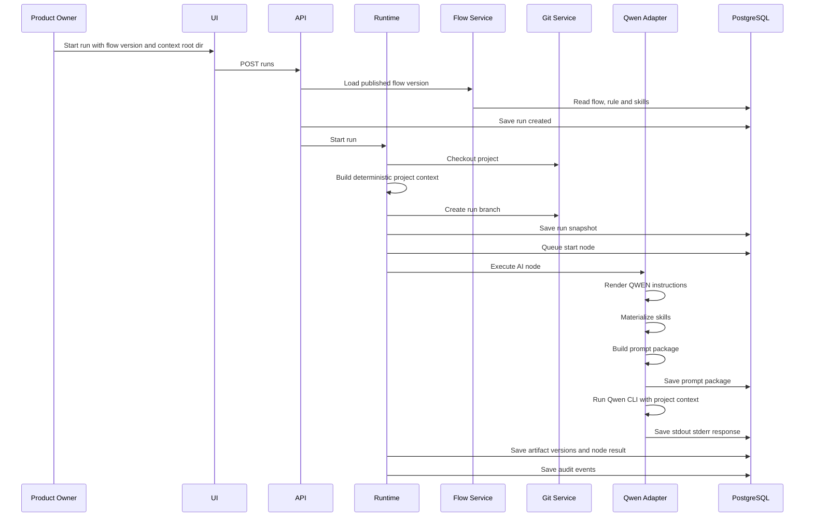
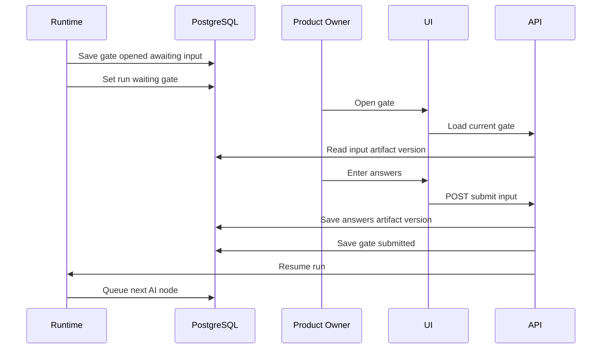
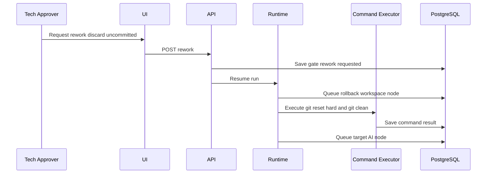

# HGSDLC Platform — полные требования к реализации (revised v-5)

## 1. Назначение

HGSDLC Platform — это платформа управляемого выполнения flow над существующим Git-проектом, в которой:

* flow задаёт graph node и переходов
* runtime исполняет только node
* `AI` node вызывает coding agent
* `External Command` node вызывает внешний процесс
* `human_input` gate ждёт человеческий ввод в виде артефакта
* `human_approval` gate ждёт approve или rework
* rules задают общие execution rules для flow
* skills задают reusable инструкции для конкретной `AI` node
* flow, rule и skill version-ируются независимо
* отдельной publish-сущности для flow, rule и skill нет
* при сохранении можно указать `publish = true`, и тогда сущность сохраняется как published version с инкрементированной версией
* run запускается на выбранной published версии flow
* flow version уже содержит ссылки на конкретную published version rule и на конкретные published version skills
* prompt package строится детерминированно, хранится в PostgreSQL и показывается в UI
* audit фиксирует запуск, выполнение node, human input, human approval, применение skills, prompt package и итоговую summary delta
* проект определяется как зарегистрированный Git repository target
* в workspace materialize-ятся только execution-time файлы
* `project_context` упрощён и состоит только из:

  * `context_root_dir`
  * `context_file_manifest`
  * `feature_request`
* этот `project_context` вместе с prompt package передаётся coding agent

Выбранная интеграционная модель соответствует возможностям Qwen Code: repository instruction file в `.qwen/QWEN.md`, project skills в `.qwen/skills`, а также headless execution для программного запуска.

---

## 2. Архитектурные принципы

1. **Runtime исполняет только node.**
   Runtime не делает rollback, commit, build, test или cleanup вне node semantics. Любое действие выражается отдельной node.

2. **Flow-level rules и node-level skills разделены.**
   Rule действует на весь flow. Skills привязываются только к `AI` node.

3. **Вопросы и ответы являются артефактами.**
   Если нужны уточнения:

   * `AI` node генерирует `questions` artifact
   * `human_input` gate собирает `answers` artifact
   * следующая `AI` node использует `questions` и `answers`

4. **Prompt package — отдельный auditable объект.**
   Он не хранится как runtime файл в проекте, а живёт в PostgreSQL и отображается в UI.

5. **PostgreSQL — канон execution state.**
   Run state, node executions, gate state, versions, prompt packages, artifacts metadata и audit events хранятся в БД.

6. **Project и reusable definitions разделены.**
   Project — это зарегистрированный Git repository target.
   Flow, rule и skill существуют независимо от проекта.
   Run связывает выбранный проект и выбранную published flow version.

7. **Запуск run идёт на flow version.**
   PRODUCT_OWNER выбирает проект и published flow version.
   Runtime загружает указанную flow version, а затем разрешает:

   * `rule_ref`
   * `skill_refs`

8. **Основной control-flow — DAG.**
   Назад можно идти только по явно заданным `rework_routes`.

9. **Один transition engine.**
   Все переходы run и node выполняются через одну state machine.

10. **Один активный run на project и target branch.**
    Для `project + target_branch` одновременно допускается только один run в состояниях `created`, `running` или `waiting_gate`.

11. **Упрощённый детерминированный context builder.**
    `PRODUCT_OWNER` при запуске run указывает `context_root_dir` внутри checked out проекта. Runtime строит `project_context` детерминированно как:

    * `context_root_dir`
    * `context_file_manifest`
    * `feature_request`

12. **Артефакты versioned в persistent store.**
    Workspace path может переиспользоваться, но в БД каждый артефакт хранится как immutable version.

13. **Flow должен быть видим прямо в run.**
    В `runs` или `run_snapshot` должен храниться `flow_canonical_name`.

---

## 3. Стек

### 3.1 Backend

* Java 21
* Spring Boot 3.x
* Spring Web
* Spring Security
* Spring Data JPA
* Liquibase
* Jackson
* SnakeYAML
* JSON Schema Validator
* PostgreSQL JDBC
* ProcessBuilder
* JGit или system git wrapper

### 3.2 Database and infrastructure

* PostgreSQL 16
* Docker
* Docker Compose
* `docker-compose.yml` для локального PostgreSQL

### 3.3 UI

* React
* Ant Design
* React Router
* Axios
* Monaco Editor

### 3.4 Agent integration

* Qwen Code CLI
* headless mode
* `.qwen/QWEN.md`
* `.qwen/skills`

### 3.5 Execution environment

* v1 запускает runtime и Qwen CLI без обязательной контейнерной изоляции
* AI node выполняется из корня checked out проекта
* дополнительные sandbox ограничения не входят в v1

---

## 4. Роли

### 4.1 FLOW_CONFIGURATOR

Отвечает за:

* редактирование flow
* редактирование rule
* редактирование skill
* сохранение draft версии
* сохранение published версии
* валидацию перед сохранением published версии

### 4.2 PRODUCT_OWNER

Отвечает за:

* выбор проекта
* выбор target branch
* выбор `context_root_dir`
* выбор published flow version
* запуск run
* заполнение `human_input` gate, если gate адресован этой роли

### 4.3 TECH_APPROVER

Отвечает за:

* approve requirements
* approve plan
* approve code result
* request rework с выбором route

---

## 5. Configuration authoring and versioning model

### 5.1 Project

`Project` — это зарегистрированный Git repository target.

Содержит:

* `project_id`
* `name`
* `repo_url`
* `default_branch`

Project не владеет flow, rule или skill.

### 5.2 Flow model

Flow version — это versioned definition flow.

Flow version содержит:

* `id`
* `version`
* `canonical_name`
* `title`
* `description`
* `start_role`
* `approver_role`
* `start_node_id`
* `rule_ref`
* `nodes`
* `status`

Где:

* `status = draft | published`

### 5.3 Rule model

Rule version — это versioned definition общего execution contract для flow.

Rule version содержит:

* `id`
* `version`
* `canonical_name`
* `title`
* `description`
* `response_schema_id`
* `allowed_paths`
* `forbidden_paths`
* `allowed_commands`
* `require_structured_response`
* `status`

### 5.4 Skill model

Skill version — это versioned definition reusable instruction package.

Skill version содержит:

* `id`
* `version`
* `canonical_name`
* `name`
* `description`
* `status`

### 5.5 Save model

Для flow, rule и skill действует единый принцип:

* обычное сохранение пишет или обновляет draft
* сохранение с `publish = true`:

  * валидирует сущность
  * создаёт новую published version
  * автоматически инкрементирует version
  * генерирует новый `canonical_name`
  * сохраняет immutable published snapshot

### 5.6 Versioning rule

Для v1 платформа автоматически инкрементирует patch version:

* `1.0.0 -> 1.0.1`
* `1.0.1 -> 1.0.2`

`canonical_name` строится как:

```text
{entity-id}@{semver}
```

### 5.7 Run start rule

Run можно стартовать только на published flow version.

Flow version должна ссылаться только на published:

* `rule_ref`
* `skill_refs`

### 5.8 Snapshot rule

Run snapshot обязан фиксировать:

* `project_id`
* `flow_canonical_name`
* raw flow YAML
* parsed flow model
* flow checksum
* raw rule markdown
* parsed rule model
* rule checksum
* raw skill markdown for each referenced skill
* parsed skill model for each referenced skill
* skill checksum set

---

## 6. Структура монорепозитория HGSDLC

```text
repo-root/
  pom.xml
  docker-compose.yml
  src/
    main/
      java/
        ru/hgsdlc/
          HgsdlcApplication.java
          auth/
          common/
          config/
          project/
          flow/
          rule/
          skill/
          run/
          runtime/
          agent/
          prompt/
          gate/
          audit/
          artifact/
          git/
          api/
      resources/
        application.yml
        db/
          changelog/
        schemas/
          flow.schema.json
          node-ai.schema.json
          node-command.schema.json
          node-human-input-gate.schema.json
          node-human-approval-gate.schema.json
          skill.schema.json
          rule.schema.json
          human-input-output.schema.json
          agent-response.schema.json
  ui/
    package.json
    src/
      app/
      api/
      pages/
      components/
      models/
```

---

## 7. Workspace structure

На сервере primary root — это сам checked out проект.
Внутрь него runtime materialize-ит `.qwen` и `.hgwork`.

### 7.1 Workspace layout

```text
project/
  .git/
  .qwen/
    QWEN.md
    skills/
      update-requirements@0.1/
        SKILL.md

  .hgwork/
    run001
      context/
        context-manifest.json
      intake-analysis/
        artifacts/
          feature-analysis.md
          questions.md
      collect-answers/
        artifacts/
          answers.md
      build-plan/
        artifacts/
          implementation-plan.md
      implement-feature/
        artifacts/
          code-summary.md
          validation-summary.md
      approve-code/
        artifacts/
          approval-comment.md
      commit-result/
        artifacts/
          git-commit-result.json

  src/
  docs/
  pom.xml
```

### 7.2 Правила структуры

1. Проект является корнем workspace.
2. `.qwen/QWEN.md` — flow-level rules, отрендеренные из rule version.
3. `.qwen/skills/*/SKILL.md` — node-level skills, отрендеренные из skill versions.
4. `.hgwork/{runId}/...` — execution artifacts и runtime files конкретного run.
5. `.hgwork/{runId}/context/context-manifest.json` — детерминированное описание выбранного `context_root_dir`.
6. Prompt package не записывается как файл в workspace.
7. Workspace удаляется или архивируется по retention policy.
8. Agent и command nodes не имеют права модифицировать `.qwen/**` и `.hgwork/system/**`.

---

## 8. Версионирование и именование

### 8.1 Обязательные поля

Для flow, rule, skill и node обязательны:

* `id`
* `version`
* `canonical_name`

### 8.2 Формат canonical_name

```text
{entity-id}@{semver}
```

Примеры:

* `feature-change-flow@1.0.3`
* `project-rule@1.0.2`
* `update-requirements@1.2.1`
* `implement-feature@1.0.0`

---

## 9. Форматы конфигурации

### 9.1 Flow как YAML

Flow хранится как один структурный файл `flow.yaml`.

### Пример `flow.yaml`

```yaml
id: feature-change-flow
version: 1.0.0
canonical_name: feature-change-flow@1.0.0
title: Feature change flow
description: Existing project feature implementation flow
start_role: PRODUCT_OWNER
approver_role: TECH_APPROVER
start_node_id: intake-analysis
rule_ref: project-rule@1.0.0

nodes:
  - id: intake-analysis
    version: 1.0.0
    canonical_name: intake-analysis@1.0.0
    type: executor
    executor_kind: AI
    title: Analyze request and generate questions
    skill_refs:
      - feature-intake@1.0.0
    inputs:
      - user-request
      - project-context
    outputs:
      - feature-analysis
      - questions
    on_success: collect-answers
    on_failure: fail
    instruction: |
      Analyze the requested feature.
      Study the project context.
      Generate feature analysis and questions artifact.

  - id: collect-answers
    version: 1.0.0
    canonical_name: collect-answers@1.0.0
    type: gate
    gate_kind: human_input
    title: Collect answers from product owner
    input_artifact: questions
    output_artifact: answers
    allowed_roles:
      - PRODUCT_OWNER
    completion_policy:
      require_non_empty_output: true
      output_format: markdown
      min_content_length: 20
    user_instructions: |
      Answer all generated questions in markdown.
    on_submit: process-answers

  - id: process-answers
    version: 1.0.0
    canonical_name: process-answers@1.0.0
    type: executor
    executor_kind: AI
    title: Process human answers and update requirements
    skill_refs:
      - update-requirements@1.2.0
    inputs:
      - feature-analysis
      - questions
      - answers
    outputs:
      - requirements-draft
      - questions
    on_success: approve-requirements
    on_failure: fail
    instruction: |
      Read feature analysis, questions and human answers.
      Update requirements draft.
      If answers are insufficient, generate follow-up questions.

  - id: approve-requirements
    version: 1.0.0
    canonical_name: approve-requirements@1.0.0
    type: gate
    gate_kind: human_approval
    title: Approve requirements
    review_artifacts:
      - requirements-draft
    allowed_roles:
      - TECH_APPROVER
    allowed_actions:
      - approve
      - rework
    on_approve: build-plan
    on_rework_routes:
      keep_current_changes: process-answers

  - id: build-plan
    version: 1.0.0
    canonical_name: build-plan@1.0.0
    type: executor
    executor_kind: AI
    title: Build implementation plan
    skill_refs:
      - plan-java-change@1.0.0
    inputs:
      - requirements-draft
    outputs:
      - implementation-plan
    on_success: approve-plan
    on_failure: fail
    instruction: |
      Create a concrete implementation plan.

  - id: approve-plan
    version: 1.0.0
    canonical_name: approve-plan@1.0.0
    type: gate
    gate_kind: human_approval
    title: Approve implementation plan
    review_artifacts:
      - implementation-plan
    allowed_roles:
      - TECH_APPROVER
    allowed_actions:
      - approve
      - rework
    on_approve: implement-feature
    on_rework_routes:
      keep_current_changes: build-plan

  - id: implement-feature
    version: 1.0.0
    canonical_name: implement-feature@1.0.0
    type: executor
    executor_kind: AI
    title: Implement feature
    retry_policy:
      max_attempts: 2
      retry_on_crash: true
    skill_refs:
      - java-spring-coding@1.0.0
      - update-tests@1.0.0
    inputs:
      - requirements-draft
      - implementation-plan
      - project-context
    outputs:
      - code-summary
      - validation-summary
    on_success: approve-code
    on_failure: fail
    instruction: |
      Implement the approved feature and update tests.

  - id: approve-code
    version: 1.0.0
    canonical_name: approve-code@1.0.0
    type: gate
    gate_kind: human_approval
    title: Approve generated code
    review_artifacts:
      - code-summary
      - validation-summary
    allowed_roles:
      - TECH_APPROVER
    allowed_actions:
      - approve
      - rework
    on_approve: commit-result
    on_rework_routes:
      discard_current_changes: rollback-workspace
      keep_current_changes: implement-feature

  - id: rollback-workspace
    version: 1.0.0
    canonical_name: rollback-workspace@1.0.0
    type: executor
    executor_kind: External Command
    title: Reset workspace
    idempotent: true
    retry_policy:
      max_attempts: 2
      retry_on_exit_codes:
        - 1
    command_engine: whitelisted_shell
    command_spec:
      action: git_reset_hard_and_clean
    success_exit_codes:
      - 0
    inputs:
      - rework-request
    outputs:
      - rollback-result
    on_success: implement-feature

  - id: commit-result
    version: 1.0.0
    canonical_name: commit-result@1.0.0
    type: executor
    executor_kind: External Command
    title: Commit result
    command_engine: git
    command_spec:
      action: git_commit
      message_template: "feat: apply approved feature change"
    success_exit_codes:
      - 0
    inputs:
      - approved-code-state
    outputs:
      - git-commit-result
    on_success: end
```

### 9.2 Rule как Markdown

Rule хранится как Markdown с frontmatter.

### Пример `RULE.md`

```markdown
---
id: project-rule
version: 1.0.0
canonical_name: project-rule@1.0.0
title: Project execution rule
description: Defines project-level execution constraints and conventions.
response_schema_id: agent-response-v1
allowed_paths:
  - src/main/java/**
  - src/test/java/**
  - docs/**
  - .hgwork/**
forbidden_paths:
  - .git/**
  - .github/**
  - .qwen/**
  - .hgwork/system/**
require_structured_response: true
allowed_commands:
  - git_commit
  - git_reset_hard_and_clean
  - maven_test
---

# Project structure

- Main code is under src main java
- Tests are under src test java
- Runtime artifacts are under .hgwork

# Coding conventions

- Keep changes localized
- Reuse existing package naming
- Update tests when behavior changes
- Do not rename public APIs unless explicitly required

# How to run and verify

- Build command: mvn test
- Unit tests command: mvn test
- Update docs if behavior or API changes

# Constraints

- Work only inside repository root
- Do not edit generated agent instructions
- Return the required JSON response envelope

Note: `allowed_commands` is a non-enforced hint for the agent. The platform allowlist is authoritative.
```

### 9.3 Skill как Markdown

Skill хранится как Markdown с frontmatter.

### Пример `SKILL.md`

```markdown
---
id: update-requirements
version: 1.2.0
canonical_name: update-requirements@1.2.0
name: Update requirements
description: Update or create requirements for a requested feature using current docs and human answers
---

# Purpose

Produce a clear requirements artifact for the requested feature.

# When to use

Use when the current node needs to write or update requirements.

# Inputs

- feature request
- generated questions
- human answers
- existing docs

# Outputs

- requirements markdown artifact
- follow-up questions when answers are insufficient

# Instructions

1. Reuse existing business terminology.
2. Preserve current scope outside requested change.
3. Separate facts from assumptions.
4. Highlight unresolved constraints explicitly.
5. If provided answers are insufficient, generate new questions.
```

---

## 10. Доменная модель

### 10.1 Project

Project определяет зарегистрированный Git repository target:

* `project_id`
* `name`
* `repo_url`
* `default_branch`

### 10.2 Flow

Flow определяет:

* metadata flow
* start node
* graph nodes
* transitions
* one `rule_ref`

### 10.3 Rule

Rule определяет flow-level execution contract:

* coding conventions
* project structure expectations
* allowed and forbidden paths
* validation commands
* command allowlist
* response constraints

### 10.4 Skill

Skill определяет reusable node-level instruction package:

* purpose
* when to use
* inputs
* outputs
* instructions
* optional examples

### 10.5 Node

Node types:

* `executor`
* `gate`

Executor kinds:

* `AI`
* `External Command`

Gate kinds:

* `human_input`
* `human_approval`

Executor optional fields:

* `retry_policy` (applies to `AI` and `External Command`)
* `idempotent` (only for `External Command`)

### 10.6 Project context contract

Каждая `AI` node получает упрощённый `project_context`:

* `context_root_dir`
* `context_file_manifest`
* `feature_request`

Правила:

1. `context_root_dir` выбирается `PRODUCT_OWNER` при запуске run.
2. `context_root_dir` обязан быть путём внутри checked out repository root.
3. Runtime строит `context_file_manifest` детерминированно:

   * recursive scan от `context_root_dir`
   * stable lexical ordering
   * относительные пути от `repo_root`
   * checksum manifest
4. Один и тот же snapshot run и один и тот же `context_root_dir` должны давать одинаковый `project_context`.
5. `project_context` вместе с prompt package передаётся coding agent.
6. Coding agent исполняется из корня checked out проекта, но `context_root_dir` является явным primary context directory для текущего run.

### 10.7 Artifact path contract

Артефакт сохраняется в workspace по node-scoped path:

```text
.hgwork/{runId}/{nodeId}/artifacts/{fileName}
```

Примеры:

* `questions -> .hgwork/run001/intake-analysis/artifacts/questions.md`
* `answers -> .hgwork/run001/collect-answers/artifacts/answers.md`
* `feature-analysis -> .hgwork/run001/intake-analysis/artifacts/feature-analysis.md`
* `requirements-draft -> .hgwork/run001/process-answers/artifacts/requirements-draft.md`
* `implementation-plan -> .hgwork/run001/build-plan/artifacts/implementation-plan.md`
* `code-summary -> .hgwork/run001/implement-feature/artifacts/code-summary.md`
* `validation-summary -> .hgwork/run001/implement-feature/artifacts/validation-summary.md`
* `approval-comment -> .hgwork/run001/approve-code/artifacts/approval-comment.md`
* `git-commit-result -> .hgwork/run001/commit-result/artifacts/git-commit-result.json`

### 10.8 Artifact version contract

В persistent store каждый артефакт хранится как immutable version:

* `artifact_id`
* `artifact_version_no`
* `run_id`
* `node_execution_id`
* `attempt_no`
* `path`
* `kind`
* `checksum`
* `is_latest`
* `supersedes_artifact_version_id`

Правила:

1. Workspace path может переиспользоваться.
2. БД не перезаписывает старые версии артефакта.
3. Каждая новая запись создаёт новую версию.
4. Gate review и audit должны ссылаться на конкретные artifact versions.

---

## 11. State machine

### 11.1 Run states

* `created`
* `running`
* `waiting_gate`
* `failed`
* `completed`
* `cancelled`

### 11.2 Executor node states

* `queued`
* `running`
* `succeeded`
* `failed`

### 11.3 Human input gate states

* `queued`
* `awaiting_input`
* `submitted`
* `failed_validation`

### 11.4 Human approval gate states

* `queued`
* `awaiting_decision`
* `approved`
* `rework_requested`

### 11.5 Allowed transitions

Run:

* `created -> running`
* `running -> waiting_gate`
* `running -> failed`
* `running -> completed`
* `waiting_gate -> running`
* `waiting_gate -> failed`
* `waiting_gate -> cancelled`

Executor node:

* `queued -> running`
* `running -> succeeded`
* `running -> failed`

Human input gate:

* `queued -> awaiting_input`
* `awaiting_input -> submitted`
* `awaiting_input -> failed_validation`
* `failed_validation -> awaiting_input`

Human approval gate:

* `queued -> awaiting_decision`
* `awaiting_decision -> approved`
* `awaiting_decision -> rework_requested`

### 11.6 Transition rules

* `AI` node with `on_success` moves to `on_success`
* `AI` node failure (no agent response or missing required artifacts) moves to `on_failure`
* `External Command` node moves to `on_success`
* `human_input` submit moves to `on_submit`
* `human_approval approve` moves to `on_approve`
* `human_approval rework` moves to `on_rework_routes[mode]`

### 11.7 DAG rule

Основной путь по:

* `on_success`
* `on_submit`
* `on_approve`

обязан быть DAG.

Backward edges разрешены только в:

* `on_rework_routes`

---

## 12. Схемы валидации

### 12.1 `flow.schema.json`

Проверяет:

* `id`
* `version`
* `canonical_name`
* `title`
* `start_role`
* `approver_role`
* `start_node_id`
* `rule_ref`
* `nodes`

### 12.2 `node-ai.schema.json`

Проверяет:

* `type = executor`
* `executor_kind = AI`
* `skill_refs`
* `inputs`
* `outputs`
* `instruction`
* `on_success`
* `on_failure` required
* `retry_policy` optional

### 12.3 `node-command.schema.json`

Проверяет:

* `type = executor`
* `executor_kind = External Command`
* `idempotent` optional
* `retry_policy` optional
* `command_engine`
* `command_spec`
* `success_exit_codes`
* `on_success`

### 12.4 `node-human-input-gate.schema.json`

Проверяет:

* `type = gate`
* `gate_kind = human_input`
* `input_artifact`
* `output_artifact`
* `allowed_roles`
* `completion_policy`
* `on_submit`

### 12.5 `node-human-approval-gate.schema.json`

Проверяет:

* `type = gate`
* `gate_kind = human_approval`
* `review_artifacts`
* `allowed_actions`
* `allowed_roles`
* `on_approve`
* `on_rework_routes`

### 12.6 `skill.schema.json`

Проверяет:

* `id`
* `version`
* `canonical_name`
* `name`
* `description`

### 12.7 `rule.schema.json`

Проверяет:

* `id`
* `version`
* `canonical_name`
* `description`
* `response_schema_id`
* `allowed_paths`
* `forbidden_paths`
* `allowed_commands`
* `require_structured_response`

`allowed_commands` is advisory only; enforcement is defined by the platform allowlist.

### 12.8 `human-input-output.schema.json`

Проверяет:

* `output_format = markdown | plain_text | json`
* `min_content_length`
* `template_ref` optional
* `instructions_for_user`

### 12.9 `agent-response.schema.json`

```json
{
  "$schema": "https://json-schema.org/draft/2020-12/schema",
  "title": "agent-response-v1",
  "type": "object",
  "required": ["status", "summary", "used_skills", "outputs", "changed_files", "notes"],
  "properties": {
    "status": {
      "type": "string",
      "enum": ["success", "failed"]
    },
    "summary": {
      "type": "string",
      "minLength": 1
    },
    "outcome": {
      "type": "string"
    },
    "used_skills": {
      "type": "array",
      "items": { "type": "string" }
    },
    "outputs": {
      "type": "array",
      "items": {
        "type": "object",
        "required": ["artifact_id", "path", "kind"],
        "properties": {
          "artifact_id": { "type": "string" },
          "path": { "type": "string" },
          "kind": { "type": "string" }
        }
      }
    },
    "changed_files": {
      "type": "array",
      "items": { "type": "string" }
    },
    "notes": {
      "type": "array",
      "items": { "type": "string" }
    }
  }
}
```

Правило применения:

* поле `outcome` опционально и в v1 не используется

### 12.10 `retry-policy.schema.json`

```json
{
  "title": "retry-policy-v1",
  "type": "object",
  "properties": {
    "max_attempts": { "type": "integer", "minimum": 1 },
    "retry_on_crash": { "type": "boolean" },
    "retry_on_exit_codes": {
      "type": "array",
      "items": { "type": "integer" }
    },
    "backoff_seconds": { "type": "integer", "minimum": 0 }
  },
  "additionalProperties": false
}
```

---

## 13. Prompt package

### 13.1 Секции prompt package

1. `system_header`
2. `flow_identity`
3. `flow_rules_summary`
4. `node_identity`
5. `node_instruction`
6. `required_skills`
7. `project_context`
8. `user_request`
9. `input_artifacts`
10. `response_schema`
11. `execution_constraints`

### 13.2 Правила построения

1. Flow-level rules включаются всегда.
2. Node-level skills включаются только для текущей `AI` node.
3. Prompt package сохраняется целиком в PostgreSQL.
4. Prompt package показывается в UI.
5. Prompt checksum пишется в audit.
6. Prompt package привязан к `flow_canonical_name` и `node_execution.attempt_no`.
7. `project_context` строится детерминированно на основе `context_root_dir`, `context_file_manifest` и `feature_request`.

### 13.3 Передача rules и skills

#### Rules

Rules materialize-ятся в:

* `.qwen/QWEN.md`
* `flow_rules_summary` внутри prompt package

#### Skills

Skills materialize-ятся в:

* `.qwen/skills/{skill-canonical-name}/SKILL.md`
* `required_skills`

`skill_bodies` в prompt package не хранятся.

---

## 14. Rules и skills semantics

### 14.1 Rules

Effective rule set для run:

* `flow.rule_ref` из выбранной flow version

На старте run runtime обязан:

* загрузить published `RULE.md`
* сохранить raw rule, parsed model и checksum в snapshot
* сгенерировать `.qwen/QWEN.md`

`allowed_commands` in `RULE.md` is a non-enforced hint for the agent. Platform allowlist remains authoritative.

### 14.2 Skills

Skills привязаны только к `AI` node.

Effective skill set для node:

* `node.skill_refs`

Перед выполнением `AI` node runtime обязан:

* загрузить skill source
* сохранить raw skill, parsed model и checksum в snapshot
* разложить skills в `.qwen/skills`
* включить skill refs в prompt package
* явно указать, что skills обязательны к применению

### 14.3 Метрики применения skills

В audit должны храниться:

* `declared_skills`
* `injected_skills`
* `agent_reported_used_skills`

Skill считается `applied`, если она присутствует во всех трёх наборах.

---

## 15. Snapshot contract

### 15.1 Обязательная структура snapshot object

Для flow, rule и каждой skill сохраняется:

```json
{
  "canonical_name": "update-requirements@1.2.0",
  "raw_source": "...",
  "parsed_model": {},
  "checksum_sha256": "..."
}
```

### 15.2 Обязательные snapshot layers

* raw source
* parsed model
* checksum

### 15.3 Run snapshot contents

Run snapshot обязан включать:

* `project_id`
* `flow_canonical_name`
* flow snapshot
* rule snapshot
* skill snapshots
* initial git head
* target branch
* run branch
* feature request
* `context_root_dir`
* `context_manifest_checksum`

---

## 16. External Command policy

### 16.1 Допустимые command engines

* `git`
* `maven`
* `whitelisted_shell`

### 16.2 Допустимые command actions

* `git_commit`
* `git_reset_hard`
* `git_clean_fd`
* `git_reset_hard_and_clean`
* `maven_test`
* `shell_whitelisted`

### 16.3 Ограничения

1. Произвольный `bash_script` запрещён.
2. `shell_whitelisted` выполняется только по allowlist.
3. Allowlist валидируется до запуска node.
4. Команды network tools, destructive delete и произвольные package manager mutations запрещены без отдельного platform change.
5. `External Command` node не может менять:

   * `.qwen/**`
   * `.hgwork/system/**`
   * конфигурацию HGSDLC в БД

---

## 17. Runtime semantics

### 17.1 Общая обязанность runtime

Runtime:

* загружает published flow version
* валидирует graph
* разрешает `rule_ref`
* разрешает `skill_refs`
* создаёт run snapshot
* строит детерминированный `project_context`
* продвигает state machine
* исполняет executor nodes
* открывает gate nodes
* пишет audit
* не делает действий вне node semantics

### 17.2 Алгоритм запуска run

1. Проверить роль `PRODUCT_OWNER`.
2. Проверить, что выбранная flow version существует и опубликована.
3. Проверить, что referenced rule опубликована.
4. Проверить, что все referenced skills опубликованы.
5. Проверить concurrency rule для `project + target_branch`.
6. Принять:

   * `project_id`
   * `flow_canonical_name`
   * `target_branch`
   * `context_root_dir`
   * `feature_request`
7. Checkout проекта в workspace root.
8. Проверить, что `context_root_dir` существует внутри checked out repository.
9. Создать уникальную `run_branch = feature/hgsdlc/{runId}`.
10. Построить детерминированный `context_file_manifest`.
11. Сохранить snapshot flow, rule и skills.
12. Создать run со статусом `created`.
13. Перевести run в `running`.
14. Поставить `start_node_id` в `queued`.

### 17.3 Алгоритм AI node

1. Создать `node_execution`.
2. Перевести node в `running`.
3. Построить prompt package.
4. Сгенерировать `.qwen/QWEN.md`.
5. Разложить `.qwen/skills`.
6. Сформировать детерминированный `project_context`.
7. Запустить `qwen` в headless mode из корня checked out project.
8. Передать coding agent:

   * prompt package
   * `project_context`
   * указание на `context_root_dir` как primary context directory
9. Сохранить:

   * prompt package
   * prompt checksum
   * stdout
   * stderr
   * exit code
   * parsed JSON response
10. Проверить `agent-response.schema.json`.
11. Сохранить output artifacts как новые artifact versions.
12. Посчитать summary delta.
13. Если нет ответа от агента или отсутствуют требуемые артефакты — `failed` и перейти в `on_failure`.
14. Если всё валидно — `succeeded`, иначе `failed`.
15. Создать audit events.
16. Перейти в `on_success`.

### 17.4 Алгоритм External Command node

1. Создать `node_execution`.
2. Перевести node в `running`.
3. Проверить `command_engine` и `command_spec` через allowlist validator.
4. Выполнить command.
5. Сохранить:

   * stdout
   * stderr
   * exit code
   * changed files summary
6. Проверить `success_exit_codes`.
7. Если код успешный — `succeeded`, иначе `failed`.
8. Создать audit events.
9. Перейти в `on_success`.

### 17.5 Алгоритм human_input gate

1. Создать `gate_instance`.
2. Перевести gate в `awaiting_input`.
3. Перевести run в `waiting_gate`.
4. Показать `input_artifact` и точную artifact version, на которую gate открыт.
5. Дать UI для ввода `output_artifact`.
6. Проверить:

   * non empty if required
   * output format
   * min content length
7. При неуспешной проверке перевести gate в `failed_validation` и вернуть в `awaiting_input`.
8. При успешной проверке сохранить `output_artifact` в workspace и БД как новую artifact version.
9. Создать audit event.
10. Перевести gate в `submitted`.
11. Перевести run в `running`.
12. Перейти в `on_submit`.

### 17.6 Алгоритм human_approval gate

1. Создать `gate_instance`.
2. Перевести gate в `awaiting_decision`.
3. Перевести run в `waiting_gate`.
4. Показать:

   * review artifacts и их точные artifact versions
   * delta summary
   * agent summary
   * prompt checksum
5. После решения:

   * `approve -> on_approve`
   * `rework -> on_rework_routes[selected_mode]`
6. Сохранить decision comment и reviewed artifact versions.
7. Перевести gate в terminal status решения.
8. Перевести run в `running`, если есть следующий node.

### 17.7 Rework правило

Если выбран route, который включает rollback, rollback выполняет отдельная `External Command` node.

### 17.8 Restart semantics

После restart backend:

* run и gate восстанавливаются из PostgreSQL
* если `human_input` gate был `awaiting_input`, UI снова показывает тот же gate
* если `human_approval` gate был `awaiting_decision`, UI снова показывает тот же gate
* если node была `running` и нет terminal event, применяется policy-driven retry:
  * если есть `retry_policy` и попытки не исчерпаны — node переводится в `queued`, `attempt_no` инкрементируется
  * для `External Command` retry разрешён только если `idempotent = true`
  * если retry не разрешён — node переводится в `failed`

---

## 18. Concurrency и idempotency

### 18.1 Concurrency rule

Для `project + target_branch` одновременно допускается только один active run в состояниях:

* `created`
* `running`
* `waiting_gate`

Второй запуск получает `409 conflict`.

### 18.2 Idempotency

Для mutate endpoints обязательны:

* `Idempotency-Key`
* `resource_version` или `gate_version`

### 18.3 Gate optimistic locking

Approve и rework и submit input выполняются только если:

* gate ещё в ожидающем статусе
* `gate_version` совпадает с текущей

### 18.4 Run optimistic locking

Cancel run и resume decisions применяются только если:

* `run_version` совпадает

---

## 19. Audit

### 19.1 Runtime audit

Показывает:

* кто запустил run
* когда запустил
* какой flow использован
* какой проект выбран
* какая branch выбрана
* какая run branch создана
* какой `context_root_dir` выбран
* какие nodes выполнялись
* какие gates были открыты
* какие решения приняты
* был ли commit
* итоговая summary delta

### 19.2 Agent audit

Для `AI` node показывает:

* node id
* attempt number
* prompt checksum
* prompt package
* declared skills
* injected skills
* agent reported used skills
* agent outcome если применимо
* agent summary
* raw stdout
* raw stderr
* parsed JSON response
* changed files summary

### 19.3 Review audit

Показывает:

* кто approved
* кто requested rework
* когда
* comment
* rework mode
* next node
* reviewed artifact versions

### 19.4 Audit event types

* `RUN_CREATED`
* `RUN_STARTED`
* `NODE_QUEUED`
* `NODE_STARTED`
* `PROMPT_PACKAGE_BUILT`
* `AI_EXECUTION_FINISHED`
* `COMMAND_EXECUTION_FINISHED`
* `NODE_SUCCEEDED`
* `NODE_FAILED`
* `GATE_OPENED`
* `HUMAN_INPUT_SUBMITTED`
* `HUMAN_INPUT_VALIDATION_FAILED`
* `GATE_APPROVED`
* `GATE_REJECTED`
* `GATE_REWORK_REQUESTED`
* `ARTIFACT_SAVED`
* `GIT_COMMIT_CREATED`
* `RUN_COMPLETED`
* `RUN_FAILED`

---

## 20. Summary delta

### 20.1 Что считать

После каждой executor node и обязательно в конце run вычислять:

* `changed_files_count`
* `created_files_count`
* `deleted_files_count`
* `added_lines`
* `removed_lines`
* `touched_areas`
* `agent_summary`
* `artifact_summary`

### 20.2 Формат

```json
{
  "changed_files_count": 8,
  "created_files_count": 1,
  "deleted_files_count": 0,
  "added_lines": 186,
  "removed_lines": 41,
  "touched_areas": [
    "src/main/java",
    "src/test/java",
    "docs"
  ],
  "agent_summary": "Implemented partial refund support and updated tests",
  "artifact_summary": "Requirements and implementation plan were approved"
}
```

---

## 21. Модель БД

### 21.1 Сущности

#### `projects`

* `id`
* `name`
* `repo_url`
* `default_branch`
* `created_at`

#### `flows`

* `id`
* `flow_id`
* `version`
* `canonical_name`
* `status`
* `flow_yaml`
* `flow_model_json`
* `flow_checksum`
* `saved_by`
* `saved_at`

#### `rules`

* `id`
* `rule_id`
* `version`
* `canonical_name`
* `status`
* `rule_markdown`
* `rule_model_json`
* `rule_checksum`
* `saved_by`
* `saved_at`

#### `skills`

* `id`
* `skill_id`
* `version`
* `canonical_name`
* `status`
* `skill_markdown`
* `skill_model_json`
* `skill_checksum`
* `saved_by`
* `saved_at`

#### `runs`

* `id`
* `project_id`
* `flow_canonical_name`
* `status`
* `started_by`
* `target_branch`
* `run_branch`
* `context_root_dir`
* `context_manifest_checksum`
* `feature_request`
* `current_node_id`
* `initial_git_head`
* `last_commit_hash`
* `final_delta_summary_json`
* `run_version`
* `created_at`
* `started_at`
* `finished_at`

#### `run_snapshots`

* `id`
* `run_id`
* `project_id`
* `flow_canonical_name`
* `flow_snapshot_json`
* `rule_snapshot_json`
* `skills_snapshot_json`
* `initial_git_head`
* `context_root_dir`
* `context_manifest_json`
* `created_at`

#### `node_executions`

* `id`
* `run_id`
* `node_id`
* `node_type`
* `node_kind`
* `attempt_no`
* `status`
* `declared_skills_json`
* `injected_skills_json`
* `agent_reported_used_skills_json`
* `agent_outcome`
* `prompt_checksum`
* `prompt_package_json`
* `agent_response_json`
* `stdout_text`
* `stderr_text`
* `exit_code`
* `changed_files_json`
* `delta_summary_json`
* `started_at`
* `finished_at`

#### `gate_instances`

* `id`
* `run_id`
* `node_id`
* `gate_kind`
* `status`
* `gate_version`
* `payload_json`
* `opened_at`
* `closed_at`
* `closed_by`

#### `gate_answers`

* `id`
* `gate_instance_id`
* `question_key`
* `answer_text`

#### `gate_decisions`

* `id`
* `gate_instance_id`
* `decision`
* `comment_text`
* `rework_mode`
* `target_node_id`
* `reviewed_artifact_versions_json`
* `decided_by`
* `decided_at`

#### `artifacts`

* `id`
* `run_id`
* `node_execution_id`
* `artifact_id`
* `artifact_version_no`
* `attempt_no`
* `path`
* `kind`
* `checksum`
* `content_text` (raw bytes; no application-level size limit)
* `is_latest`
* `supersedes_artifact_version_id`
* `created_at`

#### `audit_events`

* `id`
* `run_id`
* `node_execution_id`
* `gate_instance_id`
* `event_type`
* `actor_type`
* `actor_id`
* `payload_json`
* `created_at`

#### `users`

* `id`
* `username`
* `display_name`
* `role`
* `password_hash`
* `enabled`

### 21.2 Liquibase structure

Все изменения схемы БД идут через `src/main/resources/db/changelog/`.

Рекомендуемая декомпозиция:

* `001-init-users-projects.yaml`
* `002-flows.yaml`
* `003-rules.yaml`
* `004-skills.yaml`
* `005-runs-and-snapshots.yaml`
* `006-node-executions-and-gates.yaml`
* `007-artifacts-and-audit.yaml`
* `008-optimistic-locking-and-constraints.yaml`

---

## 22. DDL каркас

```sql
create table projects (
  id uuid primary key,
  name varchar(255) not null,
  repo_url varchar(2048) not null,
  default_branch varchar(255) not null,
  created_at timestamptz not null
);

create table flows (
  id uuid primary key,
  flow_id varchar(255) not null,
  version varchar(32) not null,
  canonical_name varchar(255) not null unique,
  status varchar(32) not null,
  flow_yaml text not null,
  flow_model_json jsonb,
  flow_checksum varchar(128),
  saved_by varchar(128) not null,
  saved_at timestamptz not null
);

create table rules (
  id uuid primary key,
  rule_id varchar(255) not null,
  version varchar(32) not null,
  canonical_name varchar(255) not null unique,
  status varchar(32) not null,
  rule_markdown text not null,
  rule_model_json jsonb,
  rule_checksum varchar(128),
  saved_by varchar(128) not null,
  saved_at timestamptz not null
);

create table skills (
  id uuid primary key,
  skill_id varchar(255) not null,
  version varchar(32) not null,
  canonical_name varchar(255) not null unique,
  status varchar(32) not null,
  skill_markdown text not null,
  skill_model_json jsonb,
  skill_checksum varchar(128),
  saved_by varchar(128) not null,
  saved_at timestamptz not null
);

create table runs (
  id uuid primary key,
  project_id uuid not null,
  flow_canonical_name varchar(255) not null,
  status varchar(32) not null,
  started_by varchar(128) not null,
  target_branch varchar(255) not null,
  run_branch varchar(255) not null,
  context_root_dir varchar(1024) not null,
  context_manifest_checksum varchar(128) not null,
  feature_request text not null,
  current_node_id varchar(255),
  initial_git_head varchar(64),
  last_commit_hash varchar(64),
  final_delta_summary_json jsonb,
  run_version bigint not null,
  created_at timestamptz not null,
  started_at timestamptz,
  finished_at timestamptz
);

create table gate_instances (
  id uuid primary key,
  run_id uuid not null references runs(id),
  node_id varchar(255) not null,
  gate_kind varchar(64) not null,
  status varchar(32) not null,
  gate_version bigint not null,
  payload_json jsonb not null,
  opened_at timestamptz not null,
  closed_at timestamptz,
  closed_by varchar(128)
);

create table artifacts (
  id uuid primary key,
  run_id uuid not null references runs(id),
  node_execution_id uuid,
  artifact_id varchar(255) not null,
  artifact_version_no bigint not null,
  attempt_no bigint not null,
  path varchar(1024) not null,
  kind varchar(255) not null,
  checksum varchar(128) not null,
  content_text bytea not null,
  is_latest boolean not null,
  supersedes_artifact_version_id uuid,
  created_at timestamptz not null
);
```

---

## 23. API

### 23.1 Auth

* `POST /api/auth/login`
* `POST /api/auth/logout`
* `GET /api/auth/me`

### 23.2 Projects

* `GET /api/projects`
* `POST /api/projects/register`
* `GET /api/projects/{projectId}`

### 23.3 Flows

* `GET /api/flows`
* `GET /api/flows/{flowId}`
* `GET /api/flows/{flowId}/versions`
* `POST /api/flows/{flowId}/save`

`POST /api/flows/{flowId}/save` принимает:

* `flow_yaml`
* `publish`
* `resource_version`

### 23.4 Rules

* `GET /api/rules`
* `GET /api/rules/{ruleId}`
* `GET /api/rules/{ruleId}/versions`
* `POST /api/rules/{ruleId}/save`

`POST /api/rules/{ruleId}/save` принимает:

* `rule_markdown`
* `publish`
* `resource_version`

### 23.5 Skills

* `GET /api/skills`
* `GET /api/skills/{skillId}`
* `GET /api/skills/{skillId}/versions`
* `POST /api/skills/{skillId}/save`

`POST /api/skills/{skillId}/save` принимает:

* `skill_markdown`
* `publish`
* `resource_version`

### 23.6 Runs

* `POST /api/runs`
* `GET /api/runs/{runId}`
* `GET /api/runs/{runId}/timeline`
* `GET /api/runs/{runId}/nodes`
* `GET /api/runs/{runId}/artifacts`
* `GET /api/runs/{runId}/delta-summary`
* `POST /api/runs/{runId}/cancel`

`POST /api/runs` принимает:

* `project_id`
* `flow_canonical_name`
* `target_branch`
* `context_root_dir`
* `feature_request`

### 23.7 Gates

* `GET /api/runs/{runId}/gates/current`
* `POST /api/runs/{runId}/gates/{gateId}/submit-input`
* `POST /api/runs/{runId}/gates/{gateId}/approve`
* `POST /api/runs/{runId}/gates/{gateId}/rework`

### 23.8 Audit

* `GET /api/runs/{runId}/audit/runtime`
* `GET /api/runs/{runId}/audit/agent`
* `GET /api/runs/{runId}/audit/review`
* `GET /api/runs/{runId}/prompt-package/{nodeExecutionId}`

### 23.9 API invariants

Для mutate endpoints обязательны:

* `Idempotency-Key`
* `If-Match` или explicit `resource_version`

---

## 24. UI требования

### 24.1 Login page

* username
* password
* role badge

### 24.2 Flow editor

* список flow
* Monaco Editor for `flow.yaml`
* validation results
* checkbox или action `publish`
* versions preview

### 24.3 Rule editor

* список rules
* Monaco Editor for `RULE.md`
* validation results
* checkbox или action `publish`
* versions preview

### 24.4 Skill editor

* список skills
* Monaco Editor for `SKILL.md`
* validation results
* checkbox или action `publish`
* versions preview

### 24.5 Run launch page

* project selector
* published flow version selector
* target branch
* context directory selector или text input for `context_root_dir`
* feature request
* flow preview
* launch button

### 24.6 Run console

* run status
* current node
* current gate
* selected `context_root_dir`
* `flow_canonical_name`
* node timeline
* artifacts list with versions
* changed files summary
* prompt package viewer
* used skills viewer
* runtime audit tab
* agent audit tab
* review audit tab

### 24.7 Human input gate page

* show `input_artifact`
* show exact artifact version
* editor for `output_artifact`
* instructions for user
* submit button
* validation messages

### 24.8 Human approval gate page

* review artifacts
* reviewed artifact versions
* delta summary
* approve button
* rework button
* comment field
* rework mode selector

---

## 25. Sequence diagrams

### 25.1 Start run and execute AI node



### 25.2 Human input gate



### 25.3 Rework through rollback node



---

## 26. ADR

### ADR 001 — Один Spring Boot монолит

**Статус:** accepted
**Решение:** backend реализуется одним Spring Boot приложением.
**Причина:** единый execution kernel и одна state machine важнее ранней service decomposition.

### ADR 002 — PostgreSQL как execution truth

**Статус:** accepted
**Решение:** PostgreSQL хранит canonical execution state, versions, prompt packages, audit и artifacts metadata.
**Причина:** один источник истины для runtime и UI.

### ADR 003 — Project отделён от flow/rule/skill

**Статус:** accepted
**Решение:** project — это Git repository target, а flow/rule/skill version-ируются независимо.
**Причина:** reuse и более чистая доменная модель.

### ADR 004 — Run запускается на flow version

**Статус:** accepted
**Решение:** PRODUCT_OWNER выбирает published flow version, а runtime по ней загружает rule и skills.
**Причина:** модель проще, чем отдельный execution bundle.

### ADR 005 — Save with publish flag

**Статус:** accepted
**Решение:** отдельного publish workflow для flow/rule/skill нет; при сохранении можно указать `publish = true`, и тогда создаётся новая published version.
**Причина:** меньше сущностей и меньше избыточной логики.

### ADR 006 — Flow задаётся YAML

**Статус:** accepted
**Решение:** flow хранится как `flow.yaml`, а не как Markdown.
**Причина:** graph и transitions являются структурными данными.

### ADR 007 — Rule и skills остаются документными

**Статус:** accepted
**Решение:** `RULE.md` и `SKILL.md` хранятся как Markdown с frontmatter.
**Причина:** их удобнее поддерживать как human-readable docs.

### ADR 008 — Runtime выполняет только node

**Статус:** accepted
**Решение:** rollback и commit выражаются `External Command` nodes.
**Причина:** execution semantics полностью контролируется flow.

### ADR 009 — Human input как отдельный gate

**Статус:** accepted
**Решение:** вопросы генерируются `AI` node как artifact, ответы собираются `human_input` gate, следующая `AI` node их интерпретирует.
**Причина:** так проще state machine и audit.

### ADR 010 — Qwen-specific materialization

**Статус:** accepted
**Решение:** flow-level rule set рендерится в `.qwen/QWEN.md`, skills — в `.qwen/skills`.
**Причина:** это соответствует выбранной модели интеграции.

### ADR 011 — Prompt package хранится в БД

**Статус:** accepted
**Решение:** prompt package не пишется в workspace.
**Причина:** prompt должен быть queryable audit object.

### ADR 012 — Simplified project context

**Статус:** accepted
**Решение:** `project_context` ограничен `context_root_dir`, `context_file_manifest` и `feature_request`.
**Причина:** для v1 этого достаточно.

### ADR 013 — Skill bodies excluded from prompt package

**Статус:** accepted
**Решение:** prompt package не содержит `skill_bodies`; skills materialize-ятся в `.qwen/skills`.
**Причина:** исключить дублирование.

### ADR 014 — Project-first workspace layout

**Статус:** accepted
**Решение:** корнем workspace является checked out проект, а `.hgwork` располагается внутри него.
**Причина:** модель проще для понимания и ближе к реальной структуре репозитория.

---

## 27. Сквозной пример

### 27.1 Flow

`feature-change-flow@1.0.0`

Node sequence:

1. `intake-analysis` — AI
2. `collect-answers` — human_input
3. `process-answers` — AI
4. `approve-requirements` — human_approval
5. `build-plan` — AI
6. `approve-plan` — human_approval
7. `implement-feature` — AI
8. `approve-code` — human_approval
9. `rollback-workspace` — External Command
10. `commit-result` — External Command

### 27.2 Запуск

PRODUCT_OWNER выбирает:

* project = `checkout-service`
* flow = `feature-change-flow@1.0.0`
* target branch = `main`
* context_root_dir = `src/main/java/ru/company/checkout`
* feature request =
  `Добавить частичный refund заказа с историей возвратов и проверкой остатка доступной суммы.`

### 27.3 Runtime behavior

#### Step 1

Runtime загружает published flow version `feature-change-flow@1.0.0`.

#### Step 2

Runtime check-ит concurrency на `checkout-service + main`.

#### Step 3

Runtime делает checkout проекта.

#### Step 4

Runtime проверяет `context_root_dir` и строит детерминированный `context_file_manifest`.

#### Step 5

Runtime создаёт run branch:

* `feature/hgsdlc/run-0001`

#### Step 6

Runtime snapshot-ит:

* `flow.yaml`
* `RULE.md`
* все referenced skills
* initial git head
* `context_root_dir`
* `context_manifest_checksum`

#### Step 7

Выполняется `intake-analysis`.

Runtime:

* рендерит `.qwen/QWEN.md` из `RULE.md`
* копирует declared skills node в `.qwen/skills`
* строит prompt package
* запускает Qwen CLI
* получает:

  * `feature-analysis`
  * `questions`

#### Step 8

Открывается `collect-answers`.

PRODUCT_OWNER видит `questions` и заполняет `answers`.

#### Step 9

Выполняется `process-answers`.

Выход = `requirements-draft`, переход в `approve-requirements`.

#### Step 10

TECH_APPROVER проходит `approve-requirements`.

#### Step 11

Выполняется `build-plan`.

#### Step 12

TECH_APPROVER проходит `approve-plan`.

#### Step 13

Выполняется `implement-feature`.

#### Step 14

TECH_APPROVER открывает `approve-code`.

#### Step 15A

Если approve:

* переход в `commit-result`
* выполняется git commit в `run_branch`
* run = `completed`

#### Step 15B

Если rework with `discard_current_changes`:

* переход в `rollback-workspace`
* выполняется:

  * `git reset --hard HEAD`
  * `git clean -fd`
* затем переход в `implement-feature`

---

## 28. Валидация

### 28.1 Flow validation

Проверять:

* обязательные поля flow
* корректность `canonical_name`
* существование `start_node_id`
* разрешение `rule_ref`
* существование всех target node ids
* DAG по основным transition edges
* отсутствие unreachable nodes
* отсутствие duplicate node ids

### 28.2 Flow publish validation

При `publish = true` дополнительно проверять:

* `rule_ref` существует и имеет `status = published`
* все referenced `skill_refs` существуют и имеют `status = published`

### 28.3 AI node validation

Проверять:

* `type = executor`
* `executor_kind = AI`
* корректность `skill_refs`
* наличие `instruction`
* наличие `on_success`
* `on_failure` required

### 28.4 External Command node validation

Проверять:

* `type = executor`
* `executor_kind = External Command`
* наличие `command_engine`
* наличие `command_spec`
* допустимость command action
* наличие `success_exit_codes`
* наличие `on_success`

### 28.5 Human input gate validation

Проверять:

* `type = gate`
* `gate_kind = human_input`
* `input_artifact`
* `output_artifact`
* `allowed_roles`
* `completion_policy`
* `on_submit`

### 28.6 Human approval gate validation

Проверять:

* `type = gate`
* `gate_kind = human_approval`
* `review_artifacts`
* `allowed_actions`
* `allowed_roles`
* `on_approve`
* `on_rework_routes`

---

## 29. Java package design

### 29.1 `ru.hgsdlc.auth`

* security config
* user service
* login controller

### 29.2 `ru.hgsdlc.project`

* project registration
* repo url validation
* context root validation
* deterministic context builder

### 29.3 `ru.hgsdlc.flow`

* flow yaml parser
* flow validator
* flow save service
* flow version resolver
* graph validator

### 29.4 `ru.hgsdlc.rule`

* rule markdown parser
* rule validator
* qwen rule renderer
* rule save service

### 29.5 `ru.hgsdlc.skill`

* skill markdown parser
* skill validator
* skill loader
* skill save service

### 29.6 `ru.hgsdlc.run`

* run aggregate
* run repository
* snapshot service
* concurrency guard

### 29.7 `ru.hgsdlc.runtime`

* orchestrator
* state machine
* transition guard
* node dispatcher

### 29.8 `ru.hgsdlc.agent`

* qwen adapter
* qwen process runner
* qwen instruction renderer
* skill injection service
* agent response parser

### 29.9 `ru.hgsdlc.prompt`

* prompt builder
* prompt serializer
* prompt checksum service

### 29.10 `ru.hgsdlc.gate`

* gate service
* human input handler
* human approval handler

### 29.11 `ru.hgsdlc.audit`

* event writer
* runtime audit query
* agent audit query
* review audit query
* delta summary builder

### 29.12 `ru.hgsdlc.artifact`

* artifact service
* artifact repository
* artifact checksum service
* artifact path resolver
* artifact versioning service

### 29.13 `ru.hgsdlc.git`

* checkout service
* branch service
* status service
* diff service
* command helpers

### 29.14 `ru.hgsdlc.config`

* shared validation config
* JSON schema config
* YAML config

---

## 30. Порядок реализации

### 30.1 Этап 1

* auth stub
* project registration
* Liquibase init
* flow save model
* rule save model
* skill save model
* flow yaml parser
* rule and skill markdown parsers
* JSON schema validation

### 30.2 Этап 2

* published save flow/rule/skill
* run aggregate
* state machine
* audit events
* project checkout
* run branch creation
* deterministic context builder
* concurrency guard

### 30.3 Этап 3

* prompt package builder
* QWEN rule renderer
* skill materialization
* Qwen adapter
* agent response parser
* on_success / on_failure AI transitions

### 30.4 Этап 4

* human_input gate
* human_approval gate
* gate inbox UI
* run console UI
* prompt package viewer

### 30.5 Этап 5

* External Command nodes
* command allowlist validator
* commit node
* rollback node

### 30.6 Этап 6

* full audit pages
* summary delta
* artifact versioning
* idempotency
* optimistic locking
* end-to-end hardening

---

## 31. Критерии приёмки

1. FLOW_CONFIGURATOR может редактировать `flow.yaml`, `RULE.md` и `SKILL.md` через Monaco Editor.
2. При сохранении можно сохранить draft или published version.
3. При `publish = true` система валидирует сущность и создаёт новую published version с инкрементированной версией.
4. Project определяется как зарегистрированный Git repository target.
5. Run стартует только на published flow version.
6. Flow version ссылается только на published rule и published skills.
7. Product Owner может запустить run на существующем проекте с указанием `flow_canonical_name` и `context_root_dir`.
8. Платформа делает checkout проекта, проверяет `context_root_dir` и создаёт run branch.
9. Runtime строит упрощённый детерминированный `project_context` из:

   * `context_root_dir`
   * `context_file_manifest`
   * `feature_request`
10. Runtime исполняет node строго по flow graph.
11. AI node передаёт Qwen:

* flow-level rules через `.qwen/QWEN.md`
* node-level skills через `.qwen/skills`
* prompt package через adapter

12. Prompt package сохраняется в БД и виден в UI.
13. Prompt package не содержит `skill_bodies`.
14. Human input gate блокирует выполнение до появления валидного `output_artifact`.
15. Human approval gate поддерживает approve и rework.
16. Rework идёт только по явно заданному route.
17. Flow использует только transitions `on_success` и `on_failure` для executor nodes.
18. Ни одна command node не исполняет произвольный shell вне allowlist.
19. Для `project + target_branch` одновременно не существует более одного активного run.
20. API mutate endpoints защищены `Idempotency-Key` и optimistic locking.
21. Audit показывает:

* кто и когда запустил run
* какой flow использован
* какие node были выполнены
* какие skills были declared, injected и used
* какой prompt был отправлен
* какая итоговая summary delta получилась

22. `flow_canonical_name` виден прямо в `run`.
23. Артефакты хранятся как immutable versions в persistent store и не теряют историю при rework и retry.
24. Human input gate использует состояния `awaiting_input`, `submitted`, `failed_validation`.
25. Human approval gate использует состояния `awaiting_decision`, `approved`, `rework_requested`.
26. Commit выполняется только если flow содержит `External Command` node с commit action.
27. В v1 платформа завершает run локальным commit в `run_branch` без обязательного push и без создания PR.
28. После restart backend открытый gate не теряется.
29. Summary delta отображается без чтения raw logs.
30. Все state transitions проходят через одну runtime state machine.
31. Вопросы формируются `AI` node как artifact, ответы собираются `human_input` gate как artifact, а следующая `AI` node использует оба артефакта для продолжения flow.
32. `QWEN.md` materialize-ится строго в `.qwen/QWEN.md`.
33. Workspace организован как project-first layout:

* корень — checked out project
* `.hgwork/{runId}` хранит runtime файлы конкретного run
