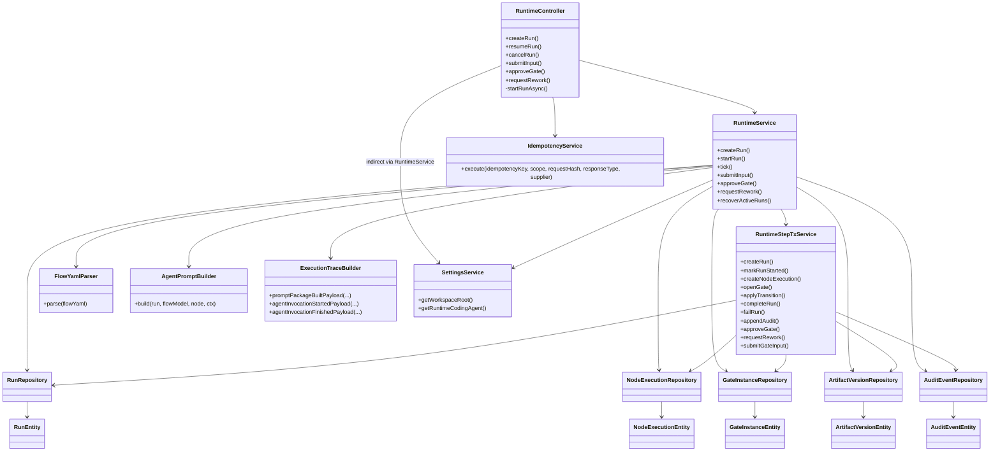

# Runtime Architecture

Документ описывает, как устроен runtime в текущей реализации backend.

## 1) Общая архитектура решения

### 1.1 Слои

- `runtime/api`: HTTP-слой (`RuntimeController`) с endpoint'ами запуска/управления run и gate.
- `runtime/application`: оркестрация выполнения (`RuntimeService`), атомарные шаги записи в БД (`RuntimeStepTxService`), сборка prompt (`AgentPromptBuilder`), форматирование audit payload (`ExecutionTraceBuilder`), recovery при старте (`RuntimeRecoveryInitializer`).
- `runtime/domain`: JPA-сущности и enum статусы (`RunEntity`, `NodeExecutionEntity`, `GateInstanceEntity`, `ArtifactVersionEntity`, `AuditEventEntity`, `RunStatus`, `GateStatus` и т.д.).
- `runtime/infrastructure`: Spring Data репозитории для runtime-таблиц.

### 1.2 Ключевые зависимости runtime

- Flow parsing/validation: `FlowYamlParser` + JSON Schema (`schemas/flow.schema.json` и node schemas).
- Конфигурация окружения: `SettingsService` (`runtime.workspace_root`, `runtime.coding_agent`).
- Идемпотентность create-run: `IdempotencyService`.
- Файловая оркестрация: рабочие директории run (`<workspace>/<runId>/repo`, `<workspace>/<runId>/runtime`).

### 1.3 Диаграмма классов (упрощённая)

## 2) Как работают потоки (threads)

### 2.1 Request thread (HTTP)

- Все endpoint'ы `RuntimeController` стартуют в request thread сервера.
- `POST /api/runs`: создаёт run и возвращает `201`; фактический `startRun` запускается в `TaskExecutor` (фоново).
- `POST /gates/{id}/approve|request-rework|submit-input`: сейчас выполняют runtime-логику синхронно в request thread (включая вызов `tick` после закрытия gate).

### 2.2 Background thread (TaskExecutor)

- `createRun` регистрирует запуск после commit и передаёт `runtimeService.startRun(runId)` в `TaskExecutor`.
- Это отделяет создание run (короткий HTTP roundtrip) от долгих операций `checkout + tick`.

### 2.3 Startup thread (ApplicationRunner)

- При старте приложения `RuntimeRecoveryInitializer` вызывает `runtimeService.recoverActiveRuns()`.
- Для run в `RUNNING` вызывается `tick`; для `WAITING_GATE` только audit `run_recovered`.

### 2.4 Внешние процессы

- Узлы `ai` и `command` выполняются через `ProcessBuilder` (`qwen` или `zsh -lc`).
- Java-поток runtime ждёт завершения процесса (`waitFor(timeout)`), затем читает stdout/stderr файлы.

## 3) Концепция работы с графом

### 3.1 Это собственная реализация

- Движок графа реализован вручную внутри `RuntimeService`.
- Граф не хранится как отдельная граф-структура в памяти (без adjacency map / graph library).
- Источник правды: `flow_snapshot_json` (сериализованный `FlowModel`) в таблице `runs`.

### 3.2 Как это работает

1. При создании run YAML flow валидируется и парсится в `FlowModel`.
2. В run сохраняется snapshot flow + `current_node_id = start_node_id`.
3. `tick` читает `current_node_id`, находит node через линейный поиск `requireNode(flowModel, nodeId)`.
4. Узел исполняется по `node_kind` (`ai`, `command`, `human_input`, `human_approval`, `terminal`).
5. Переход задаётся полями node (`on_success`, `on_failure`, `on_submit`, `on_approve`, `on_rework.next_node`).
6. `applyTransition` проверяет существование target node и обновляет `runs.current_node_id`.

### 3.3 Ограничения текущего подхода

- Переходы и валидация node existence выполняются в runtime, но без статического построения графа.
- Поиск node линейный (`O(n)` на шаг).
- Нет встроенных graph-алгоритмов (детекция циклов, topological checks, сложные path queries).
- Исполнение по сути однотредовое на run: один `current_node_id`, один активный путь.

### 3.4 Можно ли использовать библиотеку

Да, можно, но это архитектурное решение, не bugfix.

Когда стоит подключать библиотеку (например, `jgrapht`):

- нужны предварительные проверки графа (циклы, unreachable nodes, строгая валидация маршрутов);
- нужны сложные маршрутные стратегии (ветвления, параллельные пути, merge-узлы);
- нужно ускорить операции над большим числом узлов/переходов.

Когда текущей реализации достаточно:

- граф небольшой;
- переходы детерминированные и простые;
- важнее прозрачность и контроль бизнес-логики, чем универсальность graph API.

## 4) Сохранение данных в БД и транзакции

### 4.1 Таблицы runtime

- `runs`: состояние run, snapshot flow, текущий node, ошибки, timestamps.
- `node_executions`: попытки исполнения узлов.
- `gate_instances`: состояния human-gate.
- `artifact_versions`: версионность артефактов и мутаций.
- `audit_events`: последовательный журнал событий (`run_id + sequence_no`).
- `idempotency_keys`: идемпотентность `createRun`.

### 4.2 Транзакционная модель

- `RuntimeService`: в критичных методах стоит `@Transactional(propagation = NOT_SUPPORTED)`.
  Это означает: orchestration не держит одну длинную транзакцию на весь `tick`/выполнение узла.
- `RuntimeStepTxService`: почти все методы `@Transactional(REQUIRES_NEW)`.
  Каждый шаг состояния (update run/node/gate/audit) фиксируется отдельной короткой транзакцией.
- `IdempotencyService.execute`: `@Transactional` вокруг create-run сценария.

Итог: runtime использует подход "много маленьких коммитов" вместо "одна длинная транзакция".

### 4.3 Что сохраняется и на каком шаге

| Шаг | Метод | Транзакция | Что пишется в БД |
|---|---|---|---|
| 1. Создание run | `RuntimeController.createRun` + `IdempotencyService.execute` | `@Transactional` (idempotency) | Запись в `idempotency_keys` (in progress) |
| 2. Persist run | `RuntimeStepTxService.createRun` | `REQUIRES_NEW` | `runs(status=CREATED, current_node_id=start)`, audit `run_created` |
| 3. Успешное завершение createRun | `IdempotencyService.execute` | та же tx idempotency | `idempotency_keys.response_json`, `completed_at` |
| 4. Старт run | `RuntimeStepTxService.markRunStarted` | `REQUIRES_NEW` | `runs.status=RUNNING`, `started_at`, audit `run_started` |
| 5. Начало node | `RuntimeStepTxService.createNodeExecution` | `REQUIRES_NEW` | `node_executions(status=RUNNING, attempt_no++)`, audit `node_execution_started` |
| 6a. Успех ai/command | `markNodeExecutionSucceeded` + `applyTransition` | 2 x `REQUIRES_NEW` | `node_executions.status=SUCCEEDED`; `runs.current_node_id=next`, `runs.status=RUNNING`; audit success + transition |
| 6b. Ошибка node | `markNodeExecutionFailed` + `failRun` | `REQUIRES_NEW` | `node_executions.status=FAILED`; `runs.status=FAILED`, `error_code/message`, `finished_at`; audit fail |
| 6c. Открытие gate | `openGate` | `REQUIRES_NEW` | `node_executions.status=WAITING_GATE`; новая `gate_instances`; `runs.status=WAITING_GATE`; audit `gate_opened`, `run_waiting_gate` |
| 6d. Terminal | `completeRun` | `REQUIRES_NEW` | `node_executions.status=SUCCEEDED`; `runs.status=COMPLETED`, `finished_at`; audit `run_completed` |
| 7. Human submit | `submitGateInput` + transition + tick | `REQUIRES_NEW` шагами | `gate_instances.status=SUBMITTED`; node success; `runs.current_node_id=on_submit`; далее новые записи tick |
| 8. Human approve | `approveGate` + transition + tick | `REQUIRES_NEW` шагами | `gate_instances.status=APPROVED`; node success; `runs.current_node_id=on_approve`; далее tick |
| 9. Human rework | `requestRework` + transition + tick | `REQUIRES_NEW` шагами | `gate_instances.status=REWORK_REQUESTED`; pending rework instruction/clarification; `runs.current_node_id=on_rework.next_node`; далее tick |
| 10. Артефакты | `recordArtifactVersion` (внутри runtime) | `REQUIRES_NEW` | Новые `artifact_versions` (produced/mutation/human_input), supersede chain |
| 11. Любой аудит | `appendAudit` | `REQUIRES_NEW` | `audit_events` с автоинкрементом sequence по run |

### 4.4 Почему так сделано

- Сбой на позднем шаге не откатывает полностью историю run (есть audit trail и зафиксированные промежуточные состояния).
- Уменьшается время удержания транзакций при долгих операциях (git clone, внешние процессы).
- Проще recovery после рестарта: run можно продолжать из последнего зафиксированного состояния.

### 4.5 Важные детали управления транзакциями

- После создания run запуск делается `afterCommit`, чтобы `startRun` не исполнился до фиксации записи run.
- Для gate используется optimistic lock поле `resource_version` + `expected_gate_version` в API-командах.
- Для create-run от дублей используется `idempotency_key + scope` и `request_hash`.

## Краткий вывод

Runtime построен как state machine поверх snapshot flow в таблице `runs`, с пошаговым исполнением `tick` и атомарными переходами состояния через `RuntimeStepTxService`. Архитектурно это не графовая библиотека, а целевая доменная реализация с явным контролем переходов и журналированием.
